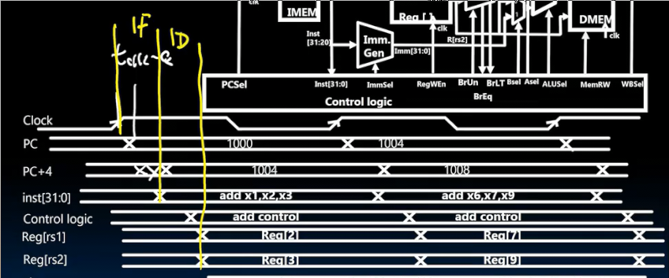

# 其他指令 指令执行的时序 控制设计
 
* [crs_控制和状态寄存器](#crs_控制和状态寄存器)
* [系统指令](#系统指令)
* [数据通路控制](#数据通路控制)
  * [指令时序_](#指令时序_)
    * [以add指令为例](#以add指令为例)
    * [lw指令](#lw指令)
* [控制逻辑设计](#控制逻辑设计)

目前我们得到了一个可配置的数据通路，通过配置不同的控制位，可以执行任何来自基础指令集的指令

## crs_控制和状态寄存器

其和ISA中的通用寄存器是分开的

靠近处理器，但和通用整数寄存器不同，不太靠近执行单元

用来监控状态和性能，以及和其他设备（外围设备或同一芯片上的其他单元）进行通信

RISCV运行寻址多达4096个CRS，但通常不会有那么多

* 可以计算我们已经执行的周期数（或者是已经退役的指令数）
* 与协处理器（如浮点单元）或外围设备（打印机等）通信
  * 将某种控制字放入外围设备拾取并处理的寄存器完成
  * 通常只是一个位（和邮箱相似） 标志完成，就绪等

几乎所有处理器都有CSR，但是其不是基本ISA的一部分 **标准扩展**

CSR有两种类型指令 一种使用源寄存器 另一种使用立即数

* 高12位用于寻址寄存器 csr （4096个）
* 立即数或源寄存器字段
* funct3 区分指令
* 目标寄存器 我们的通用寄存器
* 操作码

* `csrrw` 将csr的值写入rd 并将rs1的值写入csr
* `csrrs/c` 变体 设置或清除csr已被读取的标志
* 五位0扩展立即数变体 立即数写入csr 

* 我们会实现一条伪指令`csrw csr, rs1` 相当于`csrrw x0, csr, rs1` 目标地址是x0，我们仅仅写入csr

## 系统指令

* `ecall` `ebreak`

都是I格式指令 自己的操作码

* ecall 向支持执行环境（操作系统）发出请求 如Linux的系统调用
* ebrak 将控制权转移给调试器

* fence 将内存和IO访问与其他线程和进程所看到的访问分开

## 数据通路控制

我们还没有设计控制单元 其用于配置控制项

我们考虑sw指令，sw指令从rs2中获取值，并写入到rs1和立即数相加指向的内存地址

1. 在时钟上升沿，PC写入新值 一点延时后输出，并指向新指令 
2. 新指令被解码发往寄存器文件、控制单元、立即数计算器 同时新PC值输出到加法器 加法器输出
    * 从内存中获取新指令和加法器耗时相当的原因是缓存（后面会讲）
    * PCSel、immSel控制位发挥作用 控制位从指令中获取位，以决定置1置0
    * 指令发往控制器后，其余所有控制位同时计算得出
      * RegWEn 为 0， 决定不写回寄存器
      * Bsel 为 1 选择立即数而不是rs2参与运算
      * Asel 为 0 选择rs1而不是PC值参与运算
      * ALUSel 选择加法
      * MEMRw 置1 写入内存

### 指令时序_

#### 以add指令为例

1. 时钟的上升沿 PC被更新 新值出现在输出端
2. 此后两件事情大致同时完成 **获取阶段** 新值经过加法器加4、从指令存储器取出指令
3. 再之后两件事情同时发生 **解码阶段**
指令发往寄存器文件，开始检索寄存器rs1、rs2的值、指令发往控制器被解码，输出各个能确定的控制位，如果PCSEL被确定为0，PC前会出现正确的PC+4
4. 当寄存器中rs1，rs2被获取完成，寄存器文件输出，**执行阶段** 发往ALU
5. ALU延时后ALU输出，**写回阶段** 写回目标寄存器 在下一个时钟上升沿 完成

PC在上升沿到来clk-to-q延时后产生新的输出

再经过加法器延时后得到PC+4，但是这个延时和clk-to-q不同，低位比高位更先稳定

大致在相同时间，我们从指令内存中获取到指令 完成**指令获取阶段**

获取的指令发往控制单元，经过延时，得到可确定控制位的输出 

获取寄存器的值延时更长一些 得到值后，完成**解码阶段**

执行ALU操作 **执行阶段**

结果写回寄存器（短暂的多路复用器延时） 在下一个时钟寄存器文件建立时间前完成

时钟到来，寄存器和时钟一同更新

统计一下 

一方面PC写入路径的总延时 clk-to-q延时 + 加法器延时 + 多路复用器延时 要满足 PC的建立时间

另一方面 clk-to-q延时 + 指令寄存器延时 + 寄存器文件延时 + 多路复用器延时 + ALU延时 + 多路复用其延时 满足 寄存器文件建立时间（明显更长）

#### lw指令

前面的事情和add指令大致相同，在解码阶段，一方面我们在寄存器文件中获取输出，同时立即数计算器解码生成立即数 耗时相当 都发往ALU

而执行阶段完成后，经过内存访问阶段 后写回寄存器

因此有些指令会多几个阶段，有些会少一些，我们要以最坏情况为设计依据

以最长执行的指令计算时钟允许的最高频率

## 控制逻辑设计

这是控制单元要做的事情

如何实现呢，有两种方式

* 只读存储器 仅仅在设计时写入的普通存储器
  * 方便调试
  * 便于扩展
* 组合逻辑
  * 更紧凑 速度更快

控制单元只关心指令中的9位：5位操作码 funct3 funct7的第2高位

对于分支指令，额外关心一下另外两个输入

也就是通过11位的地址到查找表中寻找值

首先这个地址经过**独热解码** 只有一条线会亮起

可以等效为与门和或门

有符号分支 就是funct3 的中间位为1 同时是 B指令的操作码

ADD的解码

