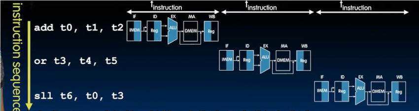
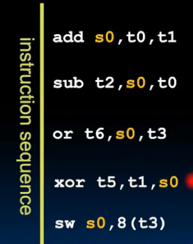

# 性能衡量和流水线
 
* [性能衡量](#性能衡量)
  * [处理器性能铁律_根据机器和程序的基本参数_得到执行程序的时间](#处理器性能铁律_根据机器和程序的基本参数_得到执行程序的时间)
    * [程序具有的指令数](#程序具有的指令数)
    * [执行一条指令的平均时钟周期数_cpi](#执行一条指令的平均时钟周期数_cpi)
    * [每个周期的时间](#每个周期的时间)
  * [能效](#能效)
* [流水线](#流水线)
  * [riscv的流水线](#riscv的流水线)
  * [流水线的数据通路_](#流水线的数据通路_)
  * [流水线危险](#流水线危险)
    * [_结构危险_](#_结构危险_)
    * [_数据危险](#_数据危险)
    * [_控制危险](#_控制危险)
 
## 性能衡量

不同的衡量性能指标

**指令级并行性**

目前我们的性能指标只有CPU中执行一条指令所需最小周期时间

通过5个阶段的时间测量确定

测量出最小周期以及最大频率，可以做的更好或者有其他指标吗

* 执行一个任务的时间 一段时间内可以处理多少任务
* 耗能多少

作为形象的例子，尽管公交车跑的更慢，它一次可以承载更多乘客，且耗能更少 （对于平均人相对小汽车而言）

通常完成任务耗能比功率更适合作为衡量指标

### 处理器性能铁律_根据机器和程序的基本参数_得到执行程序的时间

执行程序的时间 = 程序拥有的指令数 * 一条指令具有的周期数 * 每周期的耗时

#### 程序具有的指令数

有关的因素

* 什么样的任务
* 任务如何编码
* 算法
* 编程语言
* 编译器
* 指令集架构

#### 执行一条指令的平均时钟周期数_cpi

我们目前的处理器实现中，一条指令始终执行一个周期（即便是同一ISA，可以有不同cpi的处理器实现）

取决因素

* ISA
* 处理器实现
* 指令的复杂性（C语言的strcpy CPI>>1）
* 超标量处理器 CPI < 1 一个周期执行多条指令

#### 每个周期的时间

* 由微架构决定 有点哦少逻辑门
* 每个逻辑门的延迟、技术
* 同一技术的不同功率

我们想要实现一个图像压缩任务

可以发现处理器B，尽管需要更多指令，较低的时钟频率，但是其CPI很低，综合下来执行这个任务用时更少

### 能效

处理器性能和功耗之间的关系

如今，所有设备的特定部分都会受到功率限制

我们要在**功率和能量限制下最大化性能**

这是非门的细节 上下要接电源和地才能具有控制输出的功能，输出端存在电容

右侧是更底层的原理图 当输出电平从0到1时，必须给电容充电

要充入CV^2的能量才会从0到1，电容保留CV^2/2而另一半转化为热能消散。当从1到0时，剩下的能量传到地线消散

这是功耗的主要途径，另一种途径是泄漏（我们只是"调暗"其来表示其关闭）大约70%充放电 30%泄漏

回到较高层次，一个任务耗能可以分解为，其具有指令数和每条指令耗能

每条指令耗能可以大概视为CV^2 C为等效总电容 **每条指令中需要切换的电容** V表示**电源电压** 

电压通常是1V，减少电压对降低能耗很有帮助，但同时会影响性能（晶体管在较低电源电压下运行会变慢）

对这时间的推移，更高技术的出现摩尔定律，到下一个阶段，相同的架构会自然降低40%的能效

**能量铁律** 每秒执行任务 *表现* = 每秒消耗能量（焦耳） *能量* * 每焦耳执行任务 *能量效率*

而能效是我们的设计目标：从受限的能量中可以执行多少任务

## 流水线

提高能效的方法

每个项目2小时中只是使用了半小时

* 并没有改单个任务的延时 但是整个工作的延时明显改善 
* 流水线可以获得的加速 大概是阶段数
* 但是我们需要一些时间填充和清空流水线 
* 流水线的效率取决于最慢的阶段 加快其他阶段不会明显改善流水线效率

### riscv的流水线

实际上没有使用单周期指令的CPU，而是采用流水线

我们的指令存在五个阶段

这是单周期指令的处理流程

更好的方式是采用流水线

读取SLL指令的同时解码OR指令，同时执行ADD指令

时钟用于转换各个阶段

需要引入额外的寄存器来避免数据混淆

和单周期指令对比，处理一条指令用时更长（我们必须匹配时钟周期适应最慢的阶段）

由于在一定周期内可以执行多个指令 可以将CPI降到1以下

时钟可以达到更高的频率

### 流水线的数据通路_

只要要在执行阶段的边界插入寄存器

一些设计 加法器被推迟到内存读取阶段才接受PC输入

并且需要在解码阶段，会将解码出的控制位保存，并且所有后续阶段用到的控制位要在先前阶段结束的寄存器中保存

### 流水线危险

某指令将进入正在执行指令的阶段（上一条指令没有处理完，下一条已经进入）

#### _结构危险_
  * 资源争用产生 大多现代处理器 很少会遇到
  * 比如我们在之前的设计中，去掉递增地址的加法器，而是改用ALU，这样会导致每次递增地址，ALU就会变得不能执行其他操作
  * 流水线中的两条指令争夺同一资源
  * 解决方案 **停顿** 等待某指令使用完此资源（nop）更常见的是**添加更多适配ISA的硬件**
  * 寄存器文件支持在一个周期同时的三次访问（两读一写）
  * 我们的指令存储器和内存存储器实际上是同一物理存储器，但是在一些周期，我们需要同时读取指令和读取内存数据 因此采用**缓存**避免资源争用

#### _数据危险
  * 数据危险 由指令间依赖关系产生
  * 比如正在执行的指令写入寄存器后，后面的指令不能依赖于同一个操作数

ADD指令现在处于写回寄存器阶段，但是同时另一指令正在解码阶段读取寄存器文件的值 如果读的是先前指令在写的值呢？我们会期望读取到写入的值 那么就要保证**写入比读取先发生，这正是我们的单周期读写寄存器文件做的**

更复杂地

后续的每个指令都用同一个寄存器 他们依赖于add已经写入了s0

但是当第二条指令读取s0发生在解码阶段，此时第一条指令刚刚在执行，还没有到达写回

第三条也是 此时add在内存访问 只有第四条s0才是正确的值

一种解决方法是**停顿** 当下一条指令依赖于前一条的结果时，直到第一条被写回再解码其（也就是内存访问阶段开始指令获取）

这失去一些性能 

编译器通常会有一些优化：交换sub和后续不依赖与add结果的指令 如果找不到，那就插入nop

另一种方式是更改数据通路 在下一条指令的解码阶段，第一条指令会执行，执行后，会在末尾产生第二条指令需要的值（还未存储到寄存器文件），我们获取ALU或者在内存访问阶段获取这个值并转发到ALU的输入端口（下一条指令将执行）

同样对于第三条指令，在其执行阶段前，会获取内存访问末尾的正确值并输入到ALU

因此添加一些多路复用器，并进行控制 控制方式是查看当前执行指令的目标寄存器和解码阶段指令的源寄存器 相同，则置1

#### _控制危险
  * 有分支时，当分支指令被执行，下一条指令可能无效
