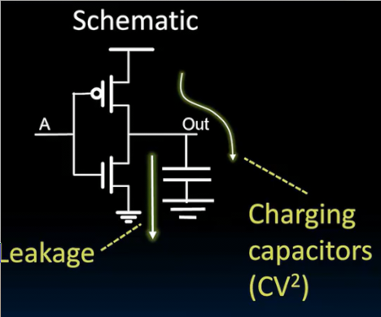

# 性能衡量和流水线
 
* [性能衡量](#性能衡量)
  * [处理器性能铁律_根据机器和程序的基本参数_得到执行程序的时间](#处理器性能铁律_根据机器和程序的基本参数_得到执行程序的时间)
    * [程序具有的指令数](#程序具有的指令数)
    * [执行一条指令的平均时钟周期数_cpi](#执行一条指令的平均时钟周期数_cpi)
    * [每个周期的时间](#每个周期的时间)
  * [能效](#能效)
* [流水线](#流水线)

## 性能衡量

不同的衡量性能指标

**指令级并行性**

目前我们的性能指标只有CPU中执行一条指令所需最小周期时间

通过5个阶段的时间测量确定

测量出最小周期以及最大频率，可以做的更好或者有其他指标吗

* 执行一个任务的时间 一段时间内可以处理多少任务
* 耗能多少

作为形象的例子，尽管公交车跑的更慢，它一次可以承载更多乘客，且耗能更少 （对于平均人相对小汽车而言）

通常完成任务耗能比功率更适合作为衡量指标

### 处理器性能铁律_根据机器和程序的基本参数_得到执行程序的时间

执行程序的时间 = 程序拥有的指令数 * 一条指令具有的周期数 * 每周期的耗时

#### 程序具有的指令数

有关的因素

* 什么样的任务
* 任务如何编码
* 算法
* 编程语言
* 编译器
* 指令集架构

#### 执行一条指令的平均时钟周期数_cpi

我们目前的处理器实现中，一条指令始终执行一个周期（即便是同一ISA，可以有不同cpi的处理器实现）

取决因素

* ISA
* 处理器实现
* 指令的复杂性（C语言的strcpy CPI>>1）
* 超标量处理器 CPI < 1 一个周期执行多条指令

#### 每个周期的时间

* 由微架构决定 有点哦少逻辑门
* 每个逻辑门的延迟、技术
* 同一技术的不同功率

我们想要实现一个图像压缩任务

可以发现处理器B，尽管需要更多指令，较低的时钟频率，但是其CPI很低，综合下来执行这个任务用时更少

### 能效

处理器性能和功耗之间的关系

如今，所有设备的特定部分都会受到功率限制

我们要在**功率和能量限制下最大化性能**

这是非门的细节 上下要接电源和地才能具有控制输出的功能，输出端存在电容

右侧是更底层的原理图 当输出电平从0到1时，必须给电容充电

要充入CV^2的能量才会从0到1，电容保留CV^2/2而另一半转化为热能消散。当从1到0时，剩下的能量传到地线消散

这是功耗的主要途径，另一种途径是泄漏（我们只是"调暗"其来表示其关闭）大约70%充放电 30%泄漏

回到较高层次，一个任务耗能可以分解为，其具有指令数和每条指令耗能

每条指令耗能可以大概视为CV^2 C为等效总电容 **每条指令中需要切换的电容** V表示**电源电压** 

电压通常是1V，减少电压对降低能耗很有帮助，但同时会影响性能（晶体管在较低电源电压下运行会变慢）

对这时间的推移，更高技术的出现摩尔定律，到下一个阶段，相同的架构会自然降低40%的能效

**能量铁律** 每秒执行任务 *表现* = 每秒消耗能量（焦耳） *能量* * 每焦耳执行任务 *能量效率*

而能效是我们的设计目标：从受限的能量中可以执行多少任务

## 流水线

提高能效的方法

每个项目2小时中只是使用了半小时

* 并没有改单个任务的延时 但是整个工作的延时明显改善 
* 流水线可以获得的加速 大概是阶段数
* 但是我们需要一些时间填充和清空流水线 
* 流水线的效率取决于最慢的阶段 加快其他阶段不会明显改善流水线效率
