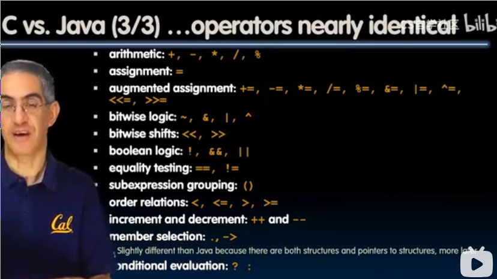
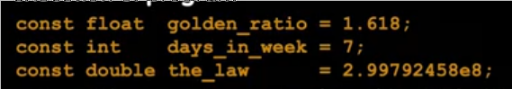

# C语言
 
* [编译和解释](#编译和解释)
  * [C语言编译过程](#C语言编译过程)
* [C_和_Java_的对比](#C_和_Java_的对比)
* [C语言的语法](#C语言的语法)
  * [main](#main)
  * [True_and_Flase](#True_and_Flase)
  * [变量](#变量)
  * [常量和枚举类型](#常量和枚举类型)
  * [函数的类型](#函数的类型)
  * [结构体](#结构体)
  * [程序控制](#程序控制)

**限制少 通用性**使得其比一些更加强大的语言更方便和有效地处理很多任务

Unix就是这样诞生的，正是因为其由C语言编写（而非传统编写操作系统的汇编语言），给予其可移植性，而非针对单一设备的汇编

C语言的级别低到可以直接操作硬件，控制位

本单元着重与**指针** **数组** **内存管理**

## 编译和解释

C语言的工作方式是编译, 也是如此，其运行速度非常快 缺点是**难以调试和可移植性不好**

编译器是一个程序 输入C程序，输出特定于架构的汇编代码

Java中的Javac是其编译器，会输出**字节码**，不同于C编译器生成的汇编，其是可移植的

然后再由**解释器**执行字节码

### C语言编译过程

1. 编译器将`.c`转换为`.o`二进制文件 `gcc -c try.c -o try.o`
2. 之后将所有`.o`链接在一起形成可执行文件


因此只修改`foo.c`只需要重新编译`foo.c`然后重新链接，而不需要重新编译`bar.c`

在编译的过程中，`.c`又经过的**预处理器**(CPP), 把一些如库文件包含的指令替换为实际文本,宏定义等操作，生成`.i`

对于定义宏需要小心！


在这个小例子中，宏可能会被执行两次

## C_和_Java_的对比




* 获取C标准的版本 `printf("%ld\n", __STDC_VERSION__);`
* 指定按某标准编译 `gcc -std=c99 hello.c -o hello`

## C语言的语法

### main

* `int argc` 参数个数
* `char *argv[]` 包含程序名称的若干参数
* `argv[0]`表示程序名称

### True_and_Flase

0 NULL(也是0) 被定义为假

其它均为真

### 变量


鼓励使用`intN_t` `uintN_t`

```c
#include <stdio_h>
#include <stdint_h>
#include <inttypes_h>

int main(int argc, char *argv[]){
    uint32_t n = 21;
    printf("%" PRIu32 "\n", n); 
    return 0;
}
```

* python Java C 中的`int`


### 常量和枚举类型



意义是锁定其值，保持不变

枚举类型


### 函数的类型


### 结构体


### 程序控制


不以缩进判断范围，而是用`{}`


`switch`每个语句结尾必须有`break`才能达成匹配即退出的目的, 否则会滚到下一个语句(statements)

不要使用goto！

```c
#include <stdio_h>
#include <math_h>

int main(int argc, char *argv[]) {
    double pi = 4.0 * atan(1.0);
    printf("pi: %lf\n", pi);
    int angle_degree = 0;
    while (angle_degree <= 360) {
        double angle_radian = pi * angle_degree / 180.0;
        double value = sin(angle_radian);
        printf("%3d\t%lf\n", angle_degree, value);
        angle_degree += 10;
    }
    return 0;
}
```
