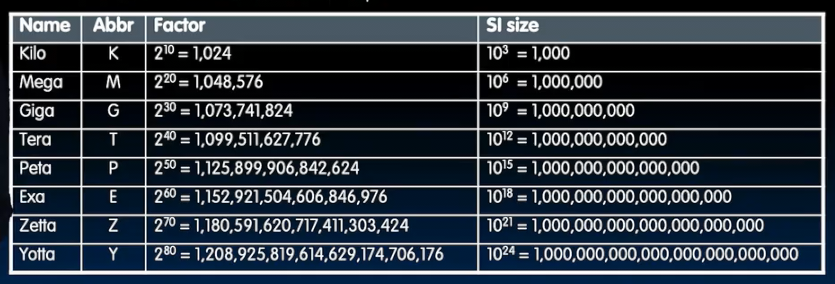
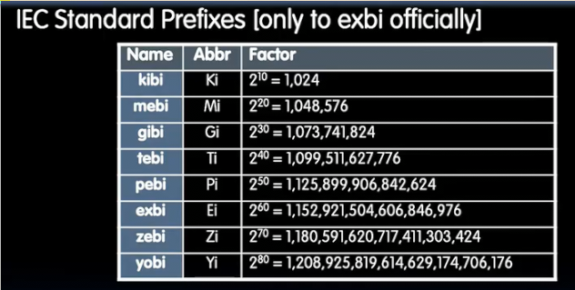
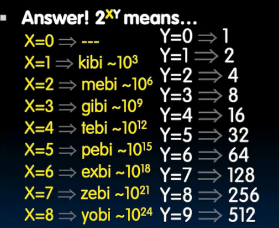
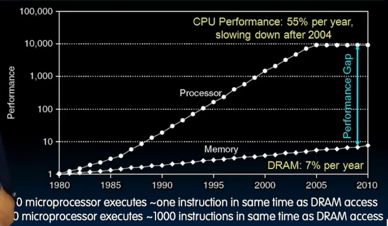
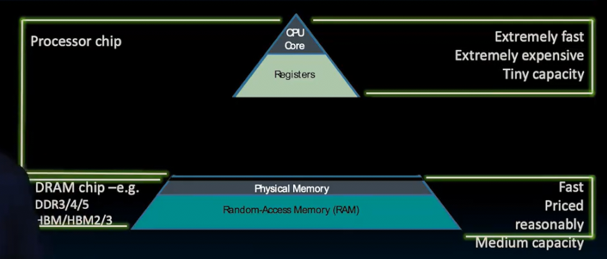
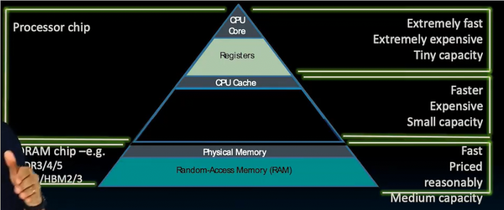

# 缓存

## 二进制前缀

通常在日常用 K 表示 10^3 M 表示 10^6 G 10^9

而在二进制中 分别代表2^10 2^20 2^30... 

我们需要一种更准确表示其含义的方式

记住KMGTPEZY的顺序以及大小

他们各需要多少位来寻址？

* 2^XY次方 
  * 对于个位Y 对应2^Y次方
  * 对于X，从1开始对应kibi 以此类推
* 2^34 就是 2^4 = 16gibi
* 2^47 128 tebi
* 2^64 16 exbi
* 寻址 2.5 tebi 需要2^41 - 2^42个地址

## 为什么需要缓存

在大型图书馆查找一本书

1. 找到在哪
2. 取回来

此外查找效率还和距离有关 

我们希望内存无限大，但是同时足够快

如今 一次内存访问相当于 1000条指令 性能损失很严重

## 内存层次结构

在翻阅书籍时，我们需要一些资料，我们希望面前的桌子尽量大，以避免反复跑去存放查找书籍

**把经常用的东西放在面前**

这个桌子相当于一个本地存储 访问速度非常快 但是容量更小 是将要使用数据一个较小的集合

**缓存始终是内存的一个副本 内存的一个子集**

大多数处理器将指令和数据缓存分开 不妨分别为指令和数据设置缓存

缓存弥补了很慢的内存（D代表动态 需要不断刷新）和很快的寄存器之前的空隙

