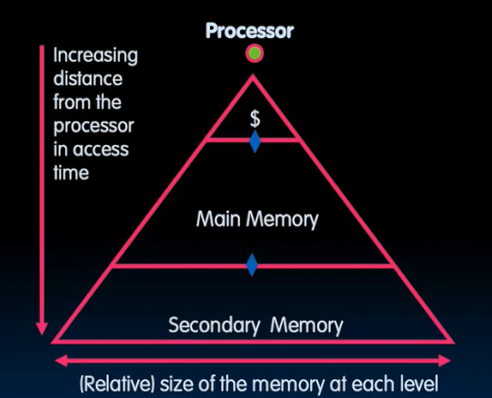
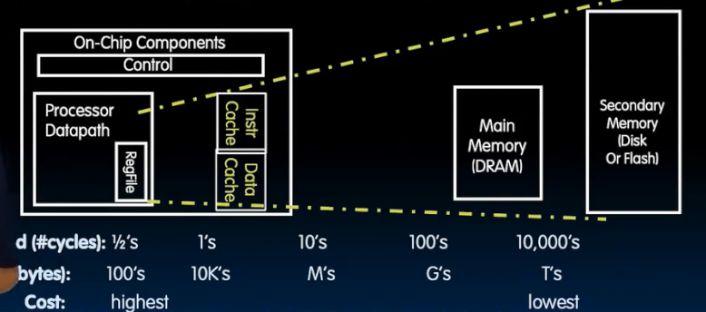

# 缓存
 
* [二进制前缀](#二进制前缀)
* [为什么需要缓存](#为什么需要缓存)
* [内存层次结构](#内存层次结构)
* [缓存的设计原则](#缓存的设计原则)

## 二进制前缀

通常在日常用 K 表示 10^3 M 表示 10^6 G 10^9

而在二进制中 分别代表2^10 2^20 2^30... 

我们需要一种更准确表示其含义的方式

记住KMGTPEZY的顺序以及大小

他们各需要多少位来寻址？

* 2^XY次方 
  * 对于个位Y 对应2^Y次方
  * 对于X，从1开始对应kibi 以此类推
* 2^34 就是 2^4 = 16gibi
* 2^47 128 tebi
* 2^64 16 exbi
* 寻址 2.5 tebi 需要2^41 - 2^42个地址

## 为什么需要缓存

在大型图书馆查找一本书

1. 找到在哪
2. 取回来

此外查找效率还和距离有关 

我们希望内存无限大，但是同时足够快

如今 一次内存访问相当于 1000条指令 性能损失很严重

## 内存层次结构

在翻阅书籍时，我们需要一些资料，我们希望面前的桌子尽量大，以避免反复跑去存放查找书籍

**把经常用的东西放在面前**

这个桌子相当于一个本地存储 访问速度非常快 但是容量更小 是将要使用数据一个较小的集合

**缓存始终是内存的一个副本 内存的一个子集**

大多数处理器将指令和数据缓存分开 不妨分别为指令和数据设置缓存

缓存弥补了很慢的内存（D代表动态 需要不断刷新）和很快的寄存器之前的空隙

* 从寄存器中获取数据就像在头脑中思考一下 
* 从内存中获取数据类比于到另一个城市取得这个东西 
* 而缓存像是在房间中寻找

更远的是磁盘

* **距离处理器越远，访问越慢，但是越便宜**
* 较小的始终是较大部分的副本 *包括寄存器*

在三角形的位置表示了访问有多快 而宽度表示其容量

这样的层次结构中，使得产生**较高层级的速度具有较低层级大小**的错觉

## 缓存的设计原则

**工作原理** **时间和空间局部性**

* **时间局部性** 如果刚刚使用某个数据，那么很可能很快会再次使用相对于其他随机数据
  * 存储最近使用的数据 以备不时之需
* **空间局部性** 如果访问内存中的特定位置 那么通常表明不会随机访问内存 *而是邻居之类*
  * 带回使用数据的一些相邻数据

* 我们需要记录这个副本来自内存中的哪里 
* 初始化为什么（以区分无效的数据） 
* 如何高效寻找数据

从寄存器到内存 是编译器写出汇编语言`lw`和`hw`

而从缓存到主内存 不需要外部进行管理 硬件 **缓存控制器**自动管理

而主内存到磁盘 由操作系统管理
