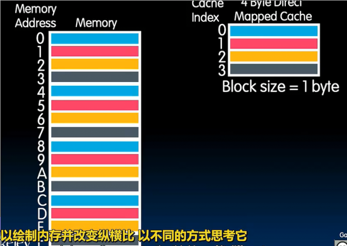
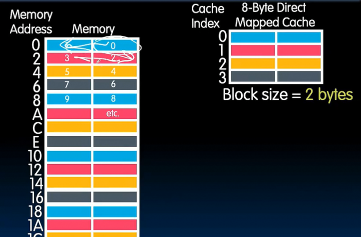
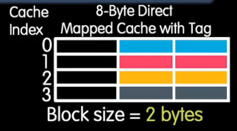
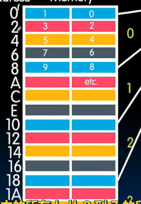
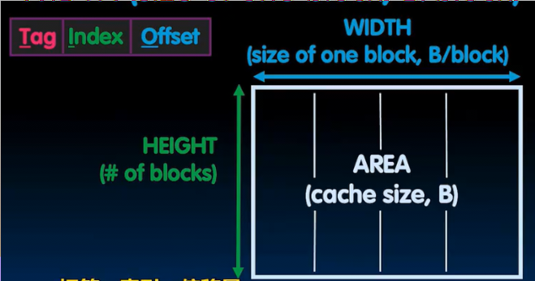
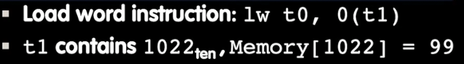
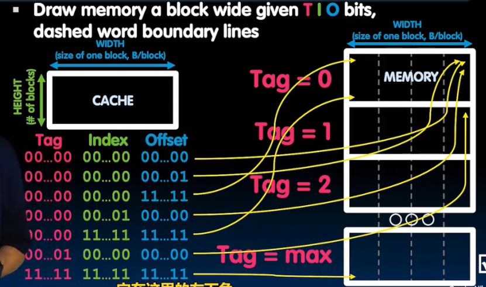
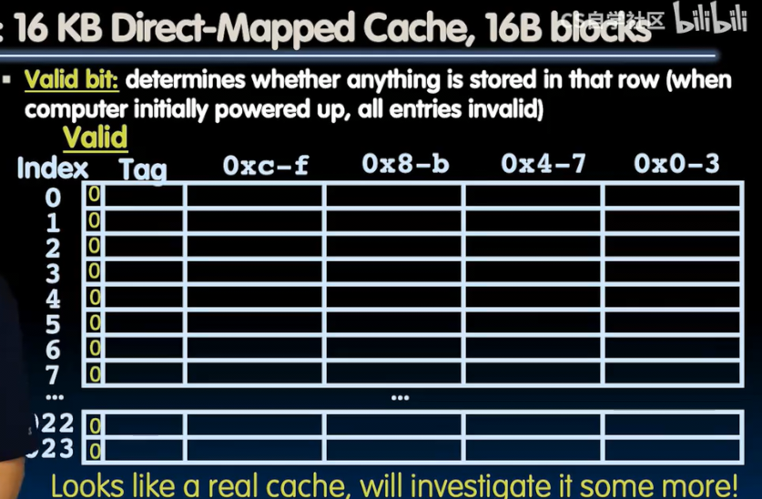

# 直接映射缓存
 
* [块和内存映射到缓存方式](#块和内存映射到缓存方式)
* [缓存映射到块](#缓存映射到块)
  * [相关计算](#相关计算)
  * [加载的例子](#加载的例子)
* [专业术语](#专业术语)

## 块和内存映射到缓存方式

每个内存地址映射到一个**块**（缓存中移入和移出的数据量）

* 硬盘中移入移出的数据称为文件
* 寄存器中移入移出的数据称为字
* 缓存中则称为块

内存有一些表示方法 比如一行表示一个字节 也可以一行表示一个字

* 但是要保证**绘制缓存和内存的一行宽度相同**

内存中的不同字中所有相同颜色字节去同一块

* 相当于取余4
* 对于二进制也相当于基于最低两位区分

对于块长为2个字节的画法

较低地址的字节在右侧

需要最低的第二位和第三位来确定在哪个块中

## 缓存映射到块

我们如何从一个已经装填蓝色的块中判断具体来自于内存中哪个蓝色的半字呢

引入一个8位的标签 要存储什么呢？

我们不关心地址中最低的三位（因为在同一块中他们都相同）

内存中第一组缓存块大小 编号为0 依次类推 这是丢掉最低三个位自然的结果

* 一个地址的高部分区分来自于内存的哪部分
* 中间表命对应哪个块
* 低部分区分在块中什么位置

### 相关计算

缓存的大小：2^H * w^W 几位表示缓存块索引 几位表示缓存字节索引 转换为二进制前缀（单位 字节）

例子 对于32位架构 8B缓存 块长2B 

1. 地址中偏移位 2B = 2^1 B 因此 1位
2. 地址中索引位 8B / 2B = 2^2 行 因此 2位
3. 地址中标签位 8B = 2^3 B 32 - 3 = 29 位

### 加载的例子

从内存中加载一个字 如果没有缓存

1. 处理器向内存发送地址 1022
2. 内存读取1022的字
3. 内存发送给处理器
4. 处理器写入99到寄存器t0

存在缓存时

1. 处理器向缓存发送地址 1022
2. 缓存检查 是否持有1022的数据
    * 如果找到 缓存读取到99 发送回寄存器
    * 如果找不到 缓存发送地址给内存
      * 内存读取字99
      * 内存发送99给和缓存
      * 缓存设置对应块地址1022 同时持有99
      * 缓存发送99给处理器
3. 处理器加载99到t0

## 专业术语

* **缓存命中** 需要的数据正好在缓存中
* **缓存未命中** 不在缓存中
* **缓存未命中块替换** 不在缓存中 同时需要缓存的块已经被其他地址数据占用 需要替换掉
* **命中率** 命中占总请求数的比例
* **未命中率** 相反
* **未命中惩罚** 从内存加载一个未命中到缓存耗费时间
* **命中时间** 访问缓存中的命中数据要多久
* `$`表示缓存

**未正式词汇** 温度

* **冷缓存** 缓存为空
* **预热** 将数据带入并遇到很多未命中 但是此时正在填充
* **温热缓存 warm** 正在命中缓存 缓存正常工作
* **热缓存 hot** 大部分命中 工作非常好

垃圾数据用额外的合法位区分 1 表示有效数据

