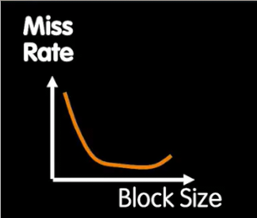
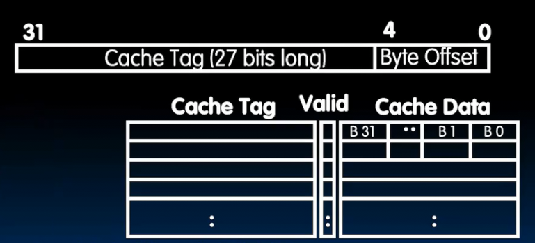

# 写入缓存和细节
 
* [缓存的写入](#缓存的写入)
* [块大小](#块大小)
* [未命中的类别](#未命中的类别)
  * [强制非命中](#强制非命中)
  * [冲突未命中](#冲突未命中)
    * [解决冲突未命中](#解决冲突未命中)
  * [容量未命中_](#容量未命中_)
  * [区分](#区分)
 
## 缓存的写入

同时写入缓存和内存？确实解决了不一致的情况 **Write-through**

**Write-back** 如果只是读写同一个值，那么为什么不继续留在缓存中呢？

仅仅读写缓存中的数据

当内存和缓存**可能**不一致时，称为内存**陈旧**

**可能**表示即使写入值和原值相同，仍然陈旧

当内存陈旧，引入一个dirty位，表示不一致的情况

当块被替换，如果dirty置1，则写回内存（或者缓存被刷新时 *操作系统*）

对于特定的系统而言二者都会成为合理设计

## 块大小

更大的块可以有更好对空间局部性的提升（连续访问），但是会增加失误惩罚（随机访问）（特别是每次访问下一个相距缓存大小的位置）

需要权衡

惩罚随块大小的增长是线性关系

而失误率随块大小的增加**先减小后增加** 

* 起初空间局部性不断改善
* 但是最终会失去时间局部性（块太少）

二者综合，我们可以在中间部分找到平均访问时间的最小值

## 未命中的类别

### 强制非命中

 因为此时是冷缓存 别无选择 必须承担开销

### 冲突未命中

 同一块Tag不同 必须要替换

#### 解决冲突未命中

**完全关联缓存** 可映射到任何位置 Tag和Offset都一样，但是没有Index 缓存中任何行（块）都能被映射 而Tag则要保存多余的信息

32B的缓存，5位表示O 因此27位表示Tag

当获取某地址时，**并行比较所有Tag** 解决了冲突未命中

缺点在与构造硬件比较器困难

### 容量未命中_

如果缓存更大就不会发生的未命中

完全关联缓存会遇到这种未命中

想存入更多，但是放不下

### 区分

* 一个无限大的完全关联缓存 只会遇到强制未命中
* 有限大小的完全关联缓存 会额外遇到容量未命中
* 有限大小的小关联性缓存 会额外遇到冲突未命中
