# 组相联缓存
 
* [块替换](#块替换)
* [平均内存访问时间](#平均内存访问时间)
  * [降低未命中惩罚](#降低未命中惩罚)
  * [降低未命中率_](#降低未命中率_)
* [真实CPU](#真实CPU)

介于全相联缓存和直接映射缓存之间

* N路组相联缓存的N表示一个组中包含的块数
* 在一个组内为全相联（较小规模 并行比较硬件容易做到） 

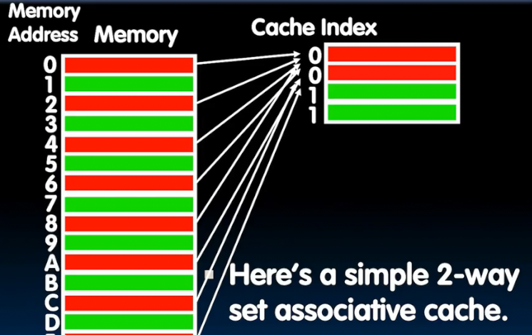

这个缓存中 红色为一组 绿色为另一组 

内存中所有为红色的数据可以放在红色组的任何一个块中

对于直接映射缓存 我们无法同时缓存 地址0 和 地址4的数据

但是在现在的组相联缓存中，可以同时存储

现在的Index表示的是哪一个组中 

1路组相联缓存就是直接映射（每个组中包含一个块）

而每个组包含总行数个块就是全相联映射

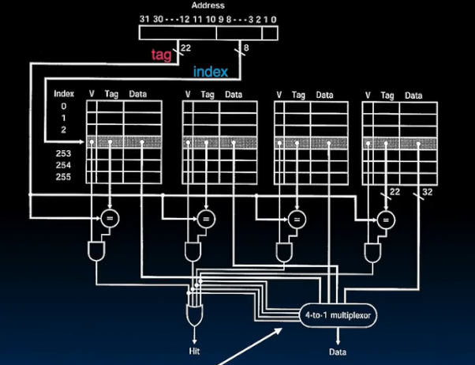

在这个4路组相联缓存中 加载数据

1. 通过Index找到对应组 
2. 同时通过tag并行判断每个组是否命中，并且将各个组的命中信号发往数据选择mux(独热编码) 

## 块替换

当某一个组满时，我们再向组添加需要进行替换 

**最近最少使用策略** LRU

踢出最早的，并且很少使用的

时间局部性：很可能不会再使用

缺点是必须跟踪使用顺序 硬件很难做到

**先入先出FIFO**

加载进来的顺序 忽略了一些时间局部性

**随机**

有时工作更好

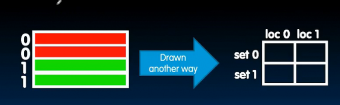

两路组相联缓存的 LRU策略 例子

* 偶数地址都是红色组 奇数地址都是绿色组

> 0 2 0 1 4 0

1. 0地址数据加载入红组0号块 此时红组RLU位设置为1号块
2. 2地址数据加载入红组1号块 此时红组RLU位设置为0号块
3. 在红组查找到0地址数据 Tag相同，命中 RLU设置1号
4. 1地址数据加载入绿组0号 绿组RLU位设置1
5. 4地址数据加载进入 红组RLU指向的1号 RLU指向0
6. 在红组查找到0地址数据 Tag相同 命中 RLU指向1

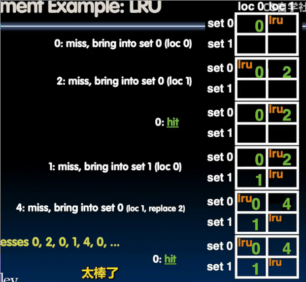

## 平均内存访问时间

= 命中花费时间 + 未命中率 * 未命中惩罚 （未命中也会花费命中时间，同时耗费额外惩罚）

### 降低未命中惩罚

除了改善块大小外，还有什么方法减小未命中惩罚？

* 内存和缓存间再加一层**二级缓存**

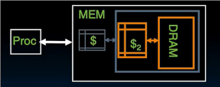

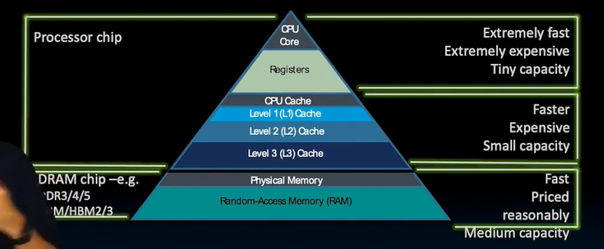

> lscpu

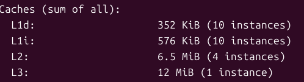

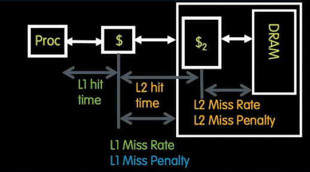

AMAT = L1 命中时间 + L1未命中率 * L1未命中惩罚

L1未命中惩罚 = L2命中时间 + L2未命中率 * L2未命中惩罚

...

### 降低未命中率_

* 更大的缓存

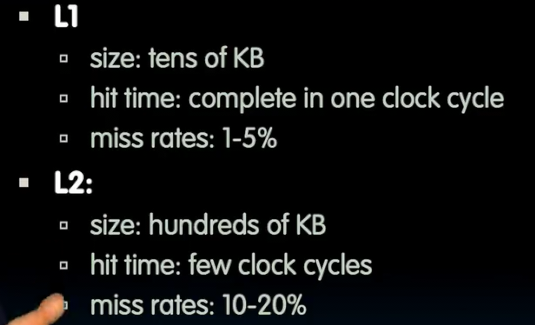

## 真实CPU

早期

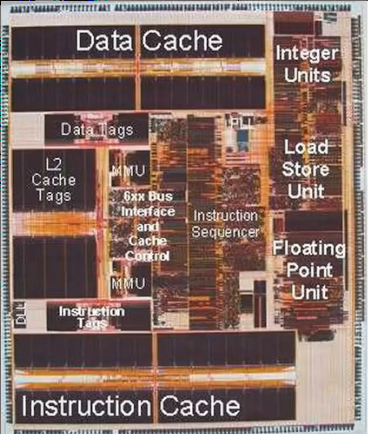

* 指令使用的l1缓存 和 数据使用的l1缓存各 32kiB
* 芯片单独存储各各个缓存的Tags以便快速比较
* 多个ALU并行做不同事情

奔腾M

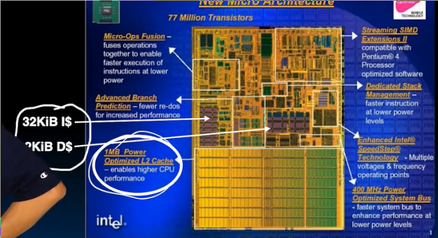

i7

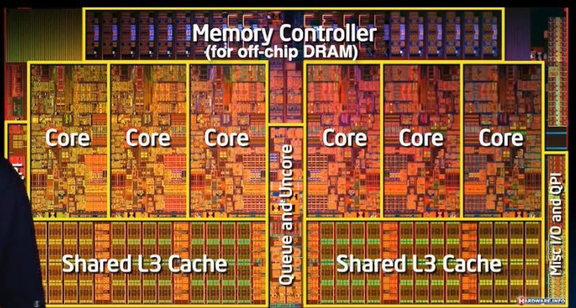

* 多核 
* 每个核心都有L1和L2
* 所有核心共享的L3

**如果某件事很费时 并且可能重复做 那就做一次并存储结果**
