# 操作系统和虚拟内存
 
* [操作系统基础知识](#操作系统基础知识)
  * [启动顺序](#启动顺序)
* [操作系统函数](#操作系统函数)
  * [启动应用](#启动应用)
  * [管理模式](#管理模式)
  * [系统调用](#系统调用)
  * [中断和异常](#中断和异常)
  * [61c的术语](#61c的术语)

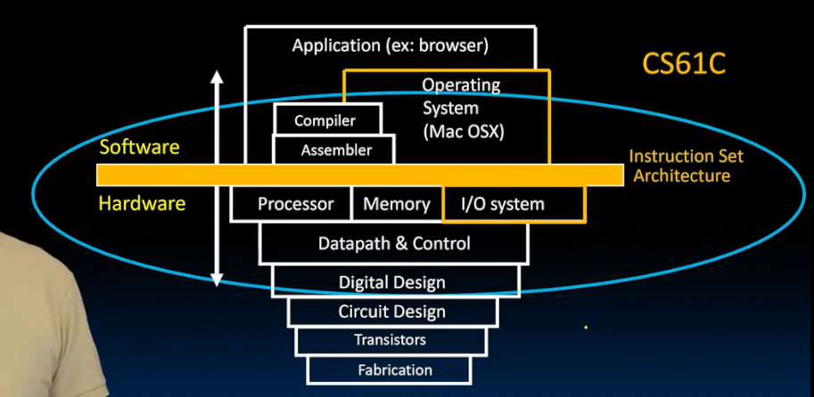

我们将添加操作系统

研究主内存和磁盘SSD一起工作实现虚拟内存

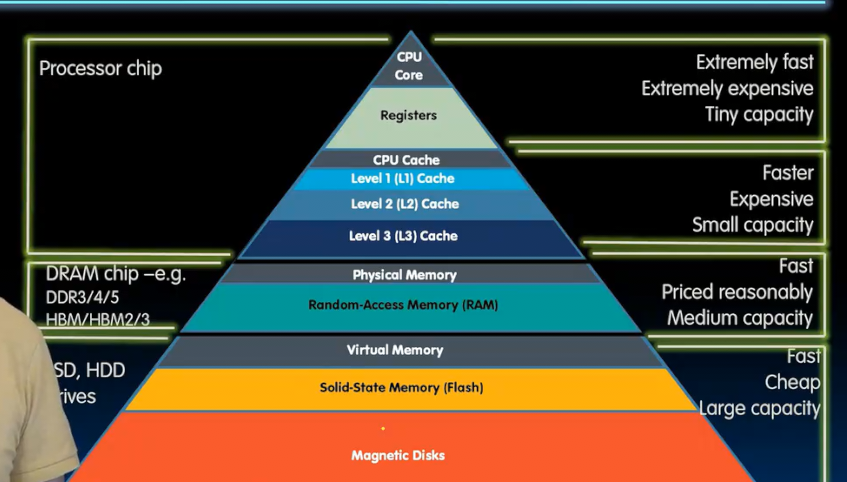

屏幕显示器输出 键盘输入 存储器（固态硬盘 磁盘驱动器）

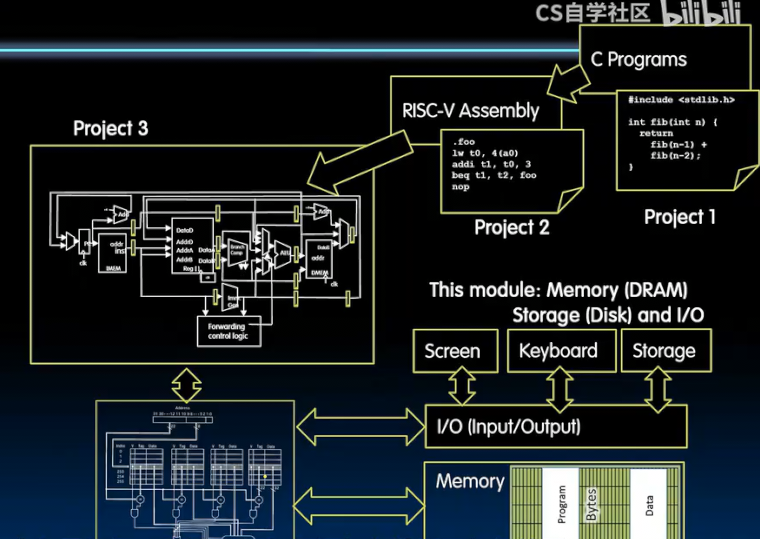

我们身边存在简单的计算机 **单板计算机** 一种简单的是树莓派 

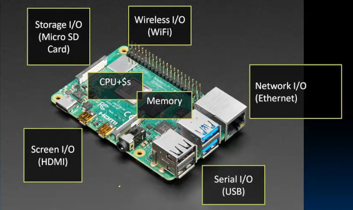

* CPU、缓存
* 主内存
* 存储器 IO口（SD卡）
* 屏幕 IO口
* 串行总线类型 串行IO口
* 有线网 IO口
* WIFI IO口

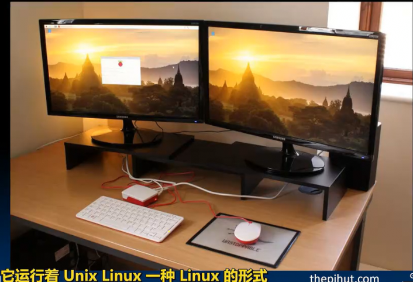

《Learning Computer Architecture with Raspberry PI》比本课程覆盖范围小一些使用树莓派学习的书

基于ARM 不是很开放 更复杂 但是有很多有趣的实验 从操作系统视角

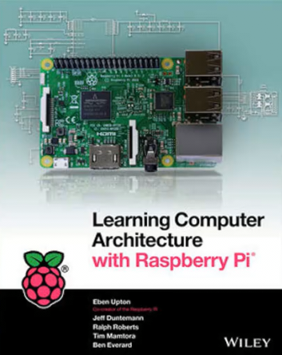

## 操作系统基础知识

使得我们同时运行多个应用程序 

软件部分：电脑上最复杂的程序

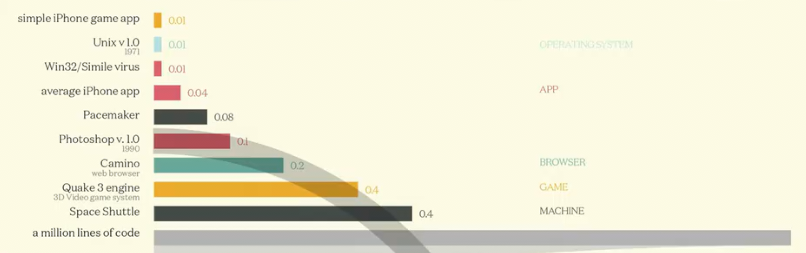

不同应用程序的代码库量

更换比例尺 

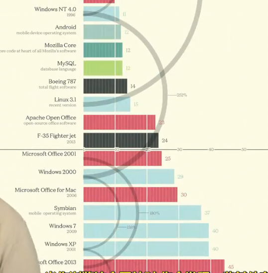

复杂的计算机系统 千万行代码库

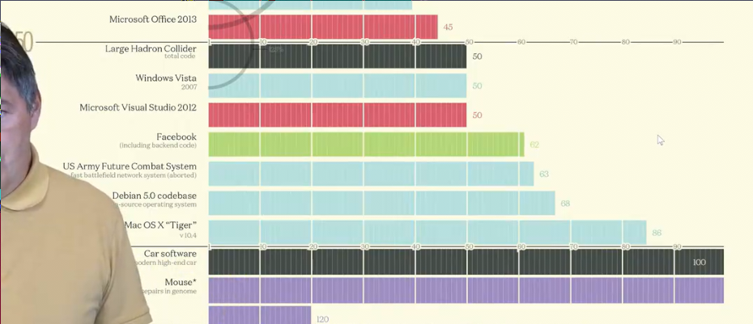

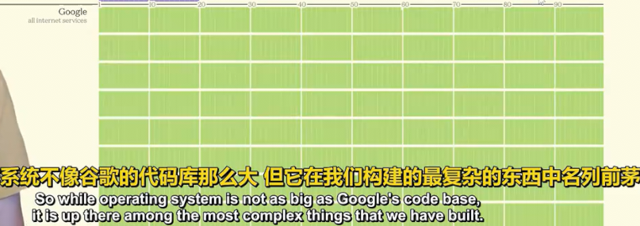

linux的内核代码库不断增长超过两千万行

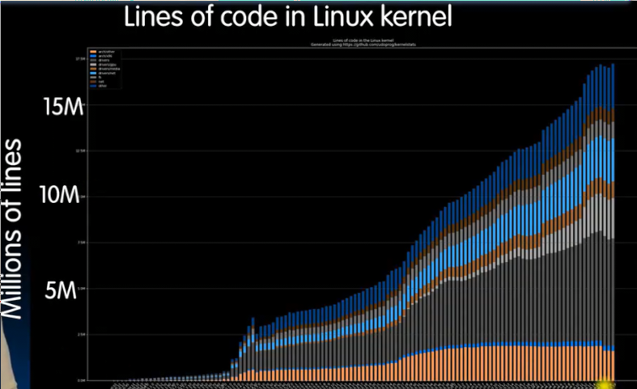

### 启动顺序

1. 操作系统是计算机启动时的第一件事（进次于bios和bootloader)
2. 操作系统找到并控制所有设备（IO口） 在linux中构建一个设备数
    * 知道有什么样的资源 以及用什么操作系统函数访问设备（通常依赖特定于硬件的**设备驱动程序**）
3. 确定计算机中内容后 启动服务(100+)
    * 文件系统
    * 网络栈 
    * 获取键盘显示器的驱动程序
4. 运行和管理程序 基础知识
    * 程序彼此隔离 共享系统资源和外围设备
    * 优雅地终结 故障程序

核心的功能

* 隔离 每个程序只在自己的世界运行（使用操作系统提供的服务）不会干扰其他程序
  * 两个程序访问或写入同一地址的情况不会出现，操作系统会拦截并映射到虚拟内存 转换为不同物理地址（需要硬件）
  * 支持保护和权限（用户模式和管理模式）RISC还支持介于两者之间的机器模式
    * 用户模式不应能造成任何损害 覆盖其他人
    * 管理模式可以改变内存映射将不同内存映射分配给不同用户
* 和外部交互 方便的方式和设备交互 磁盘 显示 网络
* 中断和异常 

启动时，首先PC被设置为特定值如0x2000，之后执行一些预定指令以启动操作系统（通常存储在闪存ROM 事实上可重新编程 仅仅是很少更新 写入慢读出快）

1. 从ROM加载BIOS到内存 并执行BIOS基本输入输出系统 找到一个存储设备 从那个存储设备（硬盘、USB驱动器）启动
    * 基本上是指定在哪里可以找到第一个数据扇区（数据块）
    * 第一个 数据扇区 有一些重要信息**BootLoader** 是加载操作系统的第一步
    * Bootloader可能支持多个操作系统 （双启动、操作系统的不同版本）

2. Bootloader将操作系统**内核**（基本关键功能）加载到内存位置并跳转
3. 操作系统启动 
    * 初始化服务 文件系统 设备驱动程序运行

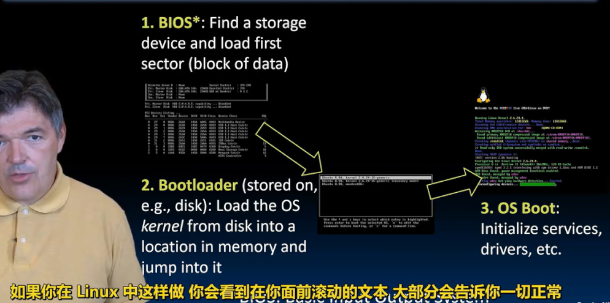

4. 进入一个等待输入的循环

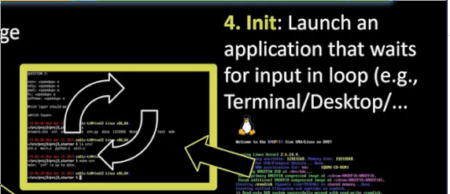

## 操作系统函数

在大多数操作系统中 应用程序通常被称为**进程**

**进程**和线程不同 具有独立的内存 在独立的内存位置工作

而**线程**始终在共享内存中

线程和进程都以**伪并行** 方式运行

* 用户看来 线程和进程看起来同时运行 但是处理器核心数量远低于正在运行的进程或线程数量
* 共享同一个核心 （操作系统管理 运行一个进程一小段时间 10ms 换出 放入一个新进程）
  * 使用定时器计时
  * 决定如何做和分配多少时间 是操作系统的**调度**工作

### 启动应用

应用程序通常由shell启动 通过系统调用 linux中syscall 启动os例程 

linux中的fork创建新进程 execv执行文件命令 加载应用程序

通过使用一些文件系统服务函数 将指令和数据放在内存中适当位置 之后准备堆栈

设置argc argv 跳转main函数 

shell等待程序完成 linux中join

### 管理模式

防止故障乱写磁盘 以及 恶意软件

操作系统限制应用程序可以运行的位置 可以访问的内存部分和设备

因此操作系统具有管理模式可以访问更多指令CSR 访问特殊的CSR寄存器 类似 Unix 的 超级用户 或 su

很少进入 最好不要频繁使用，因为这里的错误通常是致命的

### 系统调用

想要操作系统做一些事情时 

* 读取文件
* 启用新进程
* malloc
* 向网络或wifi发送数据

与其编写访问设备的单个例程 我们向操作系统发出系统调用 其为我们管理 

将一些参数放在寄存器中 引发**软件中断** 

操作系统接管并执行所需操作 之后返回用户模式

### 中断和异常

这两种时刻我们需要切换会管理模式

这也能解释`ecall`和`ebreak`的区别

* `ecall`触发更高权限的异常 （和操作系统的沟通方式 实现系统调用）
* `ebreak`触发当前权限的异常 （在当前权限内转移控制权）

### 61c的术语

* 中断 外部事件引起 独立于当前程序的运行 （按键 磁盘IO WIFI帧到达）
  * 通常不需要立即处理 而是先完成手头工作
* 异常是内部事件 程序出了问题 
  * 内存错误 总线错误 非法指令
  * 需要立即处理 
* 陷阱 我们处理这两种情况的方式 跳转中断或陷阱处理程序
  * 内存中一段为了处理中断或异常的程序

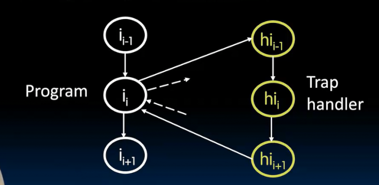

当进入陷阱处理程序前，必须存储机器的完整状态（所有寄存器 保存和临时都要）之后要恢复机器的状态 在超标量处理器中处理较复杂

触发陷阱 后面所有指令都转为空指令 控制权交给陷阱处理程序

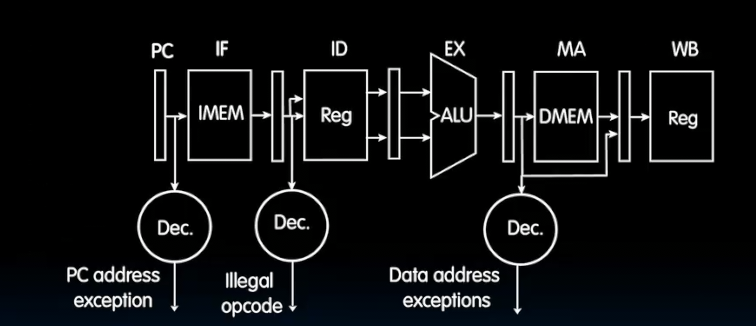
