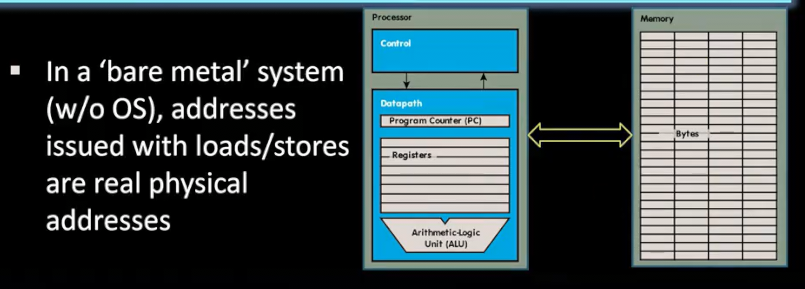
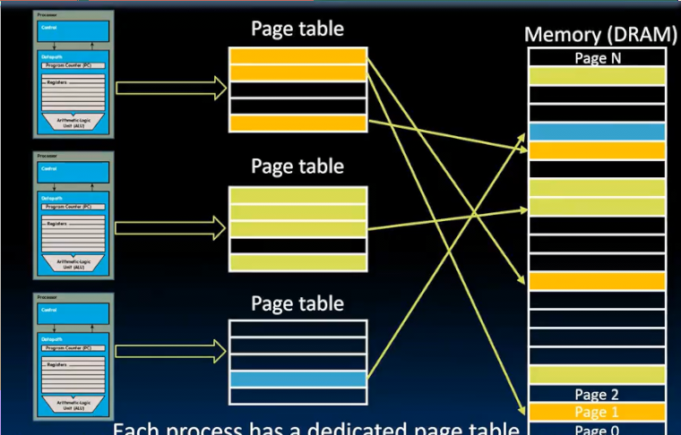

# 虚拟内存 

管理模式负责管理进程轮流占用核心 中断一个进程让另一个进程运行 

而我们还需要引入一种共享内存的方式 

**虚拟内存** 其作用是让每个进程和程序产生在任何时候都有一个极大内存可用的错觉

**页 pages** 一些常用的页驻留在内存 另一些放在磁盘中

页提供了运行需要内存大于主内存程序的能力 因为一些页面可以放在磁盘 

另一方面 虚拟内存使得操作系统能保护进程不受其他进程影响 

每个程序都有自己可以使用完整内存的错觉 但是图中表示 实际上程序使用的内存经过 虚拟内存在DRAM上的抽象 

虚拟内存管理器将程序认为的内存地址转换为真实的物理地址 管理 映射到真实内存上

* 虚拟地址空间
* 物理地址空间

去图书馆按照书名取书 在卡片上找到真实地址（可能在馆内，也可能在分馆）可以借阅多长时间（访问权限） 

## 物理内存和存储器

### 内存

动态随机存取存储器 

CMOS工艺

* 具有一位的DRAM位单元 
* 优化逻辑

DRAM单元比SRAM单元（静态 用于构建微处理器缓存）小得多 而密度更高 

无论如何封装，DRAM芯片和内存都是易失性的（断电丢失数据，SRAM也是同样）需要电源才能保持存储数据

第一次访问某个字 大概需要10ns，约30-40周期 但是！如果再读取或写入DRAM的附近位置块很多 仅仅0.5-1ns

DRAM比SRAM更易失 及时电源打开SRAM会保留数据 但是DRAM不会 数据以电荷形式存储 可能从DRAM中泄漏，因此需要每几百毫秒**刷新**（控制器访问DRAM读取并写回 *动态*）

### 存储器

磁盘 我们有两种硬盘 

* **固态硬盘** SSD 快 100000个周期 贵
* **机械硬盘** HDD 慢 10-20 M周期 便宜

都是非易失性存储器类型 断电也能保留数值

#### 机械硬盘

为什么这么慢？

磁盘主要是机械的 非常复杂的机电系统 数据存储在氧化铁中（类似铁锈）

机械臂在盘面飞行使得表面磁化存储数据 读取时悬停表面以读取

仅仅几nm的距离

转速非常快 大概一周六毫秒 因此读取平均要3毫秒 

#### 固态硬盘

没有任何机械设备 而是由**闪存**构成 有点像DRAM

由这些非易失性单元组成 及时关闭电源 电荷也存在

更加密集 

由于其组织方式 我们总是读写块 而不是字或字节

使用寿命有限 只能擦除几千次 通常不如机械硬盘可靠

闪存 随着发展不断堆积起来 目前达到128层

## 内存管理器

当没有虚拟内存时 内存寻找的是真实地址

当有多个进程时，每个进程可以发出任何地址 寻址任何部分

因此会出现相互覆盖甚至覆盖操作系统

解决方式是使用虚拟内存 在访问内存的真实位置时，查看是否具有权限

每个进程都有完整使用内存的错觉

内存管理器将每个进程的虚拟内存转换为真实内存

实际上是交错的，相互混合

* 映射虚拟内存到真实地址
* 保护进程间不干扰
* 当超过内存交换到磁盘（但是要控制少发生 避免过慢）

## 内存分页

在DRAM和磁盘始终移动固定数量的数据块

这种数据库叫**页**

* 不应太小 以免过于频繁交换
* 也不该太大 

现代操作系统一般为4KiB 12位来寻址 

因此虚拟32位地址 的 低12位来在页中寻址 高20位约一百万来找具体的页

每个进程分配一个页表 由操作系统管理（每一行表示一个页）

得到虚拟地址 管理器从 高20得到页码 找到这个页对应的真实地址 和低20位表示的偏移量计算得到真实物理地址

而保护功能
