# 分级页表
 
* [页表的大小](#页表的大小)
* [转换后备缓冲器_](#转换后备缓冲器_)
  * [设计](#设计)
  * [如何进行地址转换](#如何进行地址转换)
  * [数据通路](#数据通路)
* [评估虚拟内存的性能](#评估虚拟内存的性能)

## 页表的大小

在32位虚拟地址中 4KB页面 则一个进程可能有2^20个页 

而一个页表应当可以容纳这些页的目录 **条目**

假设一个条目为一个字的大小 那么页表大小2^2 * 2^20 = 2^22 = 4MiB

对于缓存太大，但是4GB的DRAM可以接受

但是进程上百个，假设可以支持256个进程 那么所有页表总大小是巨大的 2^8 * 2^22 = 2^30 = 1GiB

此外，更大的虚拟地址导致总大小爆炸式增长

一种改进是增加页表大小，这样其占用虚拟地址的Offset位多了，那么表示页码的地址就少了，因此每个页表条目变少，总大小减少 但是会更多内存浪费（如果程序使用少于页大小的块）

**分级页表** 

* 一级页表寻址更大的内存块 下一层定位到更小的内存块

因为大多数程序都有很多空闲的内存

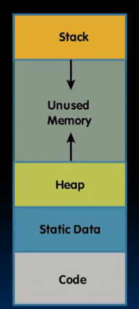

不分级内部指针多数情况指向空的位置 一些会指向有效位置

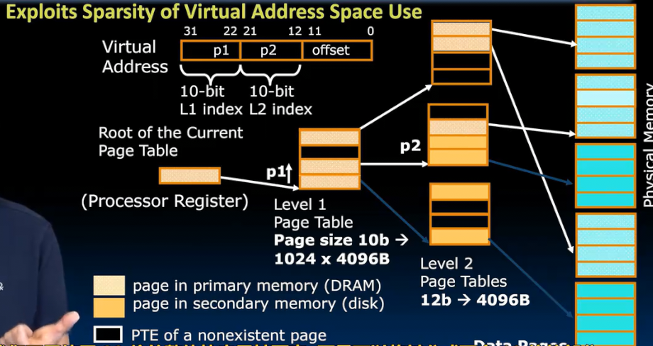 

将高位分为两个10位

第一个10位 用于寻址 1024 * 4KB的块 每一个对应1级页表的某一条目 1级页表有1024个条目

1级页表的每一条目指向2级页表 二级页表有1024个条目（由p2十位寻址），每一个对应4KiB的块

而现在2级页表的指针指向物理内存4KiB的块 但是绝大多数指向空的位置 

因此可以压缩 而减小空间占用

我们需要一个**管理程序页表基址寄存器**`SPTBR`指向某进程的1级页表

当切换进程，我们只需要改变SPTBR指向新进程的一级页表

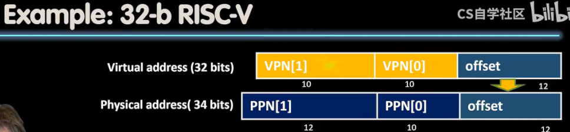

这是RISCV 32位的 虚拟和物理地址

对于页表 RISCV32位 规定如下

* 物理页号 
* 状态位（指示页的状态）
  * 让RWX 都为0 （读取写入执行）则指向下一页表

## 转换后备缓冲器_

在硬件中的加速

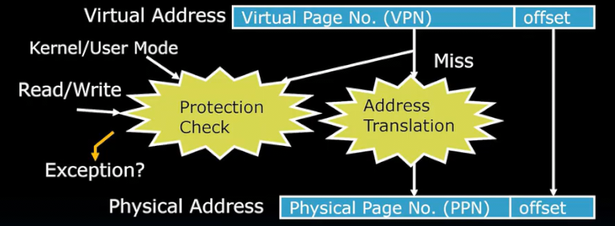

我们需要地址转换才可以访问到内存，但是在此之前先进行权限和保护检查

我们希望这一切发生在一个周期

**转换后备缓冲器 TLB** 位于处理器内部 作用是加快这些过程的速度

就像一个小缓存 

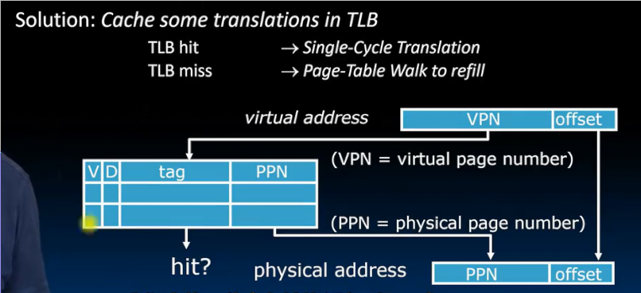

缓存机制如下

* 将一些内存转换缓存到TLB中 （TLB是一个包含少量最近被引用条目的结构）
* 因此虚拟地址首先在TLB中寻找匹配 如果匹配到，则从TLB得到物理地址 并据此访问内存 *TLB 命中*
* TLB 未命中 则去页表中找，并更新TLB

TLB 同样包含状态位

### 设计

通常是小和块的32到128个条目

通常全关联 

更大型可能256或512个，但做成组关联以支持硬件

替换常见的是FIFO 先入先出 （LRU可能有些昂贵 难以在一个周期内完成）

假设TLB有64个条目 指向4KiB页面 范围？

64 = 2^6 4KiB = 2^12 B

共2^18个地址 256KIB

在数据通路的哪里？

我们先访问FLB找到数据位置后再访问缓存

因此缓存接受物理地址

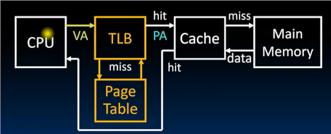

1. cpu发出虚拟地址 TLB接收
    * TLB命中 发送物理地址给缓存
    * TLB未命中 从页表中查找物理地址给缓存 
2. 缓存查找数据
    * 缓存命中 返回数据给CPU
    * 缓存未命中 从内存中加载数据给CPU

TLB通常被设计非常高的命中率 甚至远远高于99%

### 如何进行地址转换

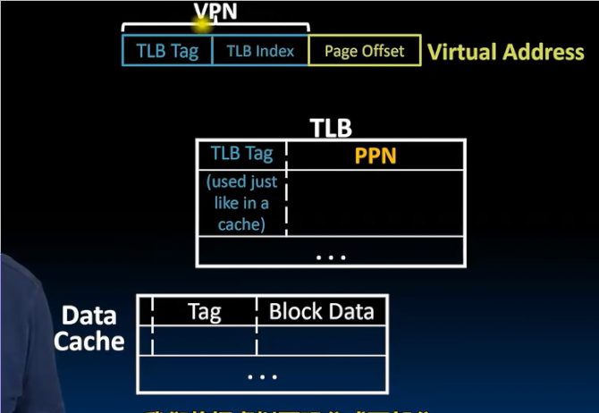

虚拟地址 分为 VPN和偏移量

VPN在不使用全相联TLB时，分为两部分

之后TLB接收 按照缓存的方式 

* 命中 意味着要查找的页地址存在于TLB
  * 页地址出来和偏移量组成真实地址

这个真实地址再次被缓存可读的方式拆分 输入缓存

如果缓存命中 数据输出给CPU

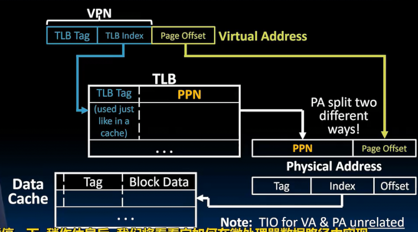

### 数据通路

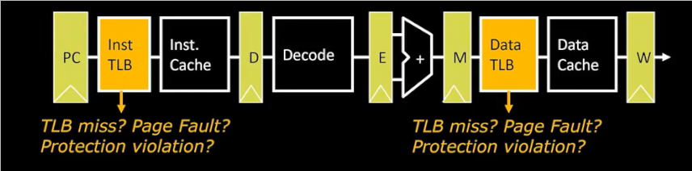

这是我们之前的五级流水线

但是在指令缓存和数据缓存前插入两个TLB

PC发出虚拟指令地址 由指令TLB转换为真实指令地址得到指令

而指令中，我们得到虚拟数据地址 数据TLB 转换为真实数据地址

如何处理 未命中 页错误等情况？

* 未命中  硬件或软件遍历页表并更新
* 页错误 陷阱 中断 停止并取消加载或存储指令 
  * 直到在DRAM中页可用
* 保护违规 操作系统同样会知道并中断

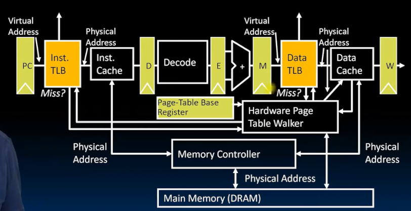

内存控制器 和 缓存 协同工作  

是一个用于将处理器语言转换为DRAM语言的数字系统（很庞大）

通过其 处理器知道如何使用内存 刷新 读写 处理突发

当TLB未命中 在图中的**页表遍历硬件**中查找

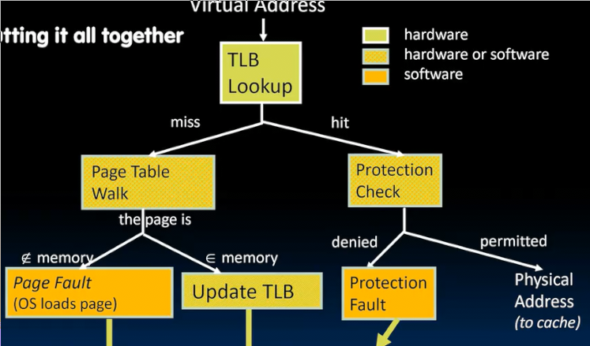

虚拟地址开始 

* 多数情况命中 TLB  检查状态位是否允许进行想要的操作
   * 允许 发出物理地址 进入缓存
   * 不允许 保护故障 操作系统在软件中处理 
* 少数情况 没有命中 TLB 遍历页表（通常在硬件完成）
   * 如果页面在内存 更新 TLB 
   * 如果页码在磁盘 发出页错误 让操作系统加载页面等

## 评估虚拟内存的性能

对比缓存和虚拟内存

| 内容 | 缓存 | 虚拟内存 |
| - | - | - | 
| | 块 | 页 |
| 未命中 | 未命中 | 页错误 | 
| 块大小 | 32-64B | 4KB也有小一些和大一些的 |
| 放置方式 | 直接映射 组相联 | 全相联 |
| 替换策略 | LRU 或 随机 | 少用LRU FIFO 随机 |
| 写回策略 | 直写 回写 | 回写 |

虚拟内存 通过 分页 将 DRAM 扩展到 磁盘

我们考虑 数据 不在 DRAM 而需要一直 访问 磁盘 才能检索数据的情况 

因此每条指令周期数和平均内存访问时间等依然使用 但是内存此时相当中间级缓存

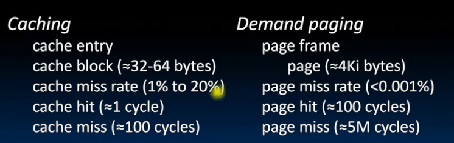

和缓存性能的计算大致相同

但是page hit需要去内存 page miss需要去磁盘

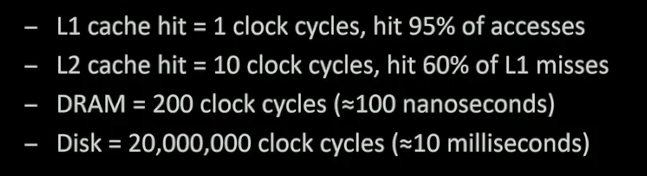

没有分页的计算如下

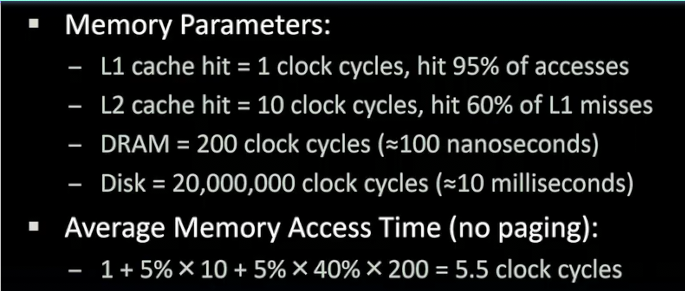

添加分页的影响

分别是 L1 L2 内存的 未命中率 只是添加最后一层磁盘

如果内存的分页命中率是99%

那么平均周期

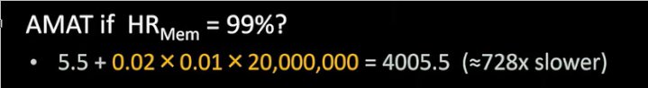

非常慢 但是现实中常会发生 trashing 颠簸 太多程序共享 

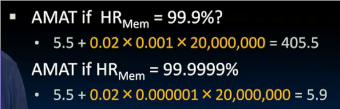
