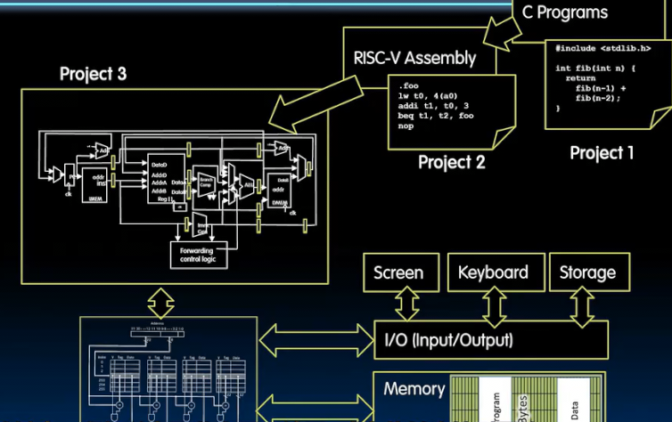
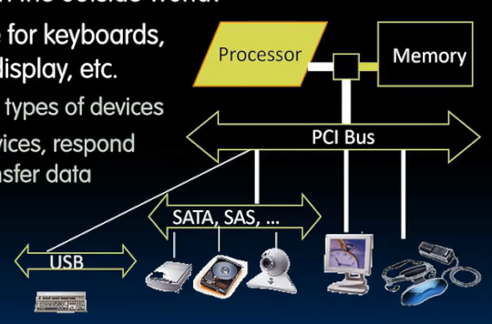
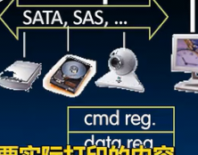
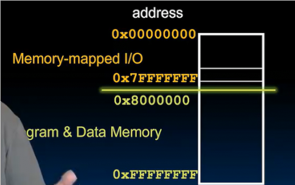
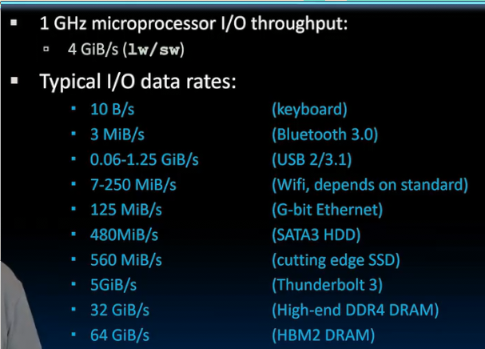
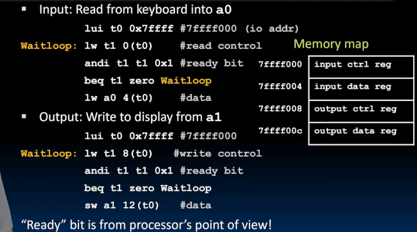
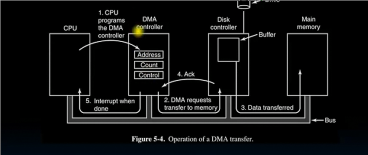

# 输入输出设备
 
* [和设备交互](#和设备交互)
* [io轮询](#io轮询)
* [io中断](#io中断)
* [直接内存访问](#直接内存访问)
* [网络](#网络)

我们需要在我们构建的目前已经可以运行指令、编译过的C程序的计算机添加IO设备

了解这些IO设备如何连接的原理

## 和设备交互

我们希望以一种统一的方式处理这些设备

但是设备的类别 数据呈现和处理方式不同 

设备通常通过某种层次结构的**总线连接**

与外界通信的方式通常通过标准化接口 （接口由命令寄存器 状态寄存器 数据寄存器组成）

* 检查状态 了解设备是否准备好通信 然后协调底层进程如何访问
* 命令寄存器 存储命令 如打印
* 数据寄存器 存储如打印的内容

ISA如何满足这种要求呢

* 设计特殊的输入输出指令 与 每种类型的设备通信的硬件
  * 设备在变化 每几年就会出现新标准和接口
  * 旧的设备会过时，ISA要一直支持 存在很长时间的东西
* 或者 **内存映射ID**
  * 地址空间中的一些低地址 专门用于IO 是IO命令寄存器和IO数据寄存器所在位置
  * 我们不会用到这些内存 对我们的程序不可见 由操作系统管理 （我们的进程可能允许从此处读出或写入）

每个IO设备都在内存映射IO区域有一个**其控制、数据寄存器的副本**

不同设备读出写入速度不同

多数都低于处理器速度

我们需要对此处理

## io轮询

* 控制寄存器 告诉我们是否可以读取或写入设备
* 数据寄存器 包含数据

在轮询中 处理器反复定期检查 控制寄存器

* 其中一位代表 **就绪位** 设备已准备好接收数据或者一些数据已准备好发送到处理器

然后处理器 写入和读取 数据寄存器

图中存在一个输出和一个输入设备

在上方输入 当就绪位为0，一直呆在循环 直到为1，则加载数据寄存器的数据

在下方输出 当就绪位为0 一直呆在循环
知道为1 写入

但是这种处理并不高效

假设我们的处理器是1GHZ 如果一次轮询需要400个时钟周期

我们通常每秒轮询鼠标约30次以免抖动 那么 占比 400 * 30 / 10^9 = 0.0012s

这看起来还可以接收，然而当我们轮询所有设备 并且我们不知道何时停止鼠标的轮询（在没有人操作时） 就会浪费很多 

轮询磁盘 磁盘每秒产生16MB数据 而每次论询可以处理其中的16B 因此我们需要每秒轮询100万次

周期占比为 10^6 * 4 * 10^2 / 10^9 = 0.4 

这是不可接受的 并且每次轮询16个字节的小块数据可能没多大意义 

我们需要更好的机制

## io中断

轮询会浪费资源 如果io设备没有东西要告诉我们 我们依旧会耗费时间检查

io中断类似于门铃 使得我们不必每分钟去门口看客人是否到来

当有一些数据要传送给我们 会抛出或引发中断

中断当前程序 控制权交给操作系统 处理中断

适用于低速设备 鼠标键盘等 更受欢迎 

产生大量数据的设备 如WIFI 当有数据要发送时 通过中断 启动数据传输 

但是通常情况 如果传输大量数据 使用另一种机制 **直接内存访问** DMA

**程序化IO** 一种旧方法 精心设计的轮询 和 ATA硬盘（所有与硬盘间的数据交互都是由CPU处理）一同引入 5%的时间会用于数据

## 直接内存访问

适用于消耗大量数据的设备

目前为止 和 能读取写入内存的只有 CPU

我们要设计一种帮助处理器将大块数据移入或移出主内存的硬件 以缓解处理器压力

DMA引擎可能和处理器位于同一芯片 但是将在CPU的监督下控制 内存

DMA引擎独立工作 有一些CPU可写的寄存器 

* 存放数据内存地址
* 传输字节数
* 应当执行该操作的IO操作编号
* 传输单位以及每次突发传输应该执行多少数据

CPU从设备接收到中断

1. CPU写入DMA的寄存器  *启动传输* 指示其将数据放置在内存特定位置
2. DMA将请求发送给设备控制器
3. 找到设备控制器（这些有很多数据移动的设备通常是磁盘或者磁盘控制器）
    * 现代磁盘通常有缓存区 
    * DMA引擎将缓存区的内容传输到CPU指定内存的特定位置
4. 传输完成后 设备控制器发送确认信号给DMA引擎 
5. DMA引擎给CPU发送中断信号 告诉其传输已完成

CPU仅在开始和结束两个之间被中断 在传输途中做自己的事情

当设备想从内存中获取数据也是一样的

1. CPU确认外部设备是否就绪 开始传输
    * 指示DMA数据在内存中某处可用
2. DMA和设备协同工作 期间CPU做其他事情
3. DMA中断CPU 表示完成

DMA放在哪里？

通常是最后一级缓存和主内存中间 这样不会弄乱缓存 但是需要处理 一致性

## 网络

也是一种IO

协议背后是什么呢？

一般我们发送数据包（由软件生成） 软件将**数据包**复制到操作系统缓冲区

操作系统会计算某种**校验和** 以防止在传输过程中出现错误（某些位损坏）

启动一个定时器 操作系统将数据发送到一个硬件网络接口 

接收端：数据出现在另一个网络接口 并被传输到操作系统数据缓冲区 

操作系统计算校验和 如果没问题 向发送方发送确认信息

如果有问题 则 删除信息 发送方会重新发送 

如果发送方计时超时而没有收到确认，则发送方也会重新发送

如果一切正常 操作系统会将其复制到用户空间 并向应用程序发送继续信号

网络接口卡 数据传输以前采用PIO 现在是DMA
