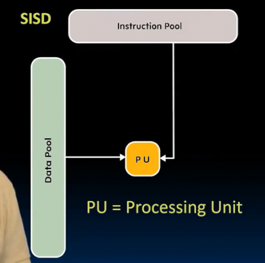

# 并行
 
* [矩阵乘法](#矩阵乘法)
* [矩阵乘法的并行性](#矩阵乘法的并行性)
  * [单指令单数据](#单指令单数据)
  * [单指令多数据](#单指令多数据)
  * [多指令多数据_](#多指令多数据_)
  * [多指令单数据](#多指令单数据)
* [simd架构](#simd架构)
* [使用这些并行扩展](#使用这些并行扩展)
  * [例子](#例子)

为了保持在合理的功耗 找到其他能提高性能的方法（相对于不断加深流水线）

数据并行性 在应用程序中的向量 同时执行多个加法 *机器学习*

矩阵的操作也广泛运用在工程中

在内存中是顺序存储的 按行或者按列

对于k从0到最高，可以同时进行，最后再求和

## 矩阵乘法

程序实际是三重循环

吞吐量 百万次浮点运算 指的是每秒百万次

可以看到和N的关系不大

最内层循环是两次浮点运算 相乘 相加

因此共 N^3 * 2次浮点运算

速度怎么样呢？

在c中

对此计时

相比较

C可以运算的更多更快 单位是 Gega 240倍

而且在N达到一定大小前，浮点运算数近乎恒定，之后开始下降 *可能和缓存大小有关 超出了缓存*

## 矩阵乘法的并行性

一种加速方法是 我们更底层 用汇编来写 （不过现在的编译器已经很强大 超过他们不容易）

另一种是 在我们处理更大矩阵时 尝试解决减速问题 **阻塞技术**

此外 可以通过**并行性** 同时进行多个乘法的硬件 并发完成循环的大部分

软件和硬件的并行性的选择是独立的

对于硬件的并行性

* 单指令单数据 我们目前遇到的所有 单核顺序处理器的运作方式
* 单指令多数据 SIMD
* 多指令单数据 
* 多指令多数据 MIMD

我们在本模块讨论大多数都是多数据架构 

现在大多数是两者的结合 单程序多数据 单个程序尝试使用多个并行度 SPMD

SIMD 是一种特定类型处理器 有专门的硬件同时运行多个数据 **锁步**以处理多个数据 适合运行数组 （一条指令遍历数组的一维）

### 单指令单数据

顺序处理器  顺序遍历指令池

一次处理一个数据

### 单指令多数据

具有多个处理单元 

发出一个指令 比如ADD 但是对多个数据操作

### 多指令多数据_

同时运行多个指令 但是每个指令都对多个数据操作

通常是多个处理器完成（每个处理器都是一个SIMD处理器）

### 多指令单数据

我们目前不会真正遇到 相同数据集的概念（对相同数据不同操作）

## simd架构

利用数据级并行性  一条用于向量的指令 作用于两个向量的每个元素

或许我们可以直接获取数据块

英特尔 对于多媒体的流行 我们要对向量进行过滤操作

两个相连放在宽的寄存器中 对于每个部分 用一条指令 向量化操作 MMX 多媒体扩展 AVX扩展

SIMD的宽度不断增加

英特尔不得不在相当复杂的指令集中添加指令 新的寄存器（以便在其中操作）

我们确实获得一些加速

但是依然没有绕过缓存的显示 N的增大会发生减速

额外的向量寄存器 可以被拆分

MMX通常将64位分解为8位 并作为整数用于音频

SIMD打包

不同代的处理iq支持不同类型的**矢量扩展**

非常适合处理视频、图像、神经网络 但是却使得寄存器越来越多 越来越大

我们的CPU有一个浮点数运算单元 sse avx

## 使用这些并行扩展

我们想在一个数组上操作 对于每一个元素 找出该元素的平方根并将结果写回内存

如果是SISD 则要依次对于每个元素 加载到寄存器 进行预算 保存回内存

而SIMD中 如果是英特尔处理器常见的4路宽 SSE风格 指令

一次取出数组中4个元素 加载到SSE寄存器 进行运算 写回内存 4倍的加速

两个向量相加

SSE指令

 

然而我们通常不会自己编写汇编指令 

而是交给编译器 但是编译器通常不能非常好地调用这些指令

当我们想要极致性能时，更常见的是在C语言中使用**内部函数** 本质上是C函数 用汇编指令替代了那个内部函数指令

*在C代码中插入汇编* （和SSE指令一一对应）

### 例子

假设数据按照列存储

第一列乘以第二个矩阵的第一个元素 得到 目标矩阵第一列的一部分

1. 首先初始化目标矩阵
2. 加载A操作数到 XMM 寄存器中
3. 加载B

我们执行乘法和加法

