# 线程级别并行
 
* [多个核心](#多个核心)
* [历史](#历史)
* [线程](#线程)
* [多线程](#多线程)

更快地程序

* 我们现在已经达到了时钟频率的极限 （由于功耗）
* 使用单指令多数据 
* 同时执行多个任务 多CPU

本节研究同一程序 同一数据的并行性

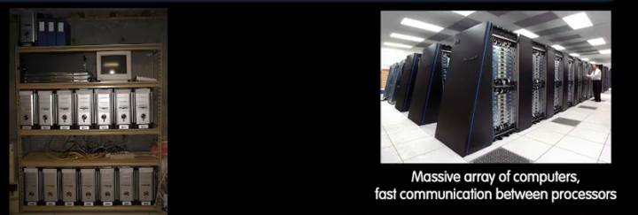

多个计算机协调完成一个任务

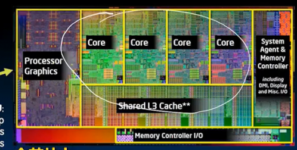

多核机器 完成并行

这是不同级别的并行性

## 多个核心

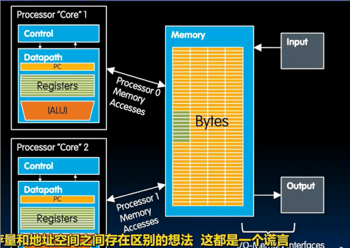

两个核心 并不能使内存翻倍

而是每个内核都有自己的控制单元 数据通路 PC 计算器 *两个完整的计算机在同一芯片* 彼此完全自主 

共享内存 IO和共享的内存通信 **共享内存模型**

处理器如何协调 同时读取写入一个地方的问题？

每个核心 有自己的 数据通路 寄存器 L1 L2等等 但是L3可能会共享 DRAM也是

**多核微处理器** 多个核心（可以在一个芯片上 可以说是一个CPU（这个词已经有点模糊）） *一个CPU 拥有多个核心*

## 历史

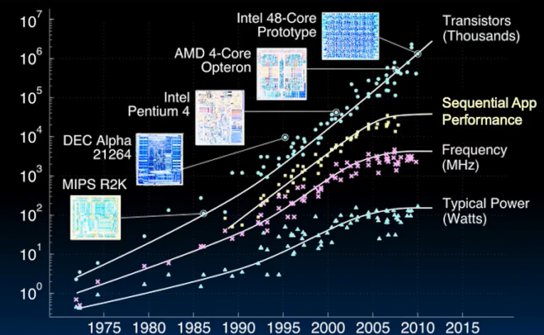

摩尔定律是一个芯片上容纳的晶体管 

在2005年左右 频率不再增加 功耗不再增加 但是性能也不再增加 

尽管摩尔定律仍然继续

此时出现多核心的概念 

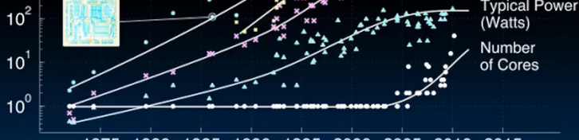

同样指数级增加 而同时并行应用的性能指数级变好

每个核心可以连接整个内存 缓存要是一致的

多个核心和彼此做不同任务 也可以做相同事情的不同部分

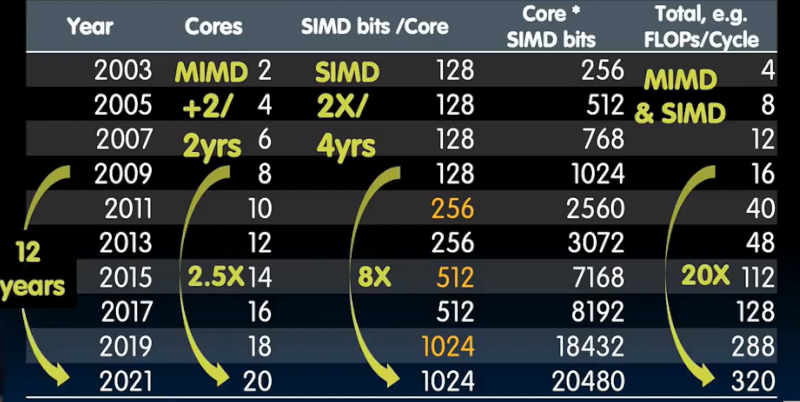

每几年增长几倍

## 线程

对于这样复杂的多核机器 如何使用呢？

`ps -x` 

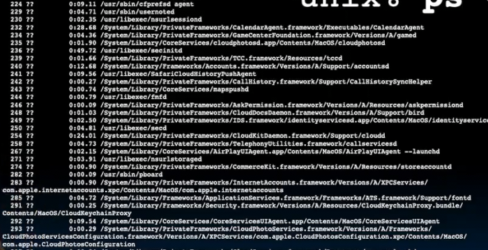

有几十或者上百个任务正在进行 但是这么多任务同时进行 风扇却没有转 

线程是一个**执行线程** 一串指令流 

一个程序可以将自身分割为若干线程 单独执行并组合

当一个单核CPU时，其几个线程**时间共享**

每个线程占用一段时间 暂停 处理下一个

当线程过多 每个线程分得时间越少 开始卡顿或者掉帧 **分时系统**

对于线程更深入的解释

* 执行某些任务的指令序列流 （之前我们称之为程序）
* 每个线程
  * 存在一个专用的程序计数器 以了解线程做什么
  * 单独的寄存器
  * 访问共享内存
* 每个物理核心 可以提供一个或者多个硬件线程 **硬件线程是在核心上运行的线程**
* 操作系统支持多个**软件线程** 可以在他们间多路复用 （比如一个程序可以把自己分成100个线程 称为软件线程）

线程具有**不确定性** 我们不知道执行顺序和返回顺序 程序员的工作是对此进行管理

划分比硬件线程更多的软件线程是有意义的

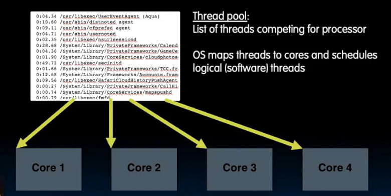

守护进程是不断运行的东西 不会结束

## 多线程

目前每个核心只可以有一个硬件线程 或许可以有多个

**硬件辅助软件多线程**

一个核心中运行多个线程 

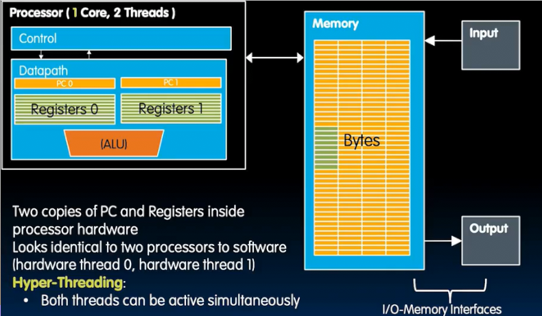

独立的PC和寄存器 但是相同的ALU 数据通路 **超线程**

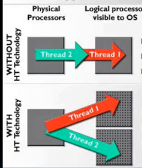

过去一个物理处理器可以运行 一个线程 

但是现在每个物理处理器对应两个操作系统可见的逻辑处理器 处理两个线程

**多核** 代表着一个芯片中具有多个核心 他们有独立的ALU **多线程** 代表 每个核心具有多个逻辑核心 （逻辑核心间共享ALU 但是有独立的寄存器）

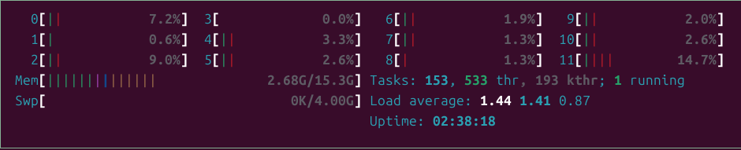

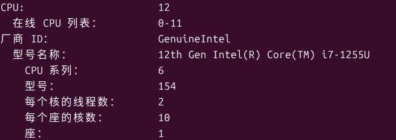
