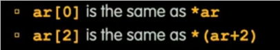

# 指针和数组
 
* [变量声明](#变量声明)
* [未定义行为_undefined_behavior](#未定义行为_undefined_behavior)
* [地址和值](#地址和值)
* [值传递和指针传递](#值传递和指针传递)
  * [值传递](#值传递)
  * [指针传递](#指针传递)
* [未定义的指针](#未定义的指针)
* [指针的高阶技巧_函数指针_任意类型指针](#指针的高阶技巧_函数指针_任意类型指针)
* [指向结构体的指针](#指向结构体的指针)
  * [指针的运算](#指针的运算)
* [数组](#数组)
  * [指针和数组的关联](#指针和数组的关联)
    * [对于常量良好的编程风格](#对于常量良好的编程风格)
  * [分段错误和总线错误](#分段错误和总线错误)
    * [分段错误_segmentation_fault](#分段错误_segmentation_fault)
    * [总线错误_bus_error](#总线错误_bus_error)

## 变量声明

在Java中，一个变量声明后，会有一个默认值，如数字中的0

而C中，一个变量声明却未赋值，其为"垃圾"，是一个未知的盒子, 使用其常常会出现问题

## 未定义行为_undefined_behavior

其不可预知，可能运行100次正常，第101次崩溃

是一种不稳定的bug，我们更希望能稳定出现的bug

`Hersenbugs`

## 地址和值

我们能访问和控制的所有内存都是一个非常大、无限大的数组, 其每个单元格有自身的**地址**，还有其内包括的值, 也可以给其起一个别名（变量名）, 每个单元格就可以作为一个变量

指针是一个**其值是别人的地址**的单元格

p 指向 x 意味着**单元格p其内的值为单元格x的地址** 

* `int *p` 表明p是一个**指向int类型单元格的指针单元格**
* `p = &y` `&y`表示y**单元格的地址** 与 `y`表示y单元格的值区分
* `z = *p` `*p`表示**p单元格（指针）指向单元格的值** 与`p`表示p单元格的值区分

## 值传递和指针传递

### 值传递

* y单元格的值被传递给了新单元格x，而函数中操作的是x单元格的值，对y没有改变

### 指针传递

尽管在函数调用时创造了新的单元格p,但是我们把单元格y的地址传递给了p,而函数中通过解引用的方式操作了指针p指向的单元格y

## 未定义的指针

`ptr`单元格中的值未知，我们对其解引用，不知道操作的是那个单元格的值，发生危险

## 指针的高阶技巧_函数指针_任意类型指针

* 指针可以任何数据类型，但是如`int *`类型的指针只能指向`int`类型
* 可以通过`void *`指向任意类型
* 可以有指向函数的指针`int (*fn) (void *, void *) = &foo` 
    * 表示返回值为`int`的，具有两个`void *`参数的指针
    * `(*fn) (x, y) 可以调用 `foo`
* 空指针是安全的，可以把指针初始化为`NULL`，其值为0,此时`if (p)`结果为false

## 指向结构体的指针

`p1 = p2` => `p1.x = p2.x; p1.y = p2.y`

并不是指针变化，p1和p2**仍为不同的存储空间**，改变p1不会影响p2

### 指针的运算

`p + n`

实际加上`n * sizeof(p指针指向的类型)`个真实地址（字节）

## 数组

### 指针和数组的关联

指针和数组可以相互转化

但是数组的指针被`const`修饰，因此不能改变其指向

**数组只在其生命的作用域内有效**

在函数的传递时，无论形参为`int arr[]`还是`int *arr`，都**只传递指针而不传递大小**, 而**字符串例外，由于其大小的判断以`\0`为准**

#### 对于常量良好的编程风格

而不是多个硬编码

### 分段错误和总线错误

#### 分段错误_segmentation_fault

意味着正在读写无法访问的内存

#### 总线错误_bus_error

对齐方式错误
