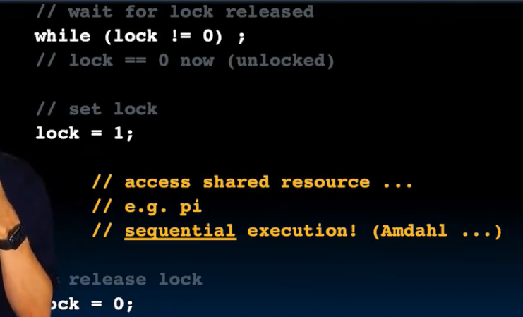

# 线程级并行_其二
 
* [openmp](#openmp)
* [例子_计算pi](#例子_计算pi)

支持并行的语言 Go可能是一种间接实现此目标的语言

内部函数是一种直接在汇编级别放置代码的方式（因为编译器还不知道如何自动生成 *SIMD*正在不断添加到编译器中）

编译器的下一个目标是将C语言**自动并行化**

实现并行有很多方式 人们还没有达成统一 有一些很独特而具体 我们学习一种OpenMP的方式

## openmp

这是一个单线程循环

如果我们有4线程 可以每个worker 处理其中25个

另一种切片则是对余数分类 但是对于缓存很不友好

在Openmp中

只需要 `#pragma omp parallel for`

推荐`gcc-5`因为只需要简单的指令

我们之前了解到软件线程映射为硬件线程运行的顺序是不可预测的 尽管这里看上去是按照顺序完成的 但实际上我们每次运行结果顺序都不同

因此，在考虑编写代码时，一定要保证结果不受到完成顺序和完成时间的影响而发生异常

如果编译器不认识OpenMP 则会忽略 #pragma

    

主线程进行分支 合并

我们只负责编写软件线程 而硬件线程的映射则是由操作系统完成 

## 例子_计算pi

我们计算圆的第一部分

对其积分得到 1/4 pi 的数值解

然而，我们还可以对这个函数积分

容易一些 因为没有平方根

取了十个步长 计算到对应的y值 然后取矩形 加和

我们可以增加step 并且并行化

但是！每个线程需要访问共享变量sum（其在变化） 可能在写入的是sum变化之前的 会发生混乱 

需要考虑不被软件线程共享写入的方式 可以每个线程写入数组的一个元素 最后加起来

指定了软件线程数

然而这种是不可取的

发生了写入共享 **竟态问题** 我们需要某种锁

原因的产生是两个线程同时访问了旧值并对其更新 解决方式是在需要修改共享值时锁定 阻止其它线程对其访问 修改结束后解锁

`lock`

但是！在线程1将要设置锁定前，线程2仍有可能判断是否解锁通过并进入 *争先恐后地设置lock* 在此层面没有解决方案 需要底层更基础的修改
