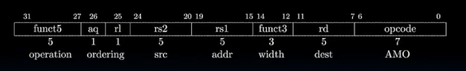
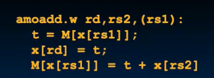
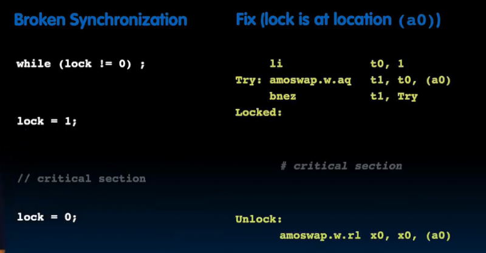
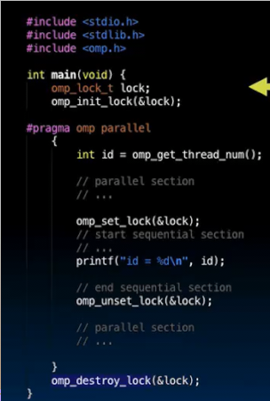
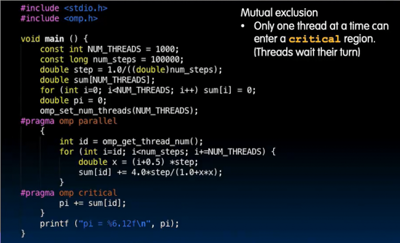
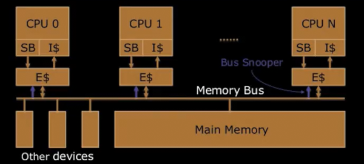
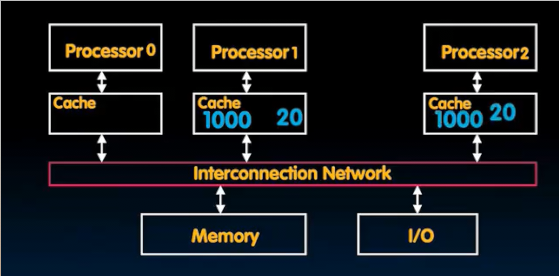

# 线程级并行 其三

## 硬件同步

在使用OpenMP时

* 注意缓存友好
* 二重循环通常不好并行
* 不要使用`break` `return` `exit` `goto`来**跳出** `pragma`块
* 不要让共享变量影响 **硬件同步**

**原子读写** 可以在一条指令中进行读写 并且期间不允许其他人进行访问 （共享内存时）`amo`原子内存操作

* 对内存中的操作数执行运算 并将原始内存值设置到目标寄存器

RISCV中

* 可以将rs2的值添加到内存rs1的原值上 原值写入寄存器rd 合成为1步

假设a0指向的内存表示lock 初始化为0 （未锁定）

将a0指向的内存设置为t0（1） 原值写入t1（0)

如果t1为1 意味着原来已经锁定 那么回到try进行等待

如果t1为0 则原来未锁定 现在锁定了 继续

在最后进行释放，交换出1

关键在与`amo`是一个原子操作 在我将1交换进入时，没有人可以进行判断

在C语言中 

* 事先声明并初始化（引用传递）一个`omp_lock_t`的锁
* 在线程中 访问可能引起争用的共享数据时，先`omp_set_lock` 访问完毕`omp_unset_lock`
* 退出多线程后 `omp_destroy_lock`

所有语言都支持这种锁的概念

* `critical`那一行对其作用域下生效锁 开始设置 结尾取消

## 死锁

引入lock可能导致死锁

每个参与者彼此等待 导致系统冻结

五个哲学家 五把叉子（围坐 左右各一把）

他们在思考 直到左右的两个叉子可用（有一个就拿起那个 两个就拿起两个） 但是只有拿起两个叉子时才可以吃一口后放下

这时如果每个人都拿起左手的叉子 就会僵住 都在等待右侧的叉子

`omp_get_wtime` 返回从过去某个时间开始经过的挂钟时间 

## 共享内存和缓存

内存是共享的，通过其中的共享变量 存储和通信

那么缓存呢

每个核心都有自己的虚拟缓存 只有没有命中私有缓存时，才需要进入共享空间

假设1和2处理器想要内存1000处的20

* P1发出地址 在缓存中没有找到 加载内存中的到缓存
* P2发出地址 同样要到内存中加载

每人都有一个副本 但是！如果处理器0要写入0到地址1000

在缓存中没有找到，于是去内存寻找 加载到缓存后 修改并直写回内存 此时p1和p2缓存中数据错误

### 缓存一致性

当缓存未命中或者写入时，要通知其他处理器 *添加新的通信方式*

`Snoop`协议  

每个缓存的每个块都跟踪一些位记录状态 

* 共享状态 其他缓存可能也有这个块的副本
* 修改状态 如果我是修改状态 那么意味者我有最新的副本 并且其他缓存没有这个新版本 
* 独占状态 和修改的不同之处在于独占状态下 内存中数据是新的 同时其他缓存没有
* 所有者状态 我的副本是新的 同时其他拥有此块缓存都是共享状态
  * 唯一有权进行修改的人
  * 20改为40 我可以和其他缓存共享我的40 他们也拥有40 如果某个核心的缓存中没有存储过这个数据 但是其去读取这个40 可以询问其他人 

