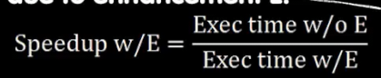

# MapReduce
 
* [阿姆达尔定律](#阿姆达尔定律)
* [请求级_数据级并行](#请求级_数据级并行)
  * [请求级并行](#请求级并行)
  * [数据级并行](#数据级并行)
    * [mapreduce](#mapreduce)
    * [集群](#集群)
    * [sqark](#sqark)

## 阿姆达尔定律

升级任何事物 对其有一些增强E 如果想衡量加速效果是多少

有一个公司规划i

加速比 等于 未使用执行时间 / 使用增强执行时间

来源：任何事物尤其代码都有并行部分和不能并行部分（临界区或串行区）*s部分*

增强E不影响s部分，但是加速了(1-s)部分(并行) 如果增强p(p>1)倍 那么

1-s部分缩小p倍 

那么新的执行时间 = 旧的执行时间 * (s + (1-s) / p)

加速比等于 1 / (s + (1 - s) / p)

换一种写法

分母由未加速的部分和加速后的部分构成 如果我们无限地增加p，无限加快其中一部分，那么就会变成1/s 加速比无论如何不能变得更大

如果我们加速一个程序的80% 为原来的16倍速度，则仅仅对整个程序加速4倍

即使无限加快这部分 仅仅能达到原来的五倍罢了

随着核心的添加 程序的并行部分不断加快

右图说明 如果程序中并行部分占比 0.5 那么无限多核心下 也仅仅翻倍 如果 并行占比 75% 则翻4倍 90则翻10倍 95则翻20倍

**尽量减少串行设置代码，尽量并行化所有内容，仅仅在最后收集汇总**

## 请求级_数据级并行

假如我们想计算100个树的平方和 第一步想得到他们的平方 区别于前面的SIMD 我们从抽象的角度出发

将其分配给一百万台或者一百万个核心（只是思考工作元素）完成

这些工作元素获取这个数字 平方后神奇的返回

### 请求级并行

web服务器处理的内容 

每秒数百或者数千个请求 当这个数量超过可以承受时 就变成 分布式拒绝攻击DDos `cs161`

假如我们有一个服务器发布植物增长多少的服务 可能收到来自世界各地人们的请求 这些请求基本是独立的

或许数据从数据库获取`cs186`

大多数是读取数据 对于社交媒体也有写入数据的情况 谁先写呢？ 软件要适应这些情况

当请求送达谷歌服务器 

1. 首先抓取一些广告
2. 然后查找索引 （并行后聚合）获取文档 

### 数据级并行

比如内存中的数据 希望用所有核心来处理它

我们现在介绍的是跨越多个磁盘的数据

数据很大 这些磁盘可能分布在云端

#### mapreduce

一种抽象概念 数据并行编程模型 为可扩展性和**容错性**而设计 *容错性相比在内核中，分布式计算很需要*

有很多不同的框架

* 为搜索建立索引
* 聚类新闻 
* 机器翻译
* 街道第五
* 垃圾检测
* 数据挖掘

当涉及海量数据时

容错机制是重新发送

#### 集群

每一台机器 称为节点

每个节点可能有一个本地磁盘 彼此由交换机连接 （决定请求去哪里）

更高层次的节点（如交换机）必须高端很多 块很多 （因为要处理更大的数据管道）

* 一个机架有40个节点
* 一个集群可能高达4000个节点
* 机架内带宽 1GiB/s
* 机架外带宽 8GiB/s

* map对一组数据执行一个函数 （通常是单参数）返回一个新列表
* reduce将一组数据应用多参数函数转换为一个数据

在完整`MapReduce`模型中，有一个中间步骤 **键值对**

* map获取传入的key和value 处理输入的键值对 
  * 将数据切片成碎片 分发给worker 并生成中间对， 按照key设置排序
  * 具有相同key的机器 拥有相同key的所有数据（key用来分配数据）

* wordcount 是分布式领域的helloworld
* 对于一些语料 统计独特的单词统计 `I do I learn`

1. 传入map map给这些key打上标签(1) 形成键值对列表 
2. 然后进入排序阶段 按照key排序 
3. 每一个机器处理一个key  对于相同key，将其value加起来

输入在不同文件中

根据分配到文件大小的不同 map执行的时间也不同

* 当map完成后，这台机器可以重新被分配一个任务
* 当所有map完成并且r机器都已经读取完，开始reduce（原因在与可能r机器就是工作结束的m机器）

#### sqark

代码更加轻量级的MapReduce

sqark很快 原因是它区别于只用磁盘输入输出 在能使用内存时尽量利用内存

可以采用交互的形式

* 分割字符串 
* 映射为键值对
* 对于键值对中相同键 值加起来

这一句将迭代对象中的数据发往各个节点 

* `.collect`将处理结果回收形成刘表
*`.flatMap`将结果变为一维（顺序与map相同）

进行一些设置 sc 将数据发往多线程的佐证

