# 数据中心和云计算
 
* [真实设备](#真实设备)
* [衡量表现](#衡量表现)
* [工作负载和电源效率](#工作负载和电源效率)

实际运行集群、分布式

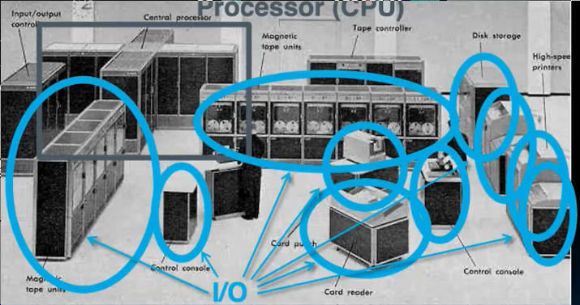

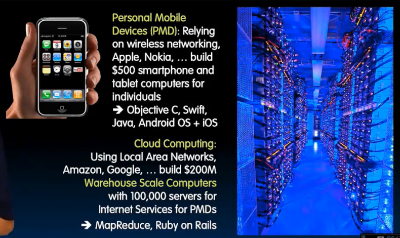

这些移动设备由云计算提供服务 

如何对云设备编程？MapReduce, Reby on Rails

## 真实设备

近期流行的原因一方面公司对计算的需求日益增加

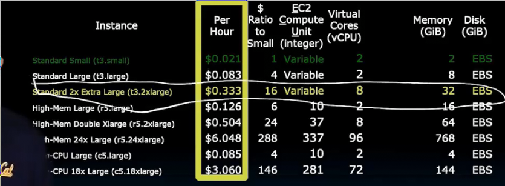

更一方面 由于每个实例配置非常低 因此价格很低

租用 仓库内软件配备相对一致 构建时考虑并行性

地点选择 成本 温度 地理

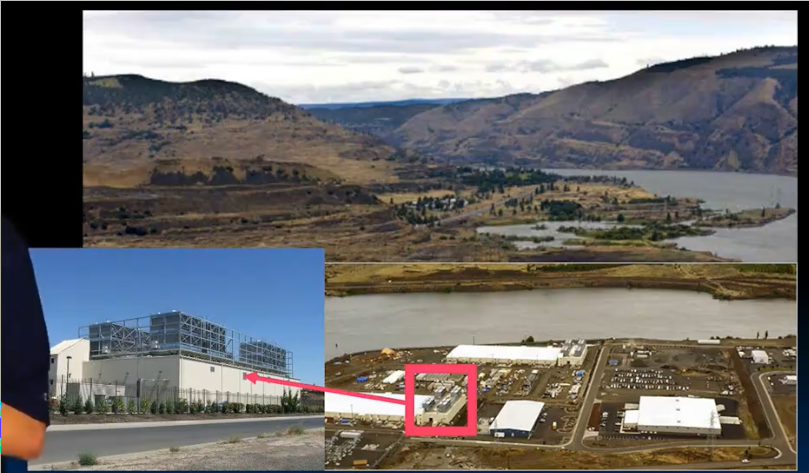

内部是一些集装箱 内部是高密度服务器

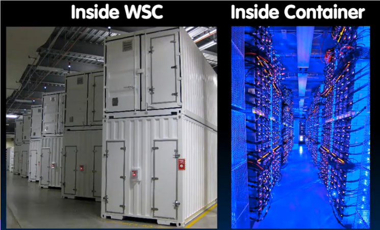

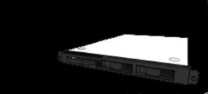

* 最小的层级是盒状服务器 和普通电脑相同

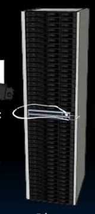

* 其被装到机架中 机架可以容纳40 - 80服务器
  * 当中还有一台交换机

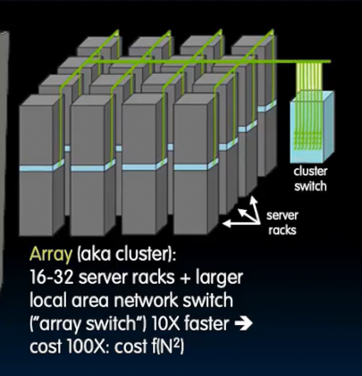

* 最后是集群 大概容纳16 - 32个机架 并配有更大更贵的一个交换机

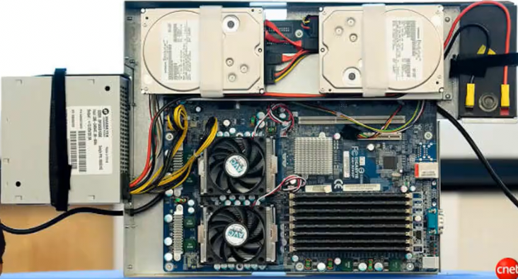

这是盒状服务器的内部

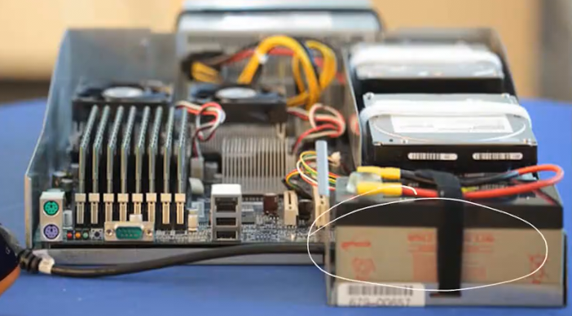

右侧是不间断电池 防止停电

## 衡量表现

如同跑车和公交车

我们需要具体的指标来衡量性能

* 单个事情的响应时间或者延时
* 吞吐量 给定时间内 能做多少这样事

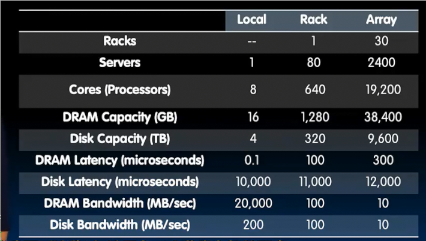

* 某一台服务计算机 机架 和 集群的对比
* 对于集群的DRAM，特定的操作系统使得其拥有其下计算机所有内存之和
* 集群的吞吐量大大增加
* 写入本地磁盘差于写入另一台的内存

## 工作负载和电源效率

* 放置尽可能靠近
* 优雅处理故障
* 扩大或减小规模

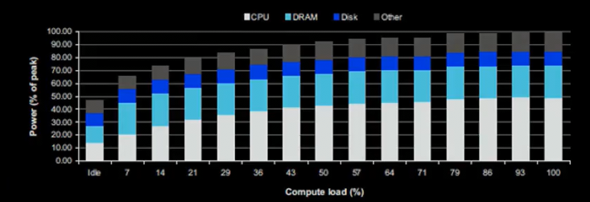

随着计算机负载增长 功率的变化

空闲时几乎消耗一半的功率 

负载50%时消耗90%功率

总效率是完成的计算工作量除以过程中使用的总能量

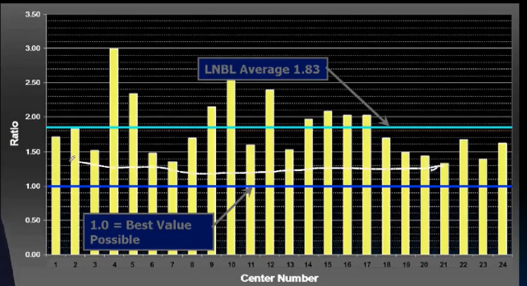

目标希望电力效率接近蓝色（1）但是平均只能达到1.8（一些电力没有进入IT系统）

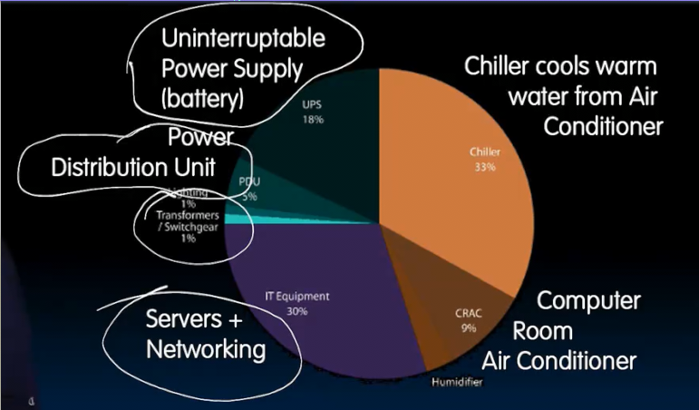
