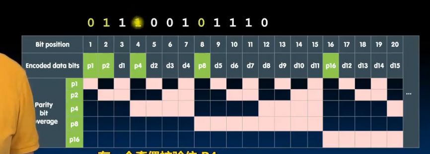
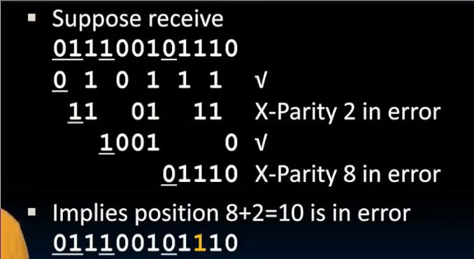
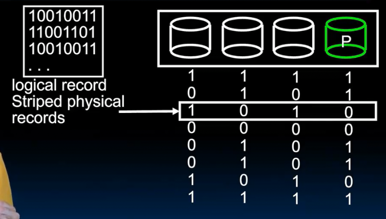

# 可靠性
 
* [衡量可靠性](#衡量可靠性)
  * [可靠性指标](#可靠性指标)
  * [可靠性的测量](#可靠性的测量)
  * [可靠性设计原则](#可靠性设计原则)
* [检测错误](#检测错误)
  * [hamming距离](#hamming距离)
    * [奇偶校验位](#奇偶校验位)
* [纠错](#纠错)
  * [例子](#例子)
* [廉价磁盘冗余阵列_raid](#廉价磁盘冗余阵列_raid)

通过冗余

如今在金融、生活领域 我们非常关心可靠性

但是确实会出现一些故障 软件我们可以等待修复 但是硬件有时不可修复 我们需要冗余来减缓

在内存中的冗余空间 并行系统中备用的核心（七核芯片在八核基础上禁用一个，多个硬件采用上述的投票机制）

故障的增长率没有我们集成更多组件的速度快 因此可以添加冗余

另一种冗余是 更高级别的用其他硬件（另一个数据中心 更多的磁盘）

## 衡量可靠性

有什么指标来定量计算

计算系统 为我们提供一些服务 但会发生一些故障 硬件引发的故障可能导致系统故障也可能不会（也许有冗余）

* 状态1 正常服务结束
* 状态2 服务中断 从而 系统中断 需要恢复会正常服务

重点是 发生频率如何 以及恢复是否快速

* 空间冗余 存在多个组件 数据的 或者计算单元的
* 时间冗余 如果存在故障 有时间的话 重复计算（再次尝试）

### 可靠性指标

* **平均故障发生时间** MTTF
  * 一个设备多久发生故障或者1个故障**恢复后**下一个故障发生的时间间隔
* **服务中断时间**  也是平均修复时间 MTTR
  * 在中断状态下停留的时间 
* **平均故障间隔时间** MTBF
  * 是MTTF 和 MTTR的和
  * **故障发生**到下一个故障发生的时间
* **可用性、可靠性** 等于 MTTF / (MTTF + MTTR = MTBF)
  * 增加可用性一方面可以增加 MTTF 即使得故障更不易发生 使用更高质量的组件 冗余 或者 容错机制
  * 另一方面 可以 减小 MTTR 使得故障更快修复 检测到系统中某些地方出现问题 并恢复到正常模式

### 可靠性的测量

* MEEF MRBF 通常以小时衡量
* 计算机系统很少宕机 假设99.99...% 
* 可靠性据此又衡量为**9的个数**
  * 90% => 1个9
  * 99% => 2个9

* 视频网站 就是 4-5个9的可用性

6 - 7 个9的系统非常可靠 原因可能我们很依赖 并且一旦宕机损失很重

几种其他衡量方式

* **AFR年化故障率**
  * 一个有很多组建的系统 每年会有多少故障
  * 比如 1000个磁盘的系统 故障发生率MTTF 为 100,000 小时
    * 一年有 8760 小时 1000磁盘 * 8760小时 / MTTF
    * =87.6 每年故障的磁盘数 （后面两项相除为一年中一台设备发生故障的概率）
    * 舍入则是 88 个 因此AFR是 8.8% 和实际相似

硬盘设备的年化故障率在不断变好

* **FIT及时故障率**
  * 一台设备在十亿小时的操作中可能发生的故障次数
* **MTBF** = 1,000,000,000 / FIT

### 可靠性设计原则

* 当设计一个需要依赖的系统时，不应该存在单点故障（一条链条的强度取决于其最薄弱的环节）
  * 设备的可靠性由其中最不可靠的组件主导

## 检测错误

如何检测系统中是否存在我们需要作出反应的错误或故障

计算系统的错误可能发生在任何地方 但是最可能发生在内存中 尤其是DRAM内

* 原因在于内存单元很多 很小 容易受到干扰
  * **软错误** 内存的物理结构没问题 数据受到干扰等导致了错误 如果重新执行会正常工作
  * **硬错误** 内存中的位单元 字 或者整个芯片都可能出现故障 
    * 修复方式可以采取修复芯片内部的故障
    * 或者更换出现故障的新盘或者磁盘驱动器

我们添加一些冗余位 对其检测 **错误检测和纠错码**

* EDC和ECC是两种对抗软错误的方式
  * 与其复制整个字 这些额外的比特位开销和冗余少得多 但是足以提供良好保护
  * 存储结果前 处理为某种数据格式 其具有冗余性

### hamming距离

本质上是两个二进制数之间比特位数的逐位比较差异 

我们不使用所有的存储空间来存储二进制数 而是存储其之间具有差异的位

* 我们考虑对于两个hamming距离为2，且发生单个位错误时的情况 此时hamming距离依据发生错误位的不同 变为1或者3个 从而被侦测到

#### 奇偶校验位

对于即将写入内存的二进制数 我们对其添加一个奇偶校验位 添加后组成的数据1之和一定是一个偶数（也可以指定奇数）

1. 假设我们有8位的字 输入一个8位异或门中 会产生奇偶校验位
2. 将这9位一同存储在内存
3. 当读取数据前 读取这9位 进行奇偶校验 判断是否偶数（再次传递给异或门检验输出）

在奇偶校验中 一个字同时发生偶数处位错误 会使得奇偶校验无效

但通常只会有一个位反转

## 纠错

我们采用奇偶校验 收到错误 意味至少一个位发生错误 但是仍然不知道写入时的正确字

* 单错误纠错 双错误检测（循环冗余校验码）

假设有n位要编码 则有2^n次方可能的位模式

如果有8位 则256种位模式

如果其中一种位有效位模式 剩下的所有都是有错误的 需要一种办法检查单词的合法性 并 通过选择最接近该非法码字的合法码字进行纠错

这是256个位模式空间 

当其中一个比特出错 基本上会回到最接近的比特

我们以这个8个位模式的3比特字为例

* 其中相连的点具有1比特的hamming距离
* 我们想从中选取一系列2harmming距离的码 那么可以选择其中的一半

这就是奇偶校验的原理

当我们读到010时，实际上有三种可能的正确码（其相邻的）

因此为了可以纠错，我们需要在空间中选择更稀疏的码（harmming距离更大）

* harmming距离为3 
* 由于空间中只有两个正确的点 我们有1位来表示数字 剩下两位为冗余位

然而，错误发生时，我们直接就能纠正回harmming距离最小的正确点（因为这是最可能的）

### 例子

我们需要设计编码来使得额外空间最小

* p表示冗余位（奇偶校验位）所在位置 d是原数据的位置 这样使得奇偶校验为本质上始终位于与2的幂次对应的位位置
* 每个奇偶校验位由下方各自点亮的位经由异或门生成

编码 1001 1010

1. 留出奇偶校验位的位置 `__1_001_1010`
2. 计算校验位
   

实际上是?由已知得来

3. 得到最终编码字 `011100101010`
4. 收到后进行解码检验是否正确

5. 依次对所有p及其组成为奇偶校验

6. 找到错误 **错误的位置等于两个错误的奇偶校验位的和P2 P8`

翻转后所有的检验都能通过了！

那么我们如何校验多个位错误？

存在能处理更多的harmming码

对于网络，可能存在更多错误，因此有更多编码

## 廉价磁盘冗余阵列_raid

设备出现永久性故障怎么办

通常使用备件 RAID

用一系列相对便宜的现代磁盘来替代

文件分散在多个磁盘 （很大的文件 分解为数据块 以条带的形式写入多个硬盘）*这也为并行读写文件加快速度提供了可能*

也可以防止故障时的速度减慢和服务中断 当磁盘故障用户文件会从剩余磁盘阵列中加载（一些作为冗余）

RAID1 是冗余磁盘阵列的一种形式（两个磁盘组 多少个主磁盘就有多少备份 称为恢复组）

简单的拷贝

但是 RAID相对耗费资源昂贵 因为每一份磁盘都有额外的磁盘作为备份 

我们能否和DRAM一样，在磁盘中引入纠错码之类的方式吗

RAID3添加了奇偶检验 某一个磁盘负责奇偶校验

每个文件分条存放在数个硬盘

单独的磁盘对其奇偶校验 如果某一个磁盘坏掉 奇偶校验磁盘替代其

RADI4提供更高的输入输出速度

瓶颈在与奇偶校验全部写在一个磁盘

RADI5提高吞吐量并保持奇偶校验 交错奇偶校验
