# GPU的架构
 
* [什么是gpu](#什么是gpu)
  * [最大化吞吐量](#最大化吞吐量)
  * [gpu的流水线](#gpu的流水线)
* [gpu执行模型](#gpu执行模型)
* [纹理映射](#纹理映射)
* [例子_saxpy_算法](#例子_saxpy_算法)
* [q&a](#q&a)
  * [如何在gpu中管理一致性_什么软件](#如何在gpu中管理一致性_什么软件)
  * [需要担心gpu中的死锁吗](#需要担心gpu中的死锁吗)
  * [gpu中像素数量和执行单元数量中存在理想数量关系吗](#gpu中像素数量和执行单元数量中存在理想数量关系吗)
  * [gpu有哪些意想不到的应用](#gpu有哪些意想不到的应用)
  * [作为学生_我们如何使用GPU](#作为学生_我们如何使用GPU)

* 什么是GPU 有什么作用
* 图形管线的细节和主要节点
* GPU的可编程性

## 什么是gpu

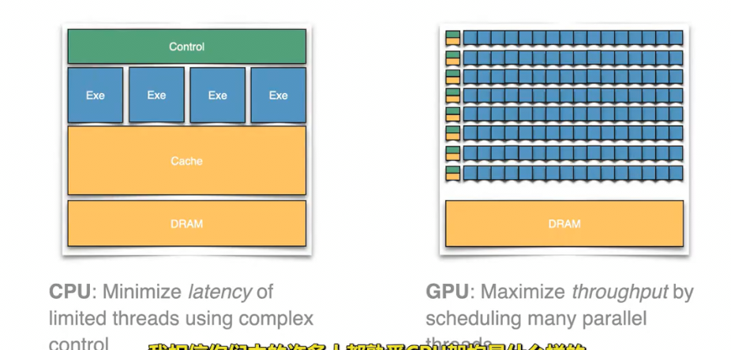

和CPU架构对比

* CPU的工作方式是有大量控制逻辑进行解码和执行指令
  * 为了从CPU获得更好的性能，我们希望最大限度减少不同步骤的延时
  * 现代CPU的性能的一个重要指标是执行单元到内存的延迟周期
* GPU有许多的执行单元 更小更简单，但是更多的控制单元 并且也有小缓存
  * 很容易能达到100多个核心 这是能获得巨大并行编程提升的原因
  * 为了获得最大性能 目标是最大化蓝色执行单元的吞吐量（使用数量）

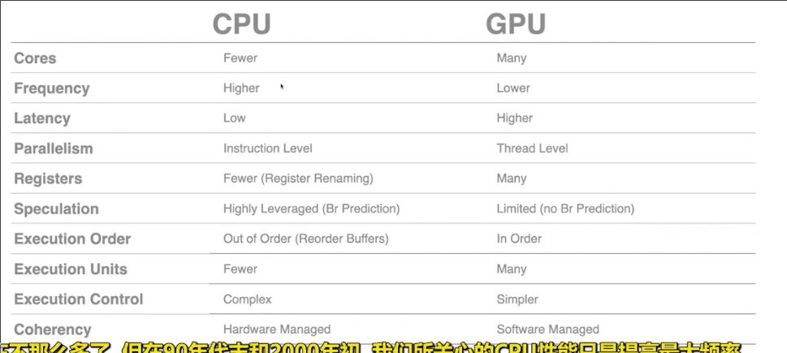

* GPU并不太关注最高频率
* 不注重跳转等 按顺序执行 容易控制
* 一致性由软件管理 （程序员管理数据同步）

*CPU 数学教授 GPU 充满小学生的课堂* 复杂的少量问题给CPU 很多的简单问题给GPU

### 最大化吞吐量

* 希望尽可能运用大量的执行单元
* 如何尽可能利用缓存减少对内存的直接访问

### gpu的流水线

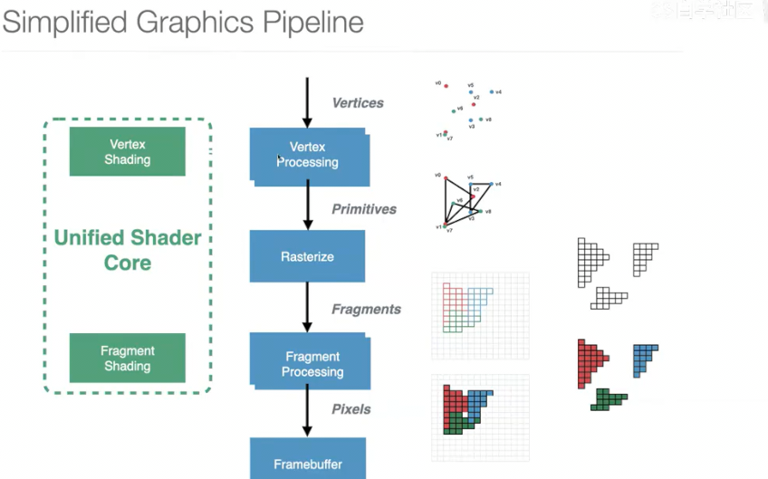

五个部分

1. 定点处理 处理顶点进行一些计算 （可以在每个定点单独运行程序）
2. 光栅化 将三角形转换为屏幕上显示的单个像素
3. 片段处理 在单个像素上运行程序写入缓存 以在屏幕上显示
4. 帧输出 将像素从缓存输出到内存 显示到屏幕                                               

为了每秒处理数百万像素、定点 需要一个大型计算引擎来运行

我们想要显示这样的图片 后面我们会具体研究这个例子

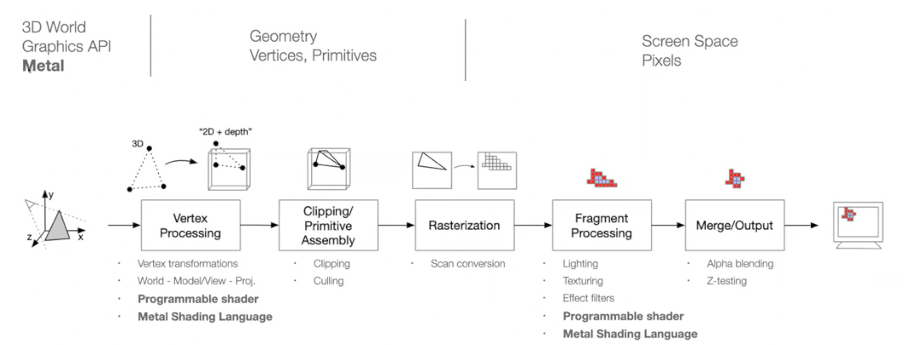

1. 图形都是由三角形构成 对于制作游戏使用的库 基本会将模型定点的位置输入 并给出描述 这些定点如何连接为数个三角形
2. 之后开始上述处理对定点计算（转换为三角形 **组装** 转化为2维）
3. 光栅化，裁剪掉看不见的模型片段
4. 转化为像素
5. 片段处理 对于每个像素 计算光照纹理等 来计算最终的像素
6. 发送到屏幕

一切都是三角形

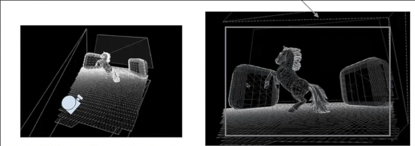

获取顶点

获取定点的步骤和矩阵计算（线性代数有关）

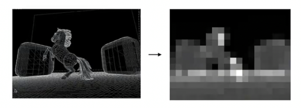

将定点转化为三角形

**分bin处理** 较浅的颜色代表三角形的复杂度 更多 更复杂 用来估算渲染代价 分配资源来渲染

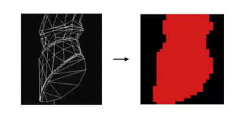

光栅化

扫描转换 将三角形转换为单个像素 

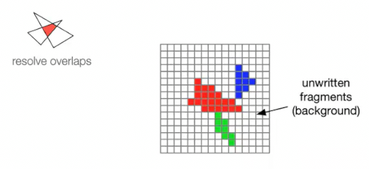

片段处理 上色、深度测试（较深的不必渲染）

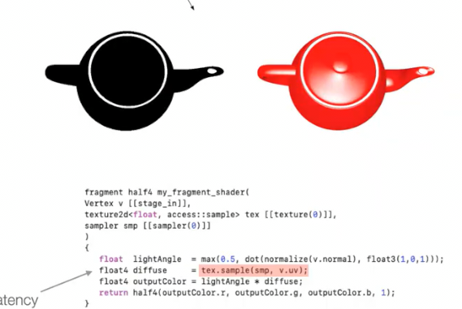

着色器允许指定每个像素的算法 进行光照计算

## gpu执行模型

在针对各个像素的计算阶段 相比于顺序执行 不如对一些像素并行执行 

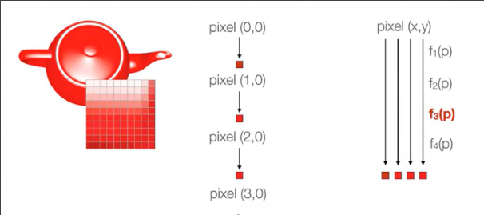

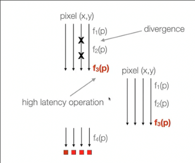

当其中一个像素进行比较复杂度如高延迟纹理提取等，暂停所有，并去执行另一组像素 等待延时结束 （线程级并行）

## 纹理映射

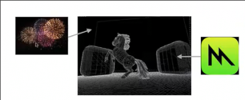

这些纹理 是 预先存储的图像或纹理 

可以将其映射到我们的图像中

两个图像的像素相映射 这有时会有一些比例问题

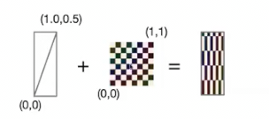

更高级的模式 各向异性过滤 避免顶部一些奇怪伪迹 （抗锯齿）

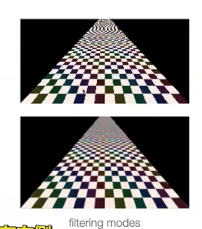

将像素写入内存 写入帧缓存 通知渲染完成

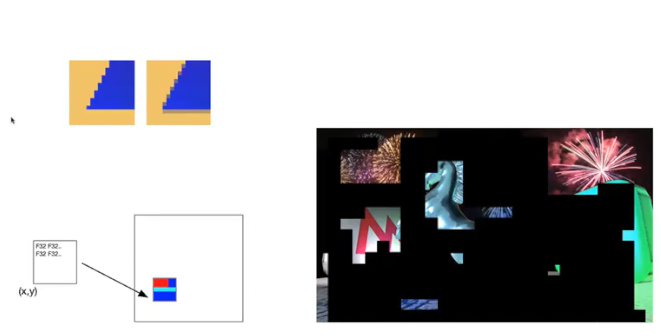

（需要所有都写好后再通知）

## 例子_saxpy_算法

在CPU中的代码

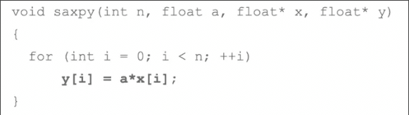

* 接受浮点数数组x 
* 将每个元素乘以一个浮点数a
* 存储在浮点数数组y

而GPU中同样的事情（Metal语言）

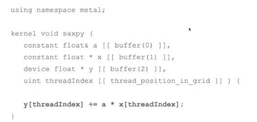

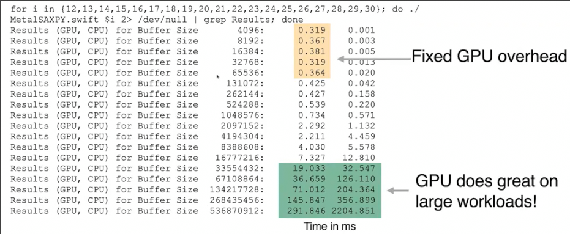

对比不同大小 CPU和GPU的完成时间 当缓冲区很大 GPU的性能明显更优

但是GPU不适合小型的工作（启动很耗时）

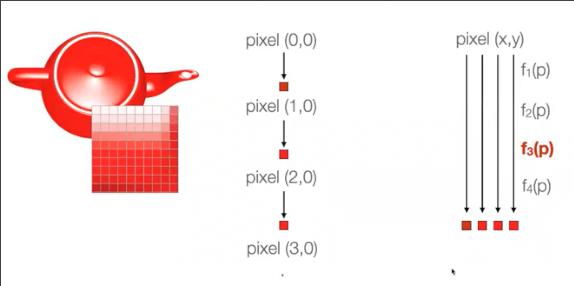

这是二者差别的来源

从GPU中获得效率和性能的关键在于**最大化并行性** 并依次最大化吞吐量（多个数据上相同的指令）

现代GPU很容易用于计算

## q&a

### 如何在gpu中管理一致性_什么软件

实际是应用程序和驱动程序的组合 负责编程和管理GPU的底层细节

了解驱动程序 同步要求 对并行性计算帮助很大

### 需要担心gpu中的死锁吗

对于硬件团队是一件值得担心的事情

但是对于编程级别 如同不需要担心CPU崩溃一样

硬件上存在各种风险会导致死锁 需要从架构上来避免

### gpu中像素数量和执行单元数量中存在理想数量关系吗

什么是一个比较好的比例？

GPU的一大优点是可扩展性

如果需要超高分辨率如8K 需要一个大型GPU （游戏、高帧率）

不过没有固定的关系 小型的GPU也可以驱动 但是玩游戏时性能会降低（不能保证每秒30帧 卡顿）

### gpu有哪些意想不到的应用

* 特斯拉的自动驾驶的图形处理算法 应当用到了GPU
* 现代手机会进行相当数量计算摄影，其算法通过GPU运行 以生产或融合图像来生成模型图像
  * 因此摄影不仅仅取决于摄像头的像素 还有算法、GPU 算力等
* 比特币挖矿 当时的高端GPU都卖光了 不过现在有专用的硬件

### 作为学生_我们如何使用GPU

MAC中提供metal编程指南和一些实例

NVIDIA和AMD应当也提供了其他语言类似教程

* CUDA
* OPENCL
