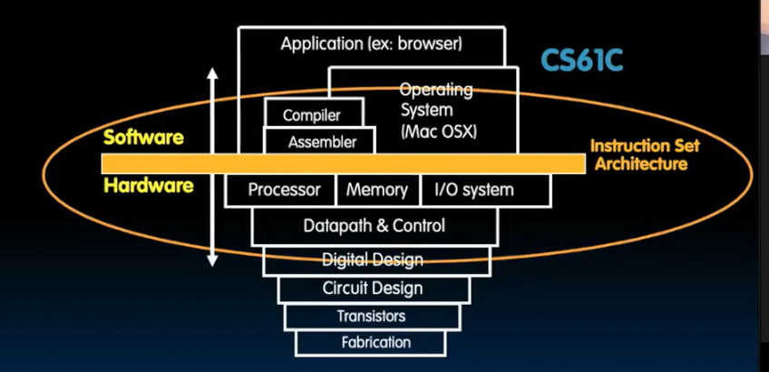
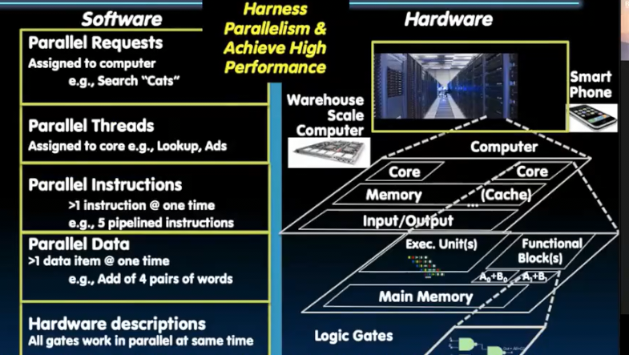
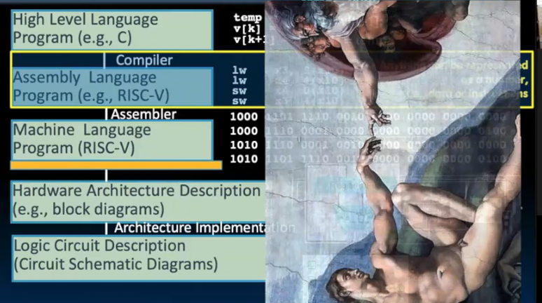

# 总而言之
 
* [计算机架构的六个重要想法](#计算机架构的六个重要想法)
* [架构示意](#架构示意)
* [课程参考](#课程参考)

## 计算机架构的六个重要想法

* 抽象的概念 
  * 非常复杂的系统隐藏了门的细节 
  * 构建了不同层次的抽象层
* 摩尔定律
  * 在今天也在持续 但是面临消失的担忧（然而新的设计、优化）还在不断发生
  * 我们面临功率限制下的设计
  * CMOS至少还能用十年，之后或许是量子技术
* 局部性原理和内存层次结构
  * 使得我们看上去在使用无限大、无限块的内存系统
  * 大多数时候我们都在用L1的缓存
* 并行性
  * 帮助解决功耗限制和摩尔定律放缓问题
* 性能测量和改进
  * 知道如何衡量才知道如何改进
  * 多个角度衡量
* 通过冗余实现可靠性
  * 医疗保健 汽车等领域
  * 衡量可靠性

## 架构示意

以ISA为核心的单机器单核机器架构示意

多台机器多个内核体现并行性的机器架构示意

指令集架构将软件和硬件的部分紧密连接起来

连接的最后一根枕木在与弄懂RISCV机器的逻辑

## 课程参考

* CS152 CPU设计 内存 体系结构
* CS162 OS

>The best way to predict the future... is to invent it
