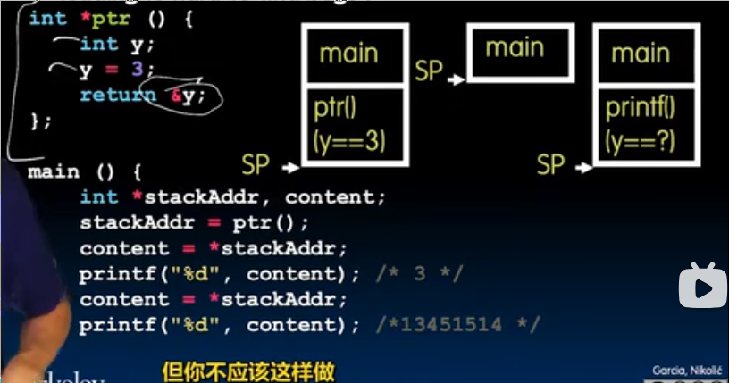
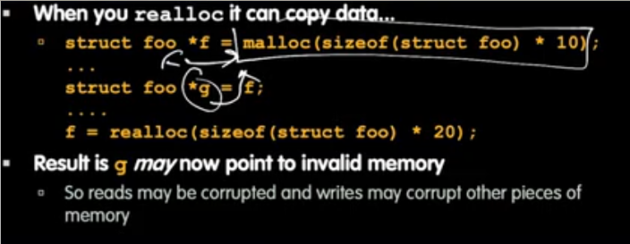
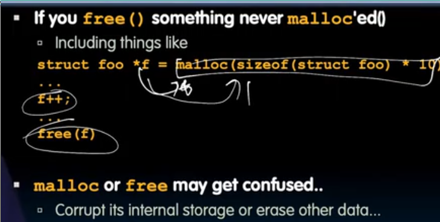

# C语言内存管理_
 
* [动态堆内存管理](#动态堆内存管理)
  * [申请](#申请)
  * [释放](#释放)
  * [调整](#调整)
* [数组的地址](#数组的地址)
* [指针在链表中的应用](#指针在链表中的应用)
* [全局变量](#全局变量)
* [C语言的内存池](#C语言的内存池)
  * [栈_帧](#栈_帧)
  * [堆_动态内存](#堆_动态内存)
* [处理内存时易出现错误](#处理内存时易出现错误)
  * [指针](#指针)
  * [内存泄漏](#内存泄漏)
  * [不能返回指向栈空间的指针](#不能返回指向栈空间的指针)
  * [free后不要使用那块空间](#free后不要使用那块空间)
  * [realloc会移动堆区数据](#realloc会移动堆区数据)
  * [永远free头指针](#永远free头指针)
  * [永远保留一个指向`malloc`的数据头部的指针](#永远保留一个指向`malloc`的数据头部的指针)

sizeof 也可以得知数组的大小

## 动态堆内存管理

### 申请

`int *ptr = (int *) malloc (sizeof(int));`

`malloc`接受想要的字节数，返回一个指向**未初始化空间**的指针 `void *`, 需要进行强制类型转换(隐式也可)

如果失败会返回`NULL`

### 释放

`free(ptr)` 用完空间后需要释放

**释放完就不可以碰这块内存，比如释放两次会出错**

### 调整

`ip = (int *) realloc(ip, 20 * sizeof(int));`

接受之前申请到的空间，以及新的大小

如果失败会返回`NULL`，因此在`realloc`的下一步最好检查`NULL == ip`(这种写法更优雅，假如写成`NULL = ip`会报错，而不是内存泄漏)

通常会移动之前的内存以使得其更大（直接复制内容）

`realloc(ip, 0)`等同于`free(ip)`

## 数组的地址


可以看到在这个例子中 `a` 与 `&a` 的值都是数组的首地址，这就是数组的特殊之处

我们知道`&a`表示a的地址，因此单元格的地址为`24`，可是我们又得知了这个单元格的值是24，但是我们明明通过`*a`给这个单元格赋值了3呀，这是为什么？

**数组名并不是变量**, 也就是a并不是单元格的别名, 尽管a的值是`24`，并不意味着单元格24的值是其自身，一切到了汇编就会豁然开朗

## 指针在链表中的应用


```c
#include <stdio_h>
#include <stdlib_h>
#include <string_h>

struct Node {
    char *value;
    struct Node *next;
};

typedef struct Node *List;

List list_new() {
    return NULL;
}

List list_add(List list, char *s) {
    struct Node *new_node = (struct Node *) malloc(sizeof(struct Node));
    new_node->value = (char *) malloc(sizeof(char) * (strlen(s) + 1));
    strcpy(new_node->value, s);
    new_node->next = list;
    return new_node;
}

int main() {
    List l = list_new();
    l = list_add(l, "hello1");
    l = list_add(l, "hello2");
    l = list_add(l, "hello3");
    return 0;
}
```

## 全局变量

当声明一个结构体时，不会为其分配空间，只是标记了一个新的类型

而声明变量时，会实际为其分配内存

可以在任何地方访问此变量，包括`main`函数，任何其他子例程

## C语言的内存池

C语言有三种内存池，分别对应**局部变量** **全局变量** **堆**

这三种变量存放在不同的位置 **栈** **静态存储区** **堆**

* **静态存储区** 可以改变其值，但是不能改变其大小, 其在整个程序执行期间都存活，大小不会改变
* **栈** 存储**局部变量** **参数** **返回地址**  
* **堆** **malloc**分配地址的区域
* 栈区的含义与数据结构中的栈相同，但是堆区的含义却不是数据结构中的堆，其不以堆的形式存储或表示（只是一堆内存）


* 栈由内存顶部向下增长
* 堆由内存中部向上增长
* 底部是指令以及静态区

### 栈_帧


每一个栈帧`stack frame`存储着函数的信息

当函数发生调用时，产生了新的栈帧

当函数返回时，回退到上一个栈帧

栈帧包含

* **返回地址** 用来返回上一级
* **当前函数具有的参数** 
* **为局部变量分配的空间**

### 堆_动态内存

我们唯一需要管理的内存池

* 系统如何快速地为我们分配、记录、并防止空间被划分的过于碎片化？


所有空闲的内存块实际上都有一个**额外的头部** 说明了块的大小和指向下一个块的指针 形成了**链表**（环形，末尾于开头相连）

* `malloc` 检索空闲块链表，查找能被分配所需内存的内存块，如果没有找到足够大小的内存卡返回NULL
    * `best fit` 遍历列表，找到最合适的可分配空间（不大不小）
    * `first fit` 找到第一个足够大的可分配空间
    * `next fit` 和`firtst fit`相似，记住上一次查找的位置，下一次从此开始（分散碎片的目的）
* `free` 将内存块归还给链表，并试图合并，因此耗时会长一些

## 处理内存时易出现错误

### 指针

使用场景时，无需每一次使用都复制一个很大的结构体、数组，而是以**链接**的形式传递

* 野指针 其未指向 `malloc`后的有效内存

### 内存泄漏

丢失指针、忘记`free`

### 不能返回指向栈空间的指针

栈帧在返回后即被释放，因此返回的地址是一个被释放的地址



### free后不要使用那块空间

### realloc会移动堆区数据



之前指向堆区数据的指针，在`realloc`后，指向了非分配空间，因此保证`realloc`后，改变指向原数据指针的指向

### 永远free头指针



free会跟踪曾经`malloc`过的头地址，如果`free`中间地址，可能导致异常

### 永远保留一个指向`malloc`的数据头部的指针


* valgrind 一个可以调试这类问题的工具
