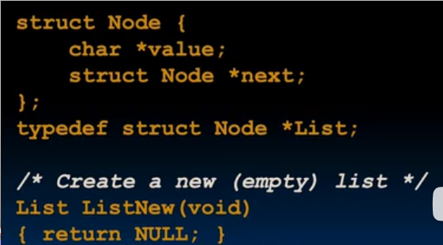

# C语言内存管理 数组的地址 全局变量

sizeof 也可以得知数组的大小

## 动态堆内存管理

### 申请

`int *ptr = (int *) malloc (sizeof(int));`

`malloc`接受想要的字节数，返回一个指向**未初始化空间**的指针 `void *`, 需要进行强制类型转换(隐式也可)

### 释放

`free(ptr)` 用完空间后需要释放

**释放完就不可以碰这块内存，比如释放两次会出错**

### 调整

`ip = (int *) realloc(ip, 20 * sizeof(int));`

接受之前申请到的空间，以及新的大小

如果失败会返回`NULL`，因此在`realloc`的下一步最好检查`NULL == ip`(这种写法更优雅，假如写成`NULL = ip`会报错，而不是内存泄漏)

通常会移动之前的内存以使得其更大（直接复制内容）

`realloc(ip, 0)`等同于`free(ip)`

## 数组的地址


可以看到在这个例子中 `a` 与 `&a` 的值都是数组的首地址，这就是数组的特殊之处

我们知道`&a`表示a的地址，因此单元格的地址为`24`，可是我们又得知了这个单元格的值是24，但是我们明明通过`*a`给这个单元格赋值了3呀，这是为什么？

**数组名并不是变量**, 也就是a并不是单元格的别名, 尽管a的值是`24`，并不意味着单元格24的值是其自身，一切到了汇编就会豁然开朗

## 指针在链表中的应用



```c
#include <stdio.h>
#include <stdlib.h>
#include <string.h>

struct Node {
    char *value;
    struct Node *next;
};

typedef struct Node *List;

List list_new() {
    return NULL;
}

List list_add(List list, char *s) {
    struct Node *new_node = (struct Node *) malloc(sizeof(struct Node));
    new_node->value = (char *) malloc(sizeof(char) * (strlen(s) + 1));
    strcpy(new_node->value, s);
    new_node->next = list;
    return new_node;
}

int main() {
    List l = list_new();
    l = list_add(l, "hello1");
    l = list_add(l, "hello2");
    l = list_add(l, "hello3");
    return 0;
}
```

## 全局变量

当声明一个结构体时，不会为其分配空间，只是标记了一个新的类型
