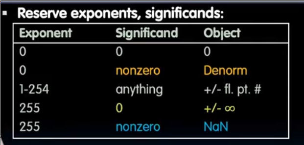
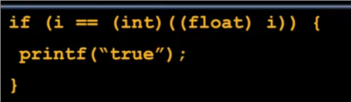

# 浮点数
 
* [小数的表示](#小数的表示)
  * [小数的运算](#小数的运算)
  * [浮点数的浮动](#浮点数的浮动)
* [浮点数的存储_IEEE754](#浮点数的存储_IEEE754)
  * [bias法表示](#bias法表示)
  * [_正负无穷的表示](#_正负无穷的表示)
  * [nan的表示](#nan的表示)
  * [指数全0_有效位不为0的用途_非规格化数](#指数全0_有效位不为0的用途_非规格化数)
* [浮点数和十进制数之间的转换](#浮点数和十进制数之间的转换)
  * [浮点数存储表示转十进制](#浮点数存储表示转十进制)
  * [十进制转浮点数存储表示](#十进制转浮点数存储表示)
* [浮点数存在的问题](#浮点数存在的问题)
  * [加法不存在交换和结合性](#加法不存在交换和结合性)
  * [精度和准确度](#精度和准确度)
  * [舍入](#舍入)
  * [C语言中的浮点数类型转换](#C语言中的浮点数类型转换)
* [其他浮点数表示方法](#其他浮点数表示方法)

## 小数的表示

xx.xxxx的范围: 0 - 3.9375

### 小数的运算

### 浮点数的浮动

我们通过一个输入来控制**小数点的位置**

另一个输入控制**大小**

在这个例子中`10101`为其大小，我们滑动小数点的位置来完成对真实数值大小的控制，即为**浮动**

这种表示方法使得我们存储**有效位**和**指数**后，可以表示极其大的数和极其小的数

**十进制的表示**

**二进制的表示**

## 浮点数的存储_IEEE754

在二进制的表示中，我们可以发现左侧的**基数**，在小数点左边永远是一个1（除非这个浮点数等于0），因此我们不存储它

* 1位符号位(1负0正)，8位指数位，23位小数位（2^-1 - 2^-23)
* 如果绝对值过大 则称为`overflow` 如果绝对值过小，以至于即便指数位最小也无法表示，则是`underflow`, 会下溢出为0
* `double` 类型有 52位 小数位
* 保留全0的指数值，用于0 `10000000..00`或 `000000..000` 但是这种存储方法导致了两个0

### bias法表示

而对于0来说仍以指数位为0作为存储

对于 `- 1.01 * 10 ^ 35`

* 符号位 1
* 指数位 35 + 127 = 162
* 有效位 010...0

### _正负无穷的表示

* 符号位 0/1
* 指数位 全1
* 有效位 全0

### nan的表示

* 符号位 均可
* 指数位 全1
* 有效位 不为0（与inf区分）

### 指数全0_有效位不为0的用途_非规格化数

用来弥补0与指数位为1时能表示的绝对值最小数`2^-126`之间的距离

这种表示方法使得0到最小的数距离`2^-126`，而之后的数间隔位`2^-149`

而指数位为0,而有效位不为0,使得最小的数

* 0000000..1
* 规定其前导为0,使得其位2^-149,以此实现了等间隔（此时指数位表示-126)

每次跨过一个指数，其步长增加

最大的浮点数在 指数为 254 有效位全1处产生

`0b1.11111..11 * 2^127` 下一步就是无穷大 

最后的结果是每2的幂和下一个2的幂中有800万个刻度

[一个模拟器](https://www.h-schmidt.net/FloatConverter/IEEE754.html)

## 浮点数和十进制数之间的转换

### 浮点数存储表示转十进制

### 十进制转浮点数存储表示

用十进制转二进制的方式，判断数字是否够0.5, 0.25, 0.123...

## 浮点数存在的问题

### 加法不存在交换和结合性

大数和小数的相加会导致小数被舍去（由于无法同时存储）

### 精度和准确度

* 精度*Precision* 指我们用于解决问题的位数，精度越高，越能接近想要表示的实际数值
* 精确度*accuracy* 指编码的任何数值与原始实际数值之间的距离

高精度低精确度

### 舍入

通常浮点数硬件会额外设置一些舍入位，用于判断具体向上还是向下舍入

也有一些舍入位可以选择

### C语言中的浮点数类型转换

有一些整数无法用浮点数完美表示，浮点数会向上或者向下舍入，再转换为整数很可能会得到和之前不同的结果

## 其他浮点数表示方法

double类型

甚至还有 128、256、16位
