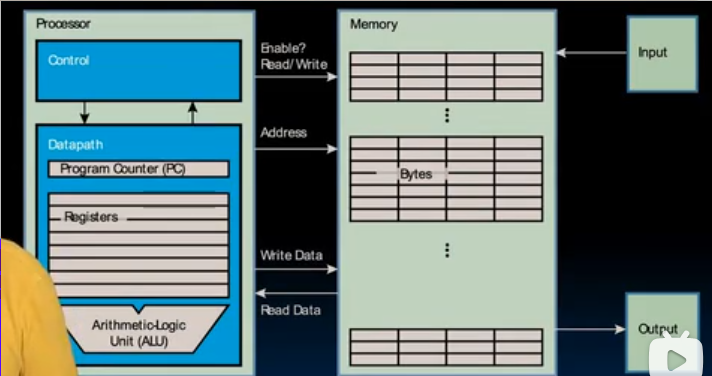
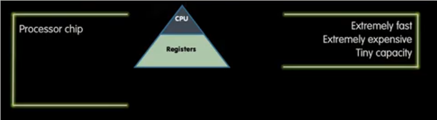
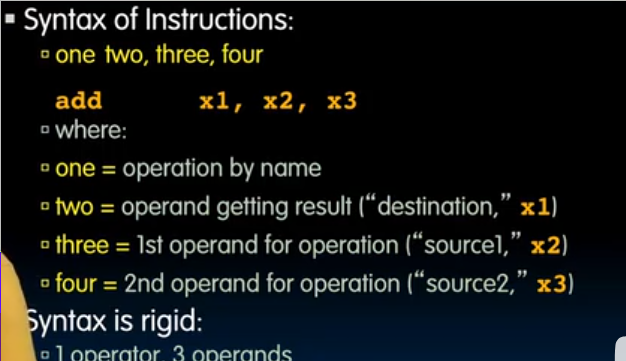
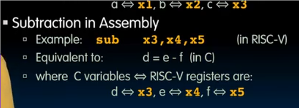
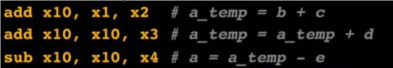
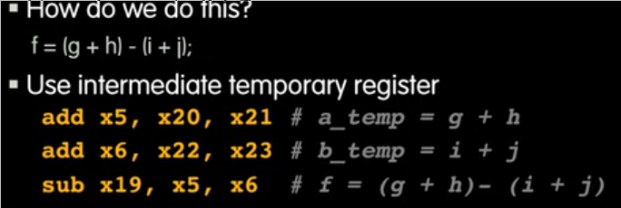
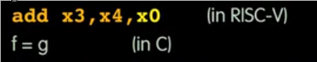
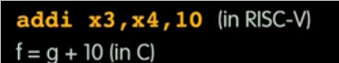

# RISC-V
 
* [指令集的分化](#指令集的分化)
* [RISC-V_寄存器](#RISC-V_寄存器)
  * [处理器内存交互模型](#处理器内存交互模型)
  * [局部性原理以及内存层次](#局部性原理以及内存层次)
  * [寄存器和变量的区别](#寄存器和变量的区别)
* [RSIC-V_汇编语言](#RSIC-V_汇编语言)
  * [加法和减法指令](#加法和减法指令)
    * [常量参与运算](#常量参与运算)

CPU的基本操作是执行指令

适用于处理器或一类处理器的特定指令集称为指令集架构

常见的指令集架构 

* **ARM** 部署在几乎所有手机和许多其他设备上
* **Intel x86** 被实现在笔记本，台式机、服务器、云处理器上
* **IBMPower** 用于服务器
* **RISC-V**

学习汇编语言的原因是真正了解软件是如何被执行的

## 指令集的分化

* RISC 简单的指令 保持指令集小而简单 从而更容易构建快速硬件
* CISC 完全指令集计算机 复杂 每个指令可以执行多个操作
    * 尽管x86还采用这种复杂指令，但其处理器已经成为RISC引擎，在内部连接了更简单指令

RISC-V 开源且免费 最初用于教学的目的，随即走向商业化

简单可扩展 适于教授

我们使用其32位版本

## RISC-V_寄存器

汇编语言中没有变量的概念

**动词**后面的**汇编操作数**通常是寄存器

寄存器是位于处理器内核中的数量有限的硬件，对数据的操作是对寄存器中的数据进行操作

* 由于其就在处理器内核和执行单元的附近，**速度很快**
* 我们的`RISC-V`有32个
* `X86`有8个通用寄存器和一些特殊寄存器

RISC-V 的寄存器按 `0-31`编号

* 其中`X0` 特殊，被硬连线为0，不可更改，以便我们快速访问到0

### 处理器内存交互模型
 

在这个模型中

* **处理器**负责协调从IO设备把数据加载进内存和把数据从内存发送到输出设备
* 处理器内部有**控制单元**（Control)和**数据通路**(Datapath)
* 数据通路中，主要元素是**寄存器**和**执行单元**(算术逻辑单元)
* 处理器通过**输出操作地址**从内存**读取数据或向内存写入数据**
* 为了防止意外地写入数据，处理器还输出一个**使能信号**标记是否写入

### 局部性原理以及内存层次

内存系统的目标是使内存看起来无限快(像寄存器一样)和无限大

### 寄存器和变量的区别

* 如C语言，变量需要先声明并给定一种类型
* 变量占据的空间依赖于其类型
* 寄存器没有类型，而表示操作的**动词决定如何处理寄存器的内容**

## RSIC-V_汇编语言

*`#`是RSIC-V汇编语言的注释*

汇编语言的每一条语句被称为指令

### 加法和减法指令

在`add`指令中，后面的三个东西分别是`结果存储位置` `加数1位置` `加数2位置`

减法指令也是相同的设计

* 当执行运算操作数不止两个`a = b + c + d - e`

会拆成多个指令

* 带有优先级的情形

* 寄存器0参与运算

实现了赋值

#### 常量参与运算

汇编中的数值常量称为**立即数**

`ADDI` add immediate

没有支持立即数减法的指令, 而是使用`addi x3, x4, -10`

