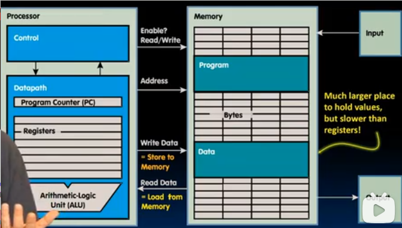
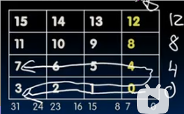
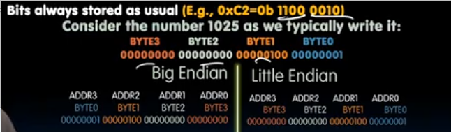
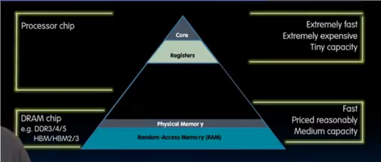
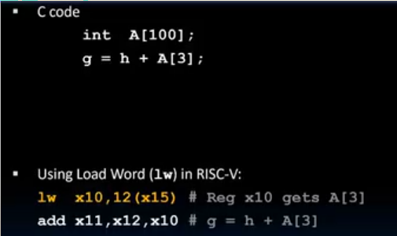
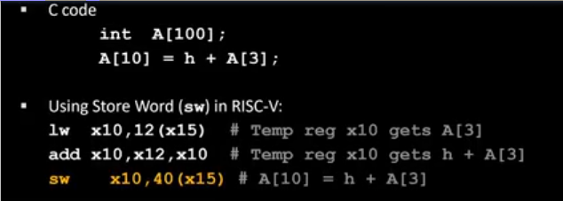
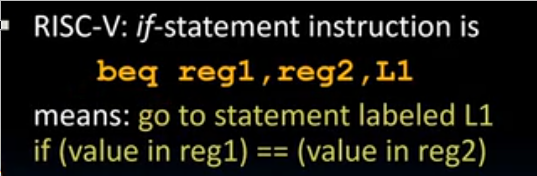
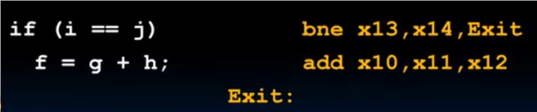
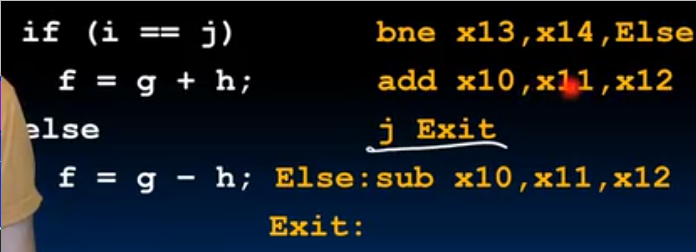

# RSIC-V_存储数据指令_流程控制指令
 
* [内存的组织形式](#内存的组织形式)
  * [字节在字中的存储_字节序](#字节在字中的存储_字节序)
* [与内存交互的加载和存储指令](#与内存交互的加载和存储指令)
  * [从内存加载字入寄存器](#从内存加载字入寄存器)
  * [从寄存器中存储字到内存](#从寄存器中存储字到内存)
  * [存储加载字节](#存储加载字节)
    * [符号扩展_加载有符号数的方式](#符号扩展_加载有符号数的方式)
    * [零扩展](#零扩展)
* [分支指令](#分支指令)
  * [条件分支](#条件分支)
  * [无条件分支](#无条件分支)

尽量少用寄存器，编译器的优化往往就是减少使用寄存器的数量

内存可以看作一个大的一位数组，地址就像其索引，从0开始

处理器想要和内存交互

* 必须输出来提供一个**地址**，以此访问内存中的一个字
* 并且还需要指明**读还是写**，以此来确定**从内存中加载`load from`还是存储到内存`store to`**

## 内存的组织形式

内存被组织成**字**的形式，而在我们的RISC-V32位中，字长为`32`

但是我们通常处理更短的数据，因此我们以8位作为一个**字节**

地址按照字节分配

### 字节在字中的存储_字节序

在RISC-V中，遵循**小端序**

即**一个字中的最低有效字节，获得字中的最小地址(0-7位)**

而在小端序中，字的地址和其中最低字节的地址相同

字节序只管理**字节**在内存中的存储顺序，而不影响更低级别的位,以及更高级别的字

**大多数处理器都遵循小端序**，有一些重要的处理器如IBM大型机服务器，一些微处理器和汽车处理器遵循大端序

## 与内存交互的加载和存储指令

从顶至下依次为

* 处理器内部的寄存器 其速度最快 价格最高 数量最小
* DRAM 也很快，但是远不及寄存器 大概慢50-500倍
    * 对于独立的访问需要几十到几百纳秒，而对存储器的单次访问约1纳秒
    * 对相邻位置的连续访问会更快

### 从内存加载字入寄存器

* `lw` 从内存中加载数据到寄存器 *load word*
* `x10` 目标寄存器 
* `x15` 存储基址的寄存器 对应C代码中的首地址
* `12` 相对与基址的偏移量 由于偏移3，并且`int`占4字节

### 从寄存器中存储字到内存

* `sw` 将寄存器中数据存储到内存 *store word*
* `x10` 来源寄存器
* `x15` 存储目标基址的寄存器 对应 数组的首地址
* `40` 相对于目标基址的偏移量 对应 `4 * 10`

无论加载lw还是存储sw，总是以**字**为基本单位，因此偏移量应该为4(字长/8)的倍数

### 存储加载字节

一些数据并不一定占用一个字，比如`char` `short`，RSIC-V提供了存储加载字节的指令

`lb x10, 3(x11)` 
`sb ...`

* 偏移量未必是4

#### 符号扩展_加载有符号数的方式

`lb`加载指令采取这种方式

而`sb`则不发生扩展

#### 零扩展

对于确定是正数或者无符号的低字节数据

采用零扩展

`lbu`(无符号数的`lb`采用这种方法)

## 分支指令

### 条件分支

* 如果 `reg1` 和 `reg2` 中内容相同，则去标签`l1`
* 否则继续执行下一句

`bne` 类似，不相等时去`l1`
`blt` `bge` `bltu`(unsign) `bgeu`

### 无条件分支

`j label`

无条件地跳转到`label`

