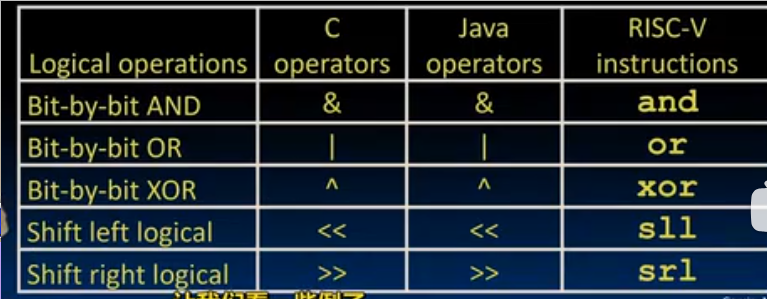
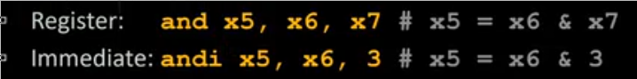
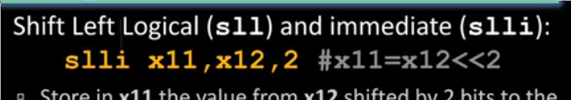

# RISC-V 的按位逻辑指令

总是有两种版本 寄存器版本`and` 立即数参与的版本`andi`

没有`not`的原因是使用`xor`异或全1值即可完成取反

## 按位运算

*shift left logical* 左移，并在最低两位填充0

每左移一位相当于乘2

`srl`右移 并在高位填充0 

此外还有**算术右移运算** `sra` `srai` 并没有算术左移

* 其会在高位填充原数据的最高有效位
