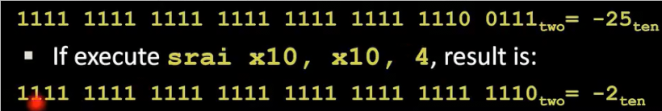
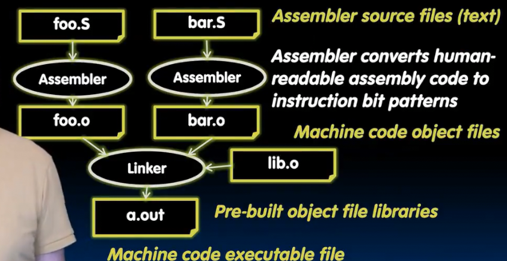
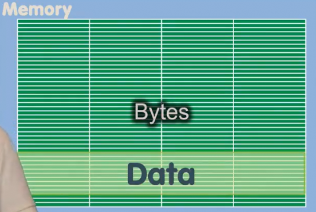
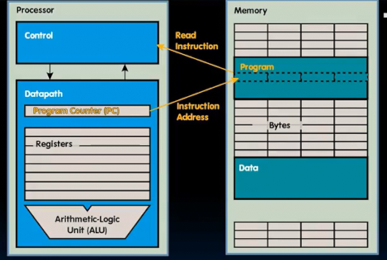
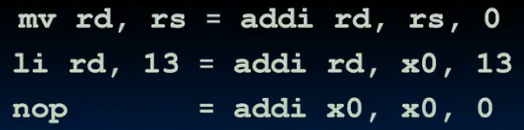

# RISC-V_的按位逻辑指令 汇编过程 伪指令
 
* [按位运算](#按位运算)
* [程序执行底层](#程序执行底层)
  * [汇编程序到可执行文件](#汇编程序到可执行文件)
  * [程序执行的硬件过程](#程序执行的硬件过程)
* [符号寄存器和伪指令](#符号寄存器和伪指令)

总是有两种版本 寄存器版本`and` 立即数参与的版本`andi`

没有`not`的原因是使用`xor`异或全1值即可完成取反

## 按位运算

*shift left logical* 左移，并在最低两位填充0

每左移一位相当于乘2

`srl`右移 并在高位填充0 

等同于无符号数 / 2^n

此外还有**算术右移运算** `sra` `srai` 并没有算术左移

* 其会在高位填充原数据的最高有效位

但是并不等同于除法（C语言要求除法向0舍入-25 / 2^4 = -1） *正数似乎和srli一样，等同于除法*

## 程序执行底层

### 汇编程序到可执行文件

1. 我们有两个汇编文本文件`.s` 
2. 汇编器分别生成`.o` *object*机器码目标文件 
3. 再之后**连接器**把这些object文件和库object文件相连形成最终的可执行文件
    * **连接**是将地址设置为适当位置，使其看上去是一个整体文件
4. 最终的可执行文件由于太大不能在寄存器中，需要存到内存

### 程序执行的硬件过程

内存中分为了**存储数据和程序的不同区域**

在RISC-V中，一条指令32位长，会被顺序执行，直到遇到分支或跳转

那么程序执行时会发生什么呢？

在处理器内部的数据通路 存在特殊的寄存器：**程序计数器** PC

* 用于存储下一条指令的字节地址

1. 控制器单元使用其从内存中获取指令，查看指令是什么，并通过数据通路和内存系统来执行
2. 更新程序计数器，为下一条要执行指令的地址（如果顺序结构则自增四个字节 **一个字**）

## 符号寄存器和伪指令

给一些寄存器和指令特别的名称方便记忆

* `a0 - a7` 对应 x10 - x17 **用于函数调用中的参数寄存器**
* `zero` 对应 x0

由于指令集很精简，一些操作没有提供相应指令，而是通过另一些操作技巧完成

提供了一些符号指令（伪指令）

* mv 寄存器间的复制 源指令 addi
* li 寄存器赋值为立即数
* nop 空转 用于等待一些东西 源指令 addi
* not 反码 源指令 xor
* bgt, bgtu, ble, bleu 
* la 标签代表地址载入寄存器
* neg 取负数 源指令sub

之前我们提到的一些跳转指令比如`j` 和我们之后要学习的函数指令 `jal` `jr` `ret`实际上都是`jal` `jalr`的源头指令
