# 函数调用
 
* [risc函数调用过程](#risc函数调用过程)
* [risc函数调用时的特殊寄存器](#risc函数调用时的特殊寄存器)
* [模拟函数调用](#模拟函数调用)
* [函数调用的指令](#函数调用的指令)
  * [jal](#jal)
  * [ret](#ret)
* [堆栈](#堆栈)
* [调用函数的汇编](#调用函数的汇编)
* [保存寄存器和易失寄存器](#保存寄存器和易失寄存器)
* [联系c和risc的内存管理](#联系c和risc的内存管理)
  * [嵌套调用例子](#嵌套调用例子)

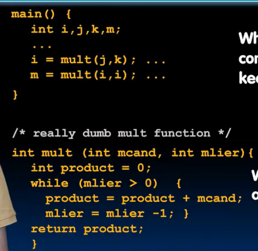

这是C语言中的函数

在main中，有两次`mult`的调用，在C语言中通过值传递给函数参数

## risc函数调用过程

在RISC中，进行函数调用有6个步骤

1. 将参数放置在新函数可以访问的位置
2. 将程序的控制权传递给新函数 **此前需要先保存原函数用到的东西**
3. 新函数获取所需的局部存储资源
4. 新函数执行相关任务
5. 将返回值放在原函数可以找到的位置 并恢复全部寄存器到调用前的状态，释放局部存储
6. 控制权交给原函数

## risc函数调用时的特殊寄存器

* 由于寄存器比内存快的多，我们使用寄存器`a0-a7`来存储变量 `a0-a1`存储返回值
* 返回地址存储在`x1`中，这个寄存器的别名是`ra`
* `s0-s1`(x8-x9) `s2-s11`(x18-x27) 负责保存寄存器

## 模拟函数调用

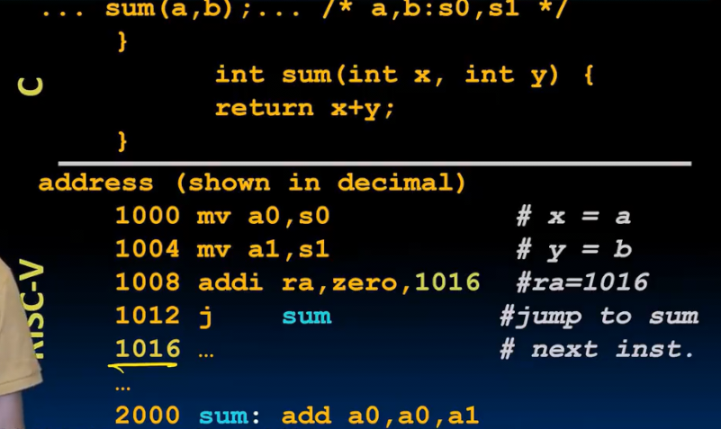

这是模拟函数调用的一些指令

1. 发生调用时，存储实参的值到寄存器作为形参
2. 存储返回地址到`ra`
3. 跳转 
4. 在函数中，根据形参`a0-a7`进行操作
5. 返回原函数`jr ra` **返回到ra存储的地址** 
    * 使用`jr`而不用`j`的原因是`j`指令需要我们传递立即数或者标签，而函数可能返回到不同地方，而`jr`支持这种操作

## 函数调用的指令

### jal

*jump and link*

* `jal SUM`

会同时设置`ra`以及跳转到函数

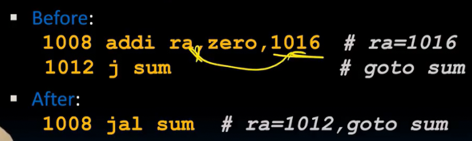

### ret

*return*

等同于 `jr ra`

## 堆栈

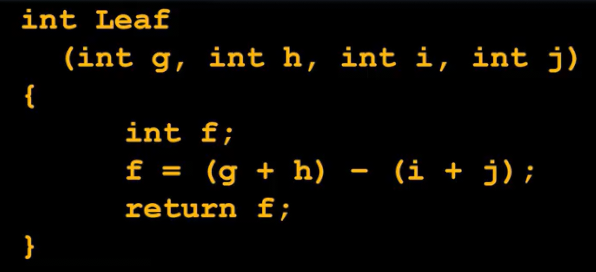

假设形参依次被存储在`a0 - a3`，局部变量f存储在s0

那么s0等寄存器中原函数的旧值去哪了？

由于我们没有足够的寄存器，他们需要**进入内存** **栈**

在RISC-V中没有专门的指令用于push和pop

我们使用一个寄存器存储当前堆栈在内存中的位置 SP （X2的别名) 堆栈从内存空间的顶部开始

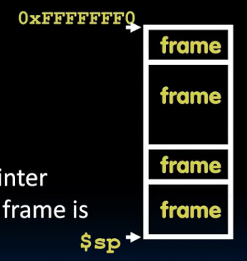

堆栈由若干**帧**组成，每一帧包括**返回地址** 当返回时，SP移动到上一栈帧 下一栈帧被释放

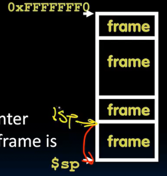

## 调用函数的汇编

这是我们`leaf`函数的汇编代码

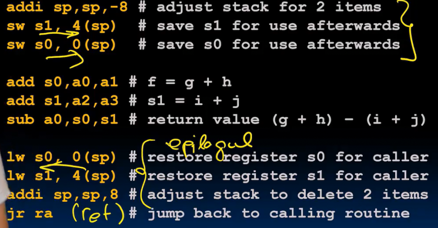

* 首先在堆栈上预留两个字的位置 **用于保存原函数寄存器状态**
  * 注意两个字即为8个字节
  * 而栈从内存顶部往前增长，因此栈的增长使得SP减小
* 保存S0和S1到刚刚预留的位置 **序言** *prolog*
* 进行leaf函数的相关操作
* 将保存的寄存器载入S0 S1 还原SP **结尾** *eqilogue*
* 返回

## 保存寄存器和易失寄存器

这是另一个调用过程

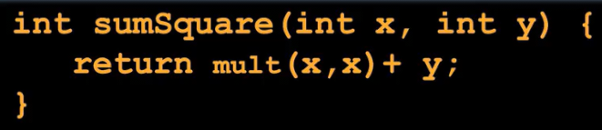

由于需要保存调用前的状态，而保存所有寄存器到堆栈是低效的，因此将寄存器分为两种**保存寄存器**和**易失**或**临时**的寄存器

保存寄存器 caller无需担心里面的值会被callee改变

* sp 调用后SP会恢复与调用前完全相同的样子
* s0-s11 调用前后值不变

这些保存寄存器如果我们需要在函数中使用，那么就要按照上述例子在 **序言** 和 **结尾** 中保存并恢复他们

易失寄存器 caller不应期望调用前后这些寄存器的值不变

* a0-a7 
* ra
* t0-t6
* 如果不想被callee覆盖，则应在调用前保存其 调用后加载回来

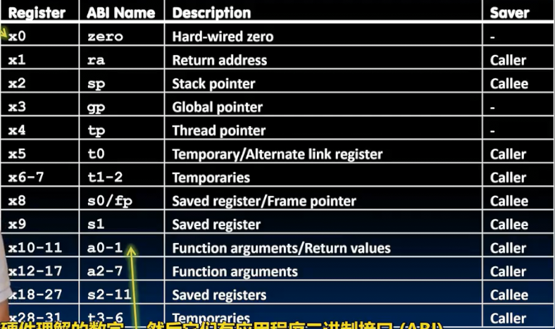

## 联系c和risc的内存管理

* 在C语言中，被**自动管理** 的是局部变量，在函数调用时出现，函数退出时被丢弃
  * 其中一些局部变量寄存器存储不下，由内存上的栈存储
  * **栈帧实际上不单单包含返回地址和需要保存的寄存器，还存储寄存器存放不下的数据**
* **静态变量**函数进入退出前后一直存在

一个函数的栈帧中包含**caller的返回地址** **参数寄存器的值** **保存寄存器的值** **任何不适合寄存器的局部变量**

C语言中内存分为三个区域**静态** **堆** **栈**

* 静态区在RV32中由指针gp管理，位于靠近内存顶部的位置
* 堆区由hp管理，位于静态区之下 和栈区相对扩展

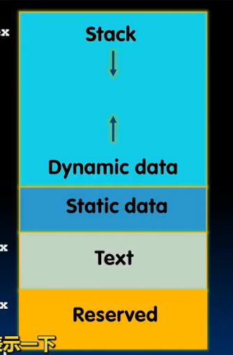

### 嵌套调用例子

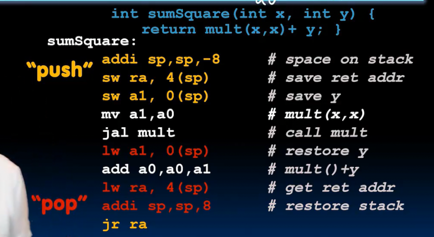

sumSquare作为callee

1.  由于sumSquare还需要调用其余函数，因此其caller存储在ra中的返回地址将被覆盖，我们在序言中将其存储在堆栈
2. 其参数a1也会将被覆盖（从y变为了x），因此也存在堆栈
    * 其a0寄存器，由于callee返回后不再被使用，因此不被保存
3. 我们在sumSquare中没有使用任何保存寄存器，因此序言中不需要保存

序言的保存工作完成，之后我们进行其内部的一系列操作，由于局部变量都可以存储在寄存器，不需要和栈交互

sumSquare作为caller

1. 将参数放在正确的位置
2. 控制权传递给新函数 *此时考虑保存一些t寄存器*
3. 新函数返回后重新载入保存的a1，并和返回值a0进行交互
4. 重新载入其caller的返回地址
5. 清理堆栈

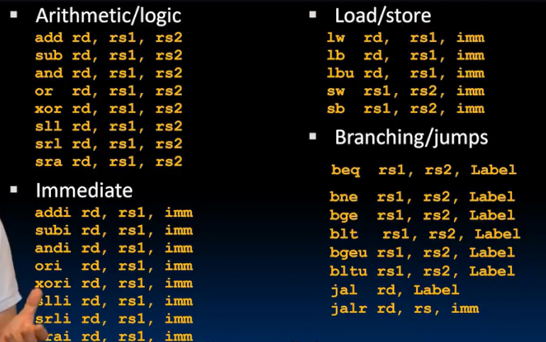

**具体而言** callee在开始前prelogue应考虑3个问题

* 我是否应该保存地址？（取决于会作为caller）
* 我是否应该保存s寄存器？（如果我使用，那么我就要保存）
* 将自身的所有参数存储为s寄存器 （如果后面不需要，再删）

caller在调用前考虑：我是否要保存t寄存器？（取决于调用后是否会用到之前的t寄存器的值）
