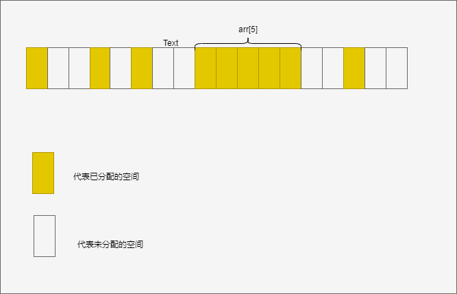
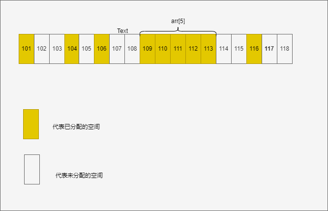
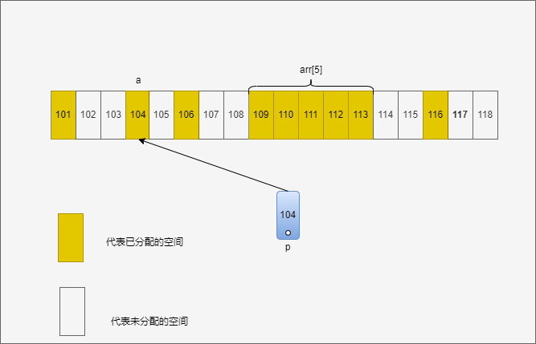
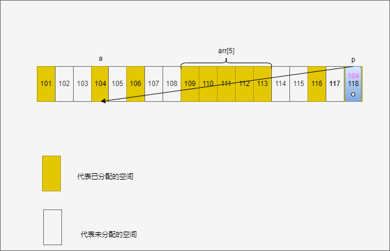
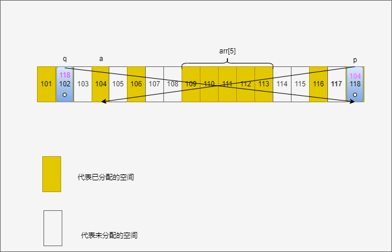
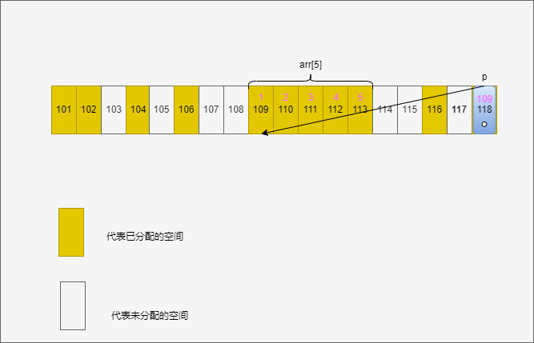
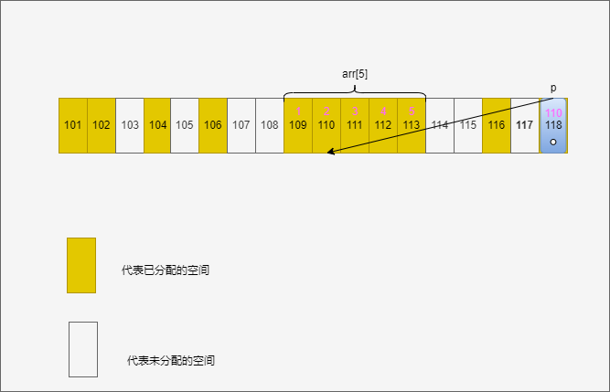

# c/c++数组、指针
## 数组
### 1.基本认识
在分配空间时，数组被分配了一块**连续**的内存空间

数组中要求**元素类型相同**

### 2.数组的初始化
三种方法:
```c
int arr[5];
int arr[5]={1,2,3,4,5};
int arr[]={1,2,3,4,5};
```
注意在第二种方法中如果不初始化所有元素
```c
int arr[5]={1,2,3};
```
**其余元素会自动赋值为默认值**，int类型的数组默认值为0，这五个元素即为
>1 2 3 0 0

### 3.地址
简单理解地址就是数据在内存的存储位置，我们定义的任何变量都有它的地址。

在定义变量时，系统分配空间就是找一个能放得下这个元素的空间（可以形象的理解成房间），元素入住到这个房间中，地址就是这个房间的门牌号。


取地址操作`&a`,a是这个变量的名字，这个操作就是通过一个人的名字查得他的门牌号(通过变量名获取地址)

### 4.数组的地址-数组名
对于数组，不需要用&来获取它的地址，数组名就是它的首地址，例如
```c
printf("%d",arr)
```
输出
>109

当然，也可以通过&加数组元素的方式来获取数组的地址
```c
printf("%d",&arr[0])
```

输出
>109

## 指针
指针是一种**存放地址**的**变量**，这是它的核心和本质。可以理解成一个存放门牌号的导航，根据这个导航，可以轻松的找到门牌号（地址），并且访问里面的住户（地址对应的变量）
### 1.指针的初始化
```c
int *p; //定义了一个用于存放int类型变量地址的指针p
char *p;//定义了一个用于存放char类型变量地址的指针p
```
**指针前面的`int`、`char`对应的是要访问的住户（变量）的类型**
### 2.指针的赋值
在前面介绍过获取变量的地址用&,把地址赋给指针即为
```c
p=&a; //p的值即为a的地址 104
```
a是变量名

这样指针p指向的就是变量a了
### 3、通过地址访问数据
我们可以通过在地址前加解引用号`*`来访问地址的数据
```c
*(&a) //会输出a的值
```
因为指针p中就是a的地址所以也可以
```c
*p //这也是a的值
```

### 4、指针在内存中的存放
在之前我们说过，指针也是一种变量，它也需要空间来存放，和普通变量的存放一样，它的地址也可以`&p`来获取

那么实际的指针如下存放


### 5.二级指针
既然指针是一种变量，那可不可以在定义指向这个指针变量p的指针q了吗？

当然可以！

我们说过指针前面的类型名是它要指向变量的类型名

那指针p的类型名是int *

指向它的指针q定义方法自然是
```c
int *(*q);
```
`*`的优先级是从右向左

自然也可以写成
```c
int **q;
```

令q指向p的地址
```c
q=&p;
```



思考如何通过q访问p?如何通过q访问a？

正如图，二级指针q也是一个变量，自然可以由三级指针取访问，四级访问三级，三级访问二级，不过显然没那个必要了，我们最多只用到二级指针。

### 6.指针的偏移
可以通过指针的++操作使指针偏移一个单位指向下一个地址，常用于数组。
```c
arr[]={1,2,3,4,5};
int *p=arr; //指针指向数组首地址
printf("%d",*p); //1
printf("%d",arr[0]); //1
```

使p偏移一个单位
```c
p++; //p现在存放的地址是110
printf("%d",*p); //2
printf("%d",arr[1]); //2
```

### 7.数组指针
**数组指针是一种指针**，这个指针和普通指针的区别是改变了偏移量。

定义如下
```c
int (*p)[2];
p=&arr;//指向数组首地址109
```

这个数组指针的基本偏移单位是2
```c
p++//偏移一次到111
```

### 8.指针数组
**指针数组是存放指针变量的数组**。

定义如下
```c
int *arr[5];
```
可以用于存放指针数据，注意与数组指针的名字，定义方式区分

## 数组和指针的关系
### 1.一维数组名和指针
我们在之前介绍过，数组名其实是数组的首地址。那在学习指针之后，有一个猜测，数组名和指针是否存在某种关系呢？

是的，数组名和指针有关系，数组名就是一种特殊的指针，在数组被定义时，自动创建的常量指针。

所谓常量，它的指向不能改变，只能指向那个首地址，也不能++，--。

但是依旧有方法访问它的不同元素。

如下：
`*(arr+n)`等价于`arr[n]`

`arr[n]`其实就是改变了arr的偏移量来访问元素
普通的指针也可以通过这种方法访问（仅说明，不常用，更常用为解引用*）
```c
int a = 739;
int *p = &a;
printf("%d",p[0]) //739
```

但是，数组名有区别于普通指针的特性

1. `sizeof(数组名)`返回的是数组的长度

    而`sizeof(普通指针)`是一个定值（32位是4，64为是8）
2. 对数组名取地址&arr返回的依旧是首地址，说明没有

    给数组名这个指针开辟额外的空间

### 2.二维数组与指针
让我们看下二维数组的定义
```c
int arr[5][3];
```
这是一个五行三列的二维数组

回想一下一维数组的定义
```c
int arr[5];
```

那二维数组可否写成这样呢
```c
int (一维数组)[3];
```

会发现这样写是不是和之前学过的一些东西相似？

数组指针！

其实二维数组名就是一个数组指针，这个数组指针的最小偏移量就是3,也就是每次都会偏移一行（二维数组的储存是先第一行再第二行...）

而arr[0],arr[1]..这些就是普通的指针常量了，和一维数组名类似。

### 练习
```练习
1.利用二级指针访问一级指针和一级指针指向的结果，并输出

2. 利用数组保存斐波那契数列的前 100 项和

3. 编写一个函数，用于判断某个数是不是质数。如果是则返回true,否则返回false
   之后利用这个函数，证明哥德巴赫猜想在1000以内都是成立的
   即，输出6-1000中所有的偶数可以写成哪两个质数和
   例如6=3+3
   	   8=3+5
	   10=3+7 
（提示：可以先求出1000以内的素数保存在数组中，再到这个数组中寻找两个素数之和恰好为这个偶数）

4.建立一个7*6的二维数组运用数组名和指针的关系，遍历其中每一个元素(要采取指针，而不是这种arr[3][4]的形式访问元素)

5.编写一个函数，用来求一维数组元素的最大值，（函数中传入数组只能利用数组的首地址）

6.编写一个函数，用来求二维数组元素的最大值，并且将数组中的这个最大值置为0。（在函数中实现）
```