# 作业设计-采矿管理系统
---
## 功能介绍
* 设计采矿管理程序，可对矿工数据进行按照编号的增删改查，同时可以按照作业要求进行不同的排序浏览与统计。
* 此外添加了按照姓名部分片段进行模糊查询功能。
* 数据通过数据库实现保存。
* 通过C++QT实现界面设计及数据库的连接与功能。
---
## 功能运行展示

**主界面**

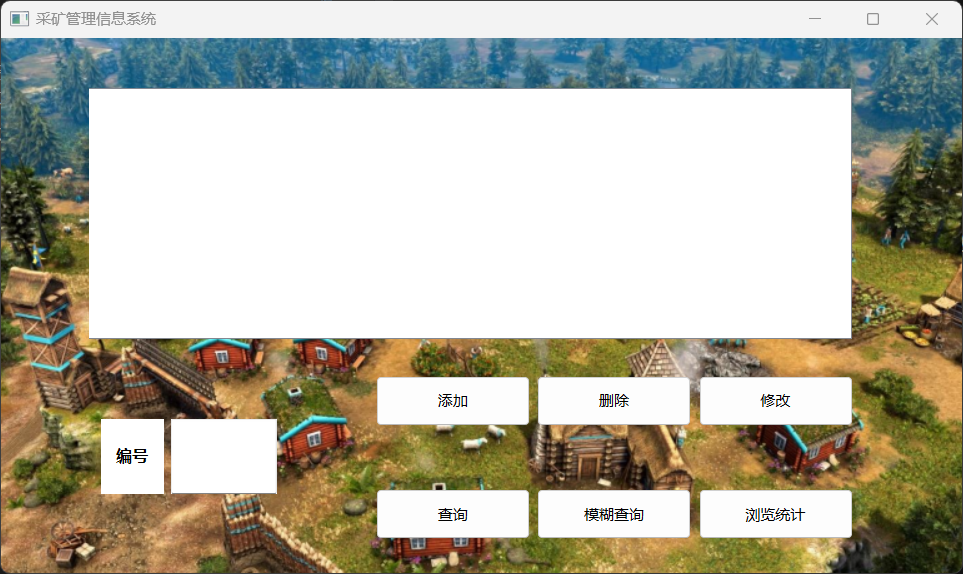

**浏览统计界面**

单击按照编号

单击按照总产量

单击按照铁矿产量
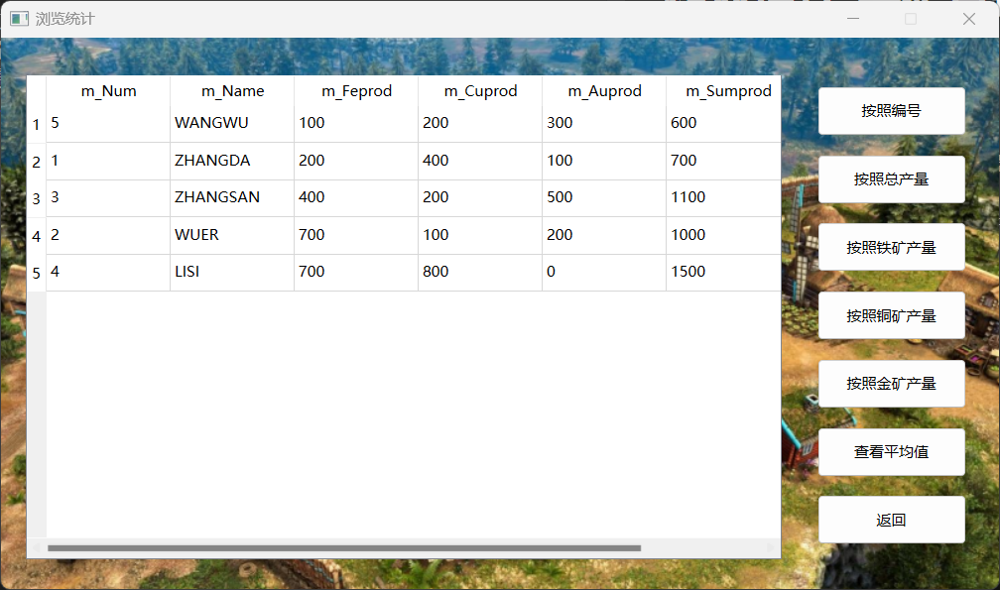
单击按照铜矿产量

单击按照金矿产量

单击查看平均值

单击返回，返回主界面

输入编号6，并单击添加
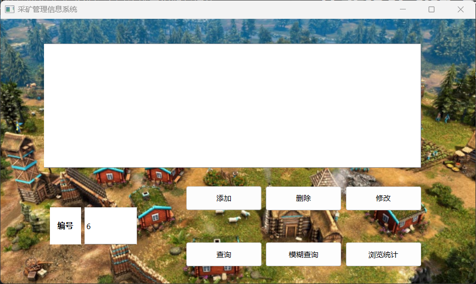

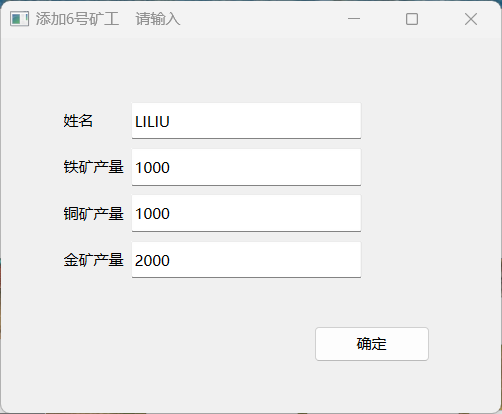
添加后

主界面输入编号5，并单击删除
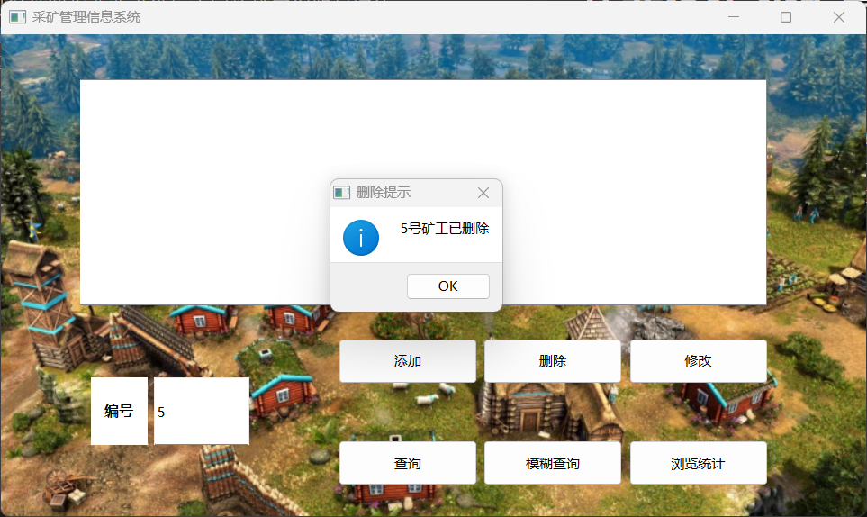
删除后

主界面输入编号1，并单击修改
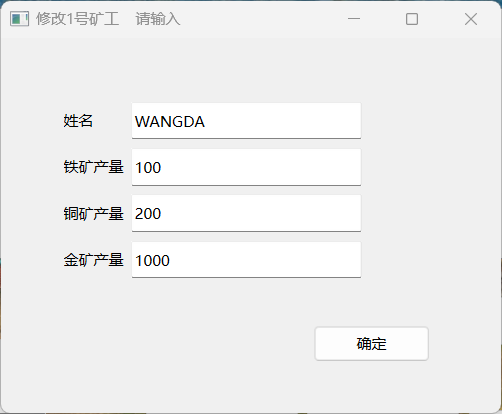
修改后

主界面输入编号6，并单击查找
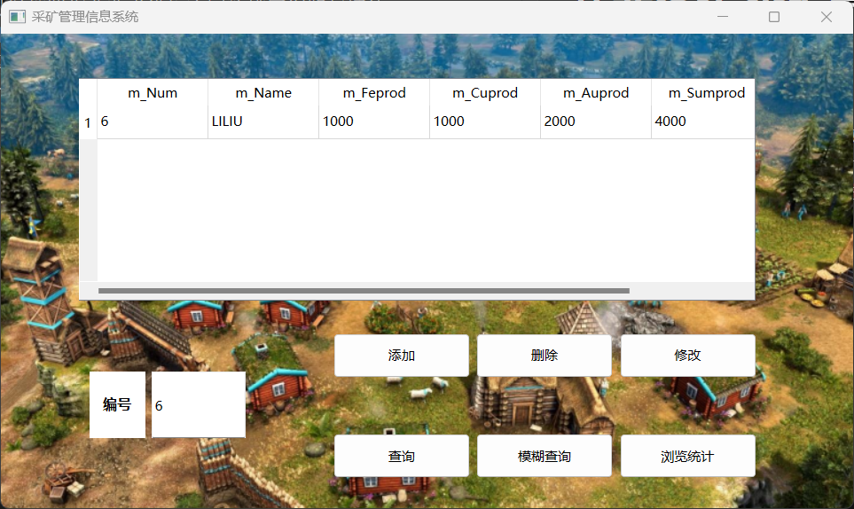
单击模糊查找

**模糊查找界面**
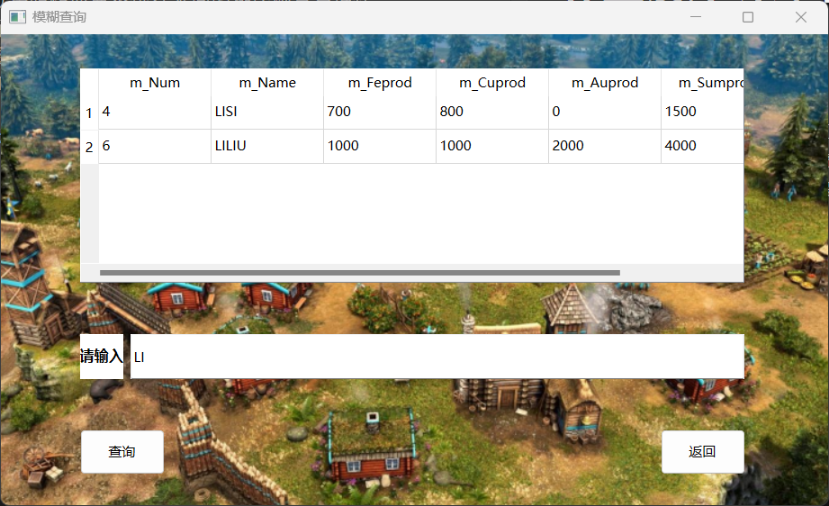

---
## 关键模块流程图
### 窗口类的实现
**主窗口类**
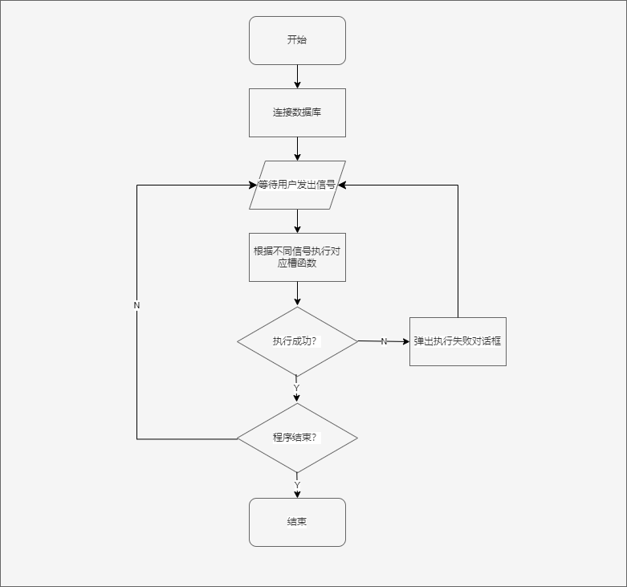
**添加窗口类、修改窗口类**
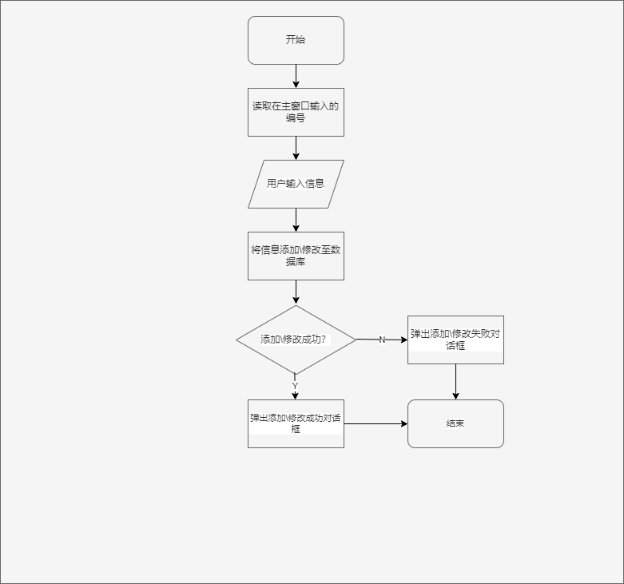
**模糊查找窗口类、浏览统计窗口类**
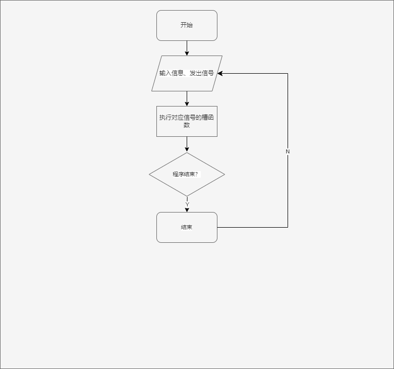
### 细节功能的实现
*添加与修改数据通过新建添加/修改窗口对象实现，不再赘述。*
**删除操作**
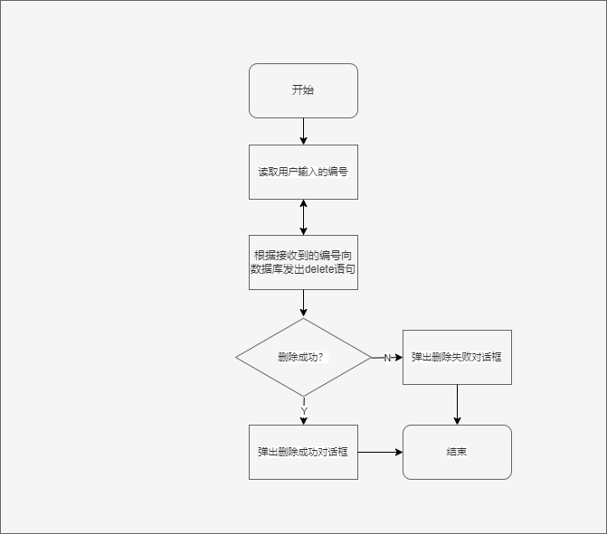
**查找操作**
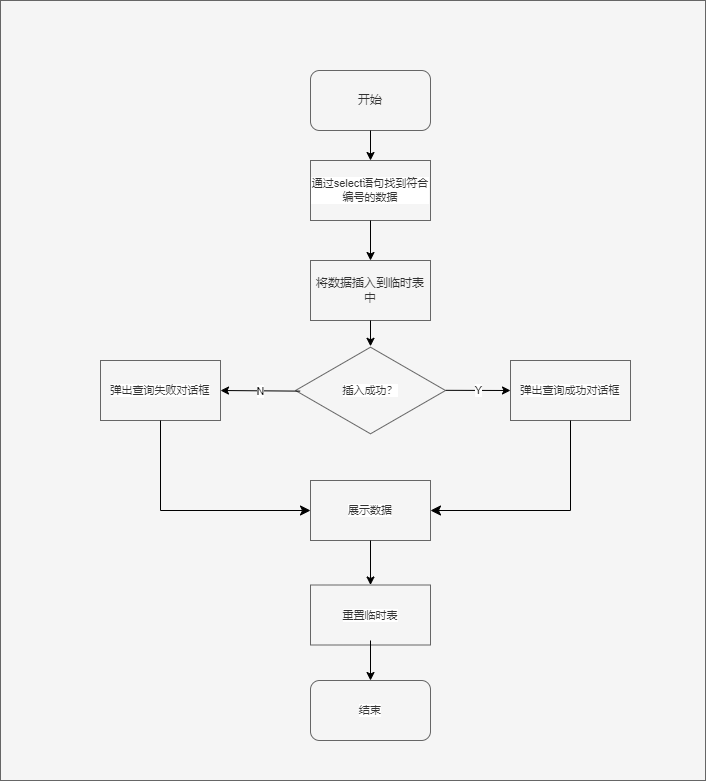
**模糊查找操作**
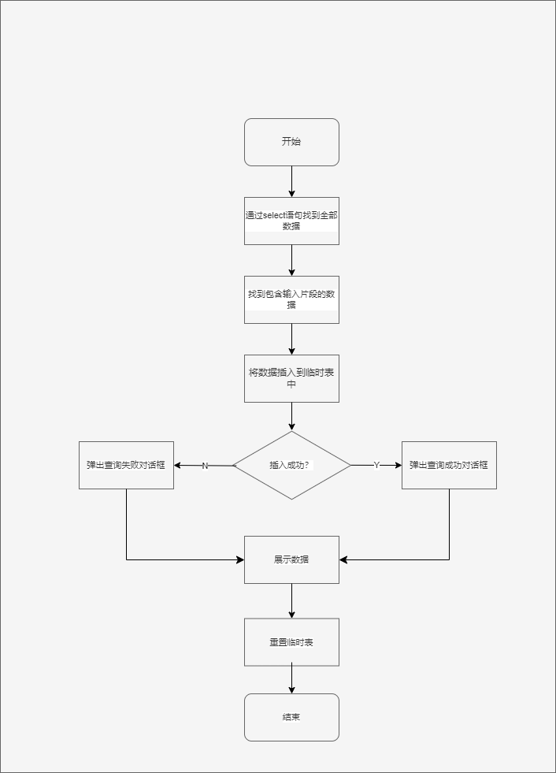
**统计平均值操作**
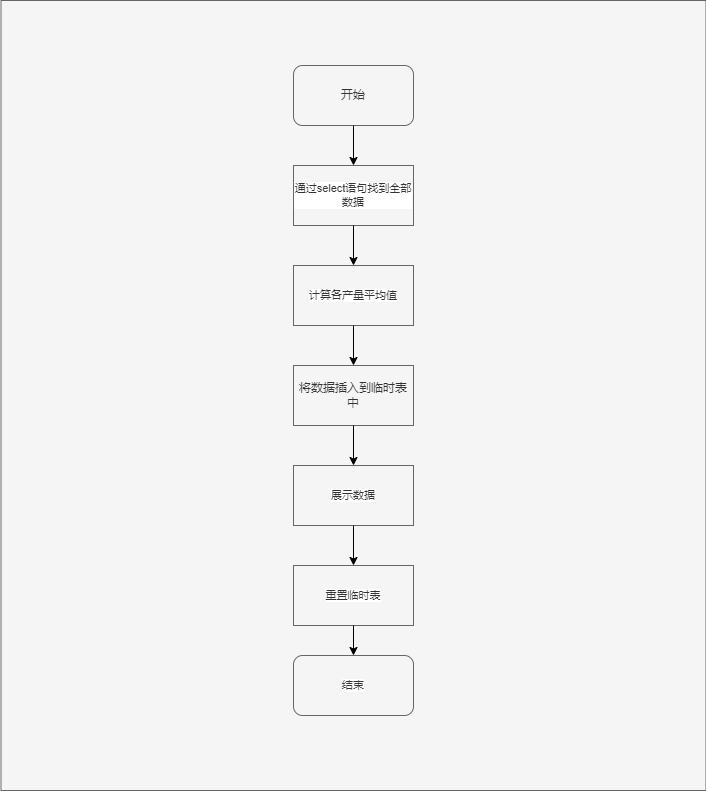
**排序输出操作**
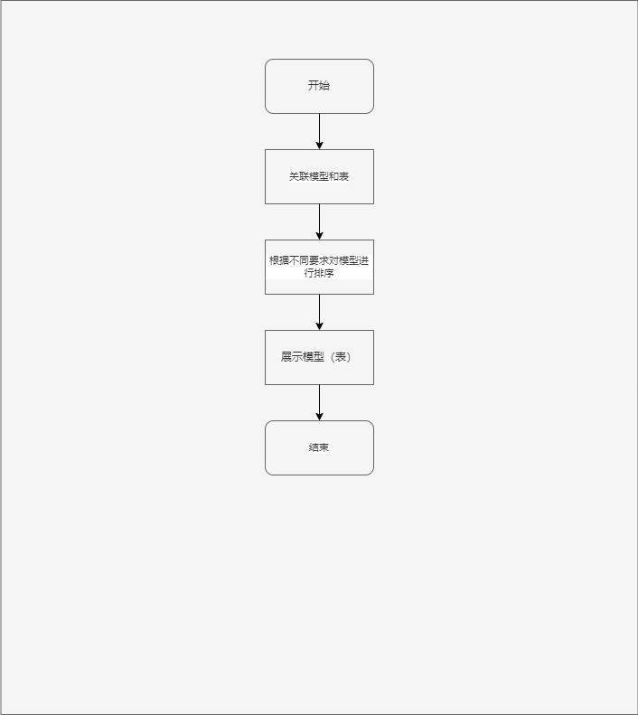

---
## 设计过程中遇到的问题及Debug
* 连接数据库后尝试读写数据时无效

使用QDebug显示
>driver not loaded

驱动没有加载，检查代码没有问题，可能是缺少sql的驱动文
件

采用ODBC数据源来连接访问sql得以解决

代码由
```c++
db = QSqlDatabase::addDatabase("MYSQL");
```
改为
```c++
db = QSqlDatabase::addDatabase("QODBC");
```

* 进行设计添加操作时，无效，表中数据没有变化。

代码没有问题

尝试在控制台执行MTSQL添加语句发现也出错

查阅资料发现是由于m_Sumprod虚拟列导致的，传入参数和表中数据不匹配。

MYSQL语句由
```sql
insert into miner values(%1,'%2',%3,%4,%5)
```
改为
```sql
insert into miner (m_Num,m_Name,m_Feprod,m_Cuprod,m_Auprod) values(%1,'%2',%3,%4,%5)
```

---
*源文件、头文件、ui文件、工程文件打包发送*