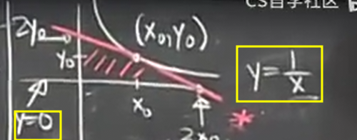
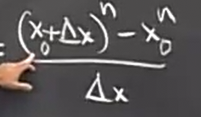
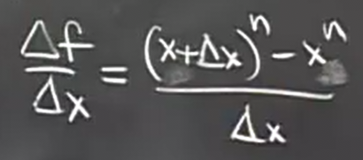
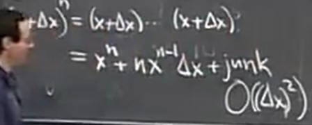
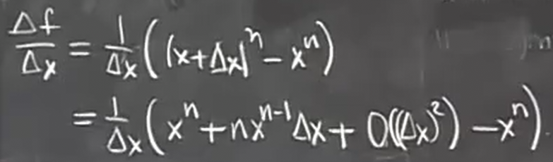
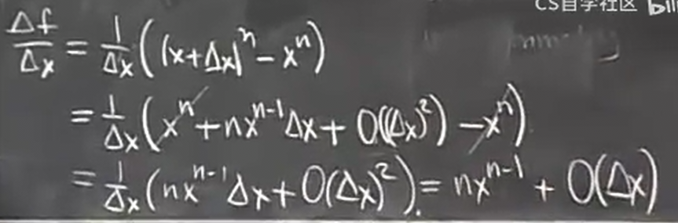
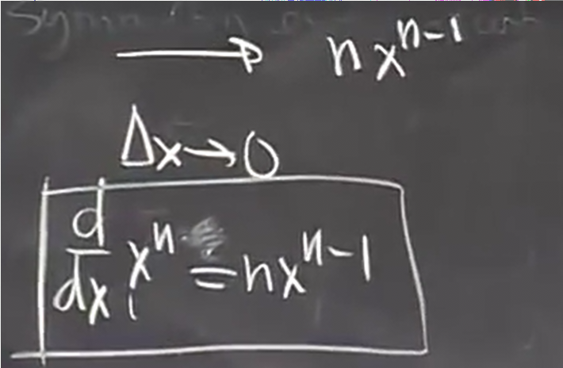
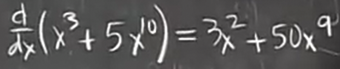
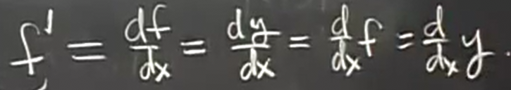

# 导数的几何解释
 
* [导数的几何解释_利用极限求解导数](#导数的几何解释_利用极限求解导数)
  * [例子](#例子)
    * [1](#1)
    * [2](#2)
    * [3](#3)
* [导数相关更多符号](#导数相关更多符号)
 
## 导数的几何解释_利用极限求解导数
 
我们想解决一个几何问题 **找到特定函数图像在某个点上的切线**

用几何方法很好解决，这一切迅速在我们脑子中得到答案

但是我们如何使用解析方法来求解？

我们学过切线是什么，根据直线的**斜切式**，我们知道通过任意点的直线都有

现在我们已经知道点p的横坐标，点在函数上，自然`y0 = f(x0)`, 我们离解析出直线还差**斜率m**

在微积分中，斜率还有另外一个名字：**导数**

符号为

**定义** ***`f'(x0)` 称为 `f` 在 `x0` 处的导数 其等于 `y = f(x)` 在 `x0` 处的斜率***

回到之前的问题，我们**如何知道直线在某点的斜率？**

即如何确定其中一条是切线而另一条不是？

在这个例子中，切线与函数只有一个交点，但是另一条有两个，不过不能作为判断的依据，因为曲线是弯曲的，切线也可能交多个点

我们回到从几何出发，大脑的思考过程，**首先我们过该点P画一条割线** *即另一条线* **当我们逐渐改变斜率 使得割点Q越来越接近此点P时，我们逐渐接近切线，当二者PQ足够近时，它就是我们所画的切线**

所以**切线就是所谓割线的极限**

那么如何用公式来表达？

1. 首先画出x轴，x轴上p点正下方位置，称其为`x0`
2. 从P点水平移动一段距离，达到Q点的横坐标值，这段距离使用`Δx`表示，也称其为x的变化量 
3. 同样的，PQ的纵坐标的差值我们用`Δf`表示，是f的变化量
3. 割线斜率即为`Δf / Δx`
4. 而据此我们结合刚才将割线转化为切线的过程得到**切线斜率**

我们通过更具体的转化也可以写出另一种形式

* `P(x0, f(x0))`
* `Q(x0 + Δx0, f(x0 + Δx0))`

因此 `Δf = f(x0 + Δx0) - f(x0)`

***重要公式***

### 例子

#### 1

我们尝试求解 `f(x) = 1 / x`的导数

实际上我们在求其任意一点的切线

1. 求 `Δf / Δx` *其有一个名字，称为* **差商**

进行化简，得到

2. 取极限 `Δx -> 0`

现在我们可以这样做，之前不这么做的原因是分子和分母给了我们 `0 / 0`的结果

我们可以对结果进行简单的验证

#### 2

`f = 1 / x`的任意一点的切线和坐标轴围成的面积(第一象限)

1. 首先，我们进行一些标记，曲线是确定的，标记为`y = 1 / x`, 特定点标记为`(x0, y0)`

2. 分析一下，要求出三角形的面积，我们需要知道两个截点, 而要解出两个截点，那么就要解出这个切线，解切线那就是微积分的所长了

解出切线如下，根据点斜式

3. 接下来就是和微积分无关的问题，分别令x和y等于0，求出两个截距

根据**对称性** `y = 2y0`

这是由于 `y0 = 1 / x0`

以至于在 解出的切线中 可以同时交换x、y和x0、y0,而保持等式仍成立

所以最终`y = 0时 x = 2x0`也可以同时交换x,y x0,y0

故 `x = 0时 y = 2y0`

4. 最后根据三角形的面积公式

得`s = 2x0y0 = 2x0 * 1 / x0 = 2`

我们注意到在虽然我们学习单变量微积分，但是本题中存在`x y x0 y0`四个未知量，他们之间存在某种联系，而他们的求解是一些代数问题，我们在微积分时只需要考虑单变量

微积分中比较复杂的就是在进行单变量微积分时，周围有无数变量在浮动

而事实上会更复杂，我们重用了一些变量名

这种重用使得问题得以简化，**计算过程中改变字母的含义**

#### 3

`f(x) = x^n, n = 1, 2, 3, (d/dx)(x^n)?`

1. 依旧先求`Δf / Δx`, 并化简

我们选择去掉`x0`的下标，因为根据我们之前的理论，如果计算过程的这一时刻，没有一个`x`在四处浮动，那我们完全可以用`x`来替代`x0`，毕竟其只是一个符号

虽然x看起来像未知数，但实际上x是固定的，而Δx是变化的

2. 我们使用**二项式定理**来化简

**这个符号`O((Δx)^2)`表示的是`(Δx)^2`, `(Δx)^3`, `(Δx)^4` ... 更高阶的情况**

3. 进一步化简

4. 带入极限，得到结果

这个结果很重要，可以带入很多多项式中

## 导数相关更多符号

* 因为`y = f(x)` 所以 `Δy` 和 `Δf` 含义相同 
* `f'`表示导数 *牛顿对导数的表示法*
* 此外 `df / dx` `dy / dx` 含义和`f'`完全相同
* 也可以表示 `(d/dx)f` `(d/dx)y` *这些和上面两个都是莱布尼兹表示*

导数的不同表示符号可以互换使用，有时会结合使用，都被证明很有作用

但是省略了 基点`x0` 因为导数定义为 函数 `y = f(x)`在点p(x0, y0)的切线斜率
