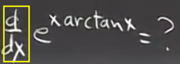

## 目标和前导

### 什么是导数

* 几何解释 *重点* 
* 物理意义
* 导数对所有测量的重要性 *科学 工程 经济学 政治学 民意调查等等*

### 如何对事物进行微分

任何我们已知的函数

### 基本知识

求某个函数的导数的符号

## 导数的几何解释 利用极限求解导数

我们想解决一个几何问题 **找到特定函数图像在某个点上的切线**

用几何方法很好解决，这一切迅速在我们脑子中得到答案

但是我们如何使用解析方法来求解？

我们学过切线是什么，根据直线的**斜切式**，我们知道通过任意点的直线都有

现在我们已经知道点p的横坐标，点在函数上，自然`y0 = f(x0)`, 我们离解析出直线还差**斜率m**

在微积分中，斜率还有另外一个名字：**导数**

符号为

**定义** ***`f'(x0)` 称为 `f` 在 `x0` 处的导数 其等于 `y = f(x)` 在 `x0` 处的斜率***

回到之前的问题，我们**如何知道直线在某点的斜率？**

即如何确定其中一条是切线而另一条不是？

在这个例子中，切线与函数只有一个交点，但是另一条有两个，不过不能作为判断的依据，因为曲线是弯曲的，切线也可能交多个点

我们回到从几何出发，大脑的思考过程，**首先我们过该点P画一条割线** *即另一条线* **当我们逐渐改变斜率 使得割点Q越来越接近此点P时，我们逐渐接近切线，当二者PQ足够近时，它就是我们所画的切线**

所以**切线就是所谓割线的极限**

那么如何用公式来表达？

1. 首先画出x轴，x轴上p点正下方位置，称其为`x0`
2. 从P点水平移动一段距离，达到Q点的横坐标值，这段距离使用`Δx`表示，也称其为x的变化量 
3. 同样的，PQ的纵坐标的差值我们用`Δf`表示，是f的变化量
3. 割线斜率即为`Δf / Δx`
4. 而据此我们结合刚才将割线转化为切线的过程得到**切线斜率**

我们通过更具体的转化也可以写出另一种形式

* `P(x0, f(x0))`
* `Q(x0 + Δx0, f(x0 + Δx0))`

因此 `Δf = f(x0 + Δx0) - f(x0)`

***重要公式***

### 例子

#### 1

我们尝试求解 `f(x) = 1 / x`的导数

实际上我们在求其任意一点的切线

1. 求 `Δf / Δx` *其有一个名字，称为* **差商**

进行化简，得到

2. 取极限 `Δx -> 0`

现在我们可以这样做，之前不这么做的原因是分子和分母给了我们 `0 / 0`的结果

我们可以对结果进行简单的验证

#### 2

`f = 1 / x`的任意一点的切线和坐标轴围成的面积(第一象限)

1. 首先，我们进行一些标记，曲线是确定的，标记为`y = 1 / x`, 特定点标记为`(x0, y0)`

2. 分析一下，要求出三角形的面积，我们需要知道两个截点, 而要解出两个截点，那么就要解出这个切线，解切线那就是微积分的所长了

解出切线如下，根据点斜式

3. 接下来就是和微积分无关的问题，分别令x和y等于0，求出两个截距

根据**对称性** `y = 2y0`

这是由于 `y0 = 1 / x0`

