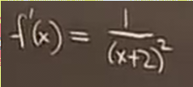
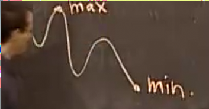

# 草图绘制_其二
 
* [例2](#例2)
* [一般策略](#一般策略)
* [例3](#例3)
* [最大值和最小值](#最大值和最小值)

## 例2

求出其导数

这个导数不会为0，因此没有自然过度的极值点

我们要想起微积分前的技能 绘制一些点 比如在-2时，函数未定义

我们引入一些新的计算 计算从右趋近于2的函数极限值

`+`的原因是希望确定其在0的哪一边

因此结果是-无穷

而从左侧趋近于-2时

接下来关注函数的末端 （在这个函数则是-无穷和+无穷）

我们可以化简这个函数 求极限 

我们犹豫的一件事是 是否函数会在中间先下降后上升

不会，因为没有临界点

完成函数的绘制 可以进行一些检验

比如导数和二阶导的正负

二阶导额外提供给我们信息 在函数上升中，不会出现抖动 因为其中没有拐点

## 一般策略

先绘图

1. 先绘制**不连续点** 特别是y无穷大的位置
2. 绘制x的端点
3. 绘制出简单点（x为0 或者y为0）等可以求得的点

之后求解函数的导数

1. 导数为0
2. 绘制临界点 和 临界值

之后确定导数在每个临界点和间断点之间的区间是正是负 **但是这一步永远不需要，而是作为上面两步的检查**

下一步是查看f''(x)的正负 判断凹凸性 为0的点为拐点 **如果没有要求 就不要这步 因为二阶导计算通常很麻烦**

最后 组合

## 例3

第一步求解函数值正无穷 奇点

下一步求解端点

为0，而右端点 可以带入一个非常大的数

趋近正无穷

我们可以确定出这些 

并且可以对其做出预期

下一步求解导数

当x为e时候 导数为0 因此其为临界点 并能求解出临界值

我们也不要忘记求解 端点时导数是否为0 在0+和+无穷处导数都为0

到此 函数已经可以完全确定 下面是检查

第三步 导数在各个区间的正负情况

查看和函数增减情况是否吻合

在求二阶导之前 我们可以重写导数

可以发现 在 1 、 e^2 时符号发生变化

所以我们的图还不太对！e^2是一个拐点

## 最大值和最小值

用草图很容易找到最大值和最小值

但是画草图很耗费时间

相反我们使用捷径 

**只关注临界点** 和 **端点** 以及 **不连续点**  （草图的前两步）

