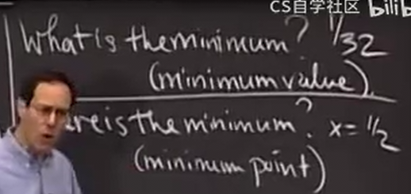
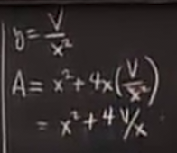

# 最大值和最小值_变化率
 
* [最大值最小值](#最大值最小值)
  * [例1](#例1)
  * [例2](#例2)
    * [隐函数微分法](#隐函数微分法)
* [相关变化率](#相关变化率)

## 最大值最小值

### 例1

1米的电线 被切成两段 每段围成一个正方形 

找到围成的最大面积

第一件事是绘图 要选定一个变量

接下来考虑问题 我们绘制的正方形

因此，面积为

找到最值可能产生的点

临界点 A' = 0

解得 x = 1 / 2 带入得 1 / 8

端点 本题要求 在 x 的0, 1的开区间 所以我们求得的是极限值

并且没有不连续点 

大概可以画出图像

所以最大值在端点取得

（注意最值和最值点的差别）

### 例2

一个没有顶部的盒子 体积固定 表面积最小 

事实证明 应当是正方形的底

绘制图 设置变量 （我们可以设置多个）

引入4个变量

上面的式子是一个约束 固定了x和y之间的关系

我们求出其临界点 端点 不连续点

端点是0到正无穷的开区间

代入

定义域内没有不连续点，因此大致画出图像

可以用二阶导检验凹凸性 以确定最值是否是最小值（但是尽量不要用，计算麻烦）

据此求出Y和A等我们关心的值

而我们可以将这个回答变得更有意义

**无量纲量**：

这是更有意义的回答 宽高比为2时 这是个好盒子

#### 隐函数微分法

最初做法相同 求出变量 和 他们的关系

隐函数微分

注意V是一个常数 但是A却是变量

化简后仍得到 x和y的比值 

更快 结果更好（直接得到比值 而不用我们自己找无量纲量）

但是！没有检查临界点是最大值最小值或者两者都不

## 相关变化率

警察距离路30 我们的车行驶在路上 警察会向我们的车发送雷达 他们读出我们的车距离50 他们还知道我们的车以80/s的速度沿雷达线靠近 我们是否超速？（> 65/s)

根据勾股定理 下边为40 

**首先了解什么是变化的 什么是不变的**

我们用t表示时间 

汽车到垂足的距离是变化的 我们命名为x

我们所求就是其随着t的变化率

dx/dt 

沿着雷达线的距离也是变化的 我们设置为D

但是边30不变

80就是D的变化率 dD/dt
