# 相对变化率和最大最小值问题的一些例子 牛顿法
 
* [相对变化率问题](#相对变化率问题)
  * [上次的例子](#上次的例子)
  * [例2](#例2)
* [最大值最小值问题](#最大值最小值问题)
* [牛顿法](#牛顿法)

## 相对变化率问题

### 上次的例子

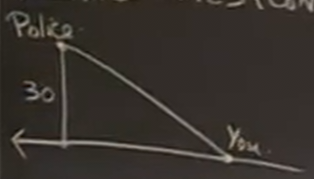

斜边 50 D

底边 40 x

当dD/dt = -80 是否超时？=> dx/dt?

x和D间存在关系

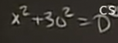

另一个关系则是上面的已知导数

因此可以隐函数求导

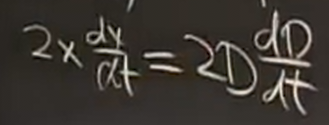

带入，得dx/dt = -100 因此超速

### 例2

锥形罐，顶部半径4 深度10 被水注满 以体积2的速度注水 当水位达到 5 时 水位上升的速度

首先绘图 标记常量 和 找到变量

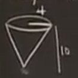

标记变量时可以绘制剖面示意图

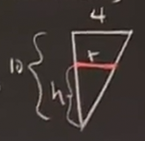

得知相似三角形的信息

建立变量间关系

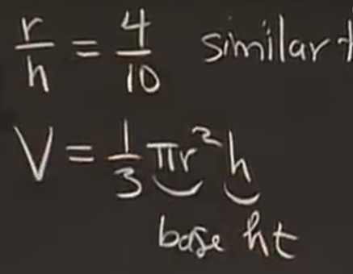

此外还有已知的关系

我们要求的就是dh/dt

代入并求导

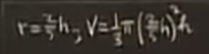

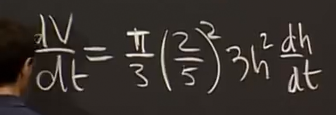

带入 求得

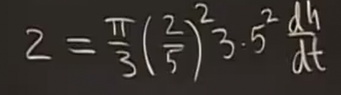

1/2pi

这类问题中，我们总是依据链式法则 通过一个变量的变化率跟踪另一个

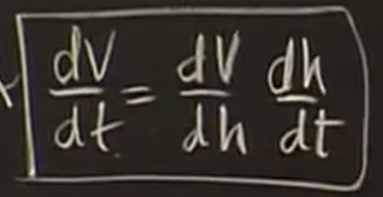

## 最大值最小值问题

绳子上挂一个重物，两端固定，重物最终会落在哪里？

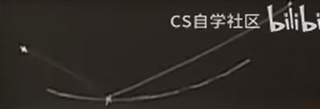

第一步是进行标记（常量、变量）但是应当先建立坐标系

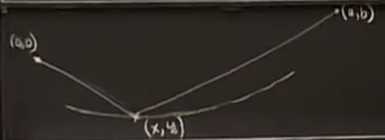

其中两个定点是常量尽管我们不知道a和b是什么

而x、y为变量

这个是一个最小值问题，在物理上，重物将降到椭圆曲线的最低点

因此曲线的表达可以用**在上面的点到两定点距离之和为定植**来表达

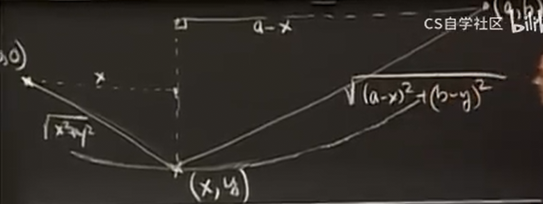

因此曲线

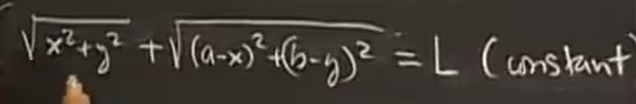

其中L是常数 这就是约束条件

要找到其中y的最小值（间断点 端点 极点 从图中可以得知是极点）

因此隐式求导得到导数为0的点

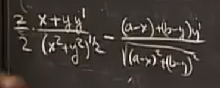

接下来怎么处理这个糟糕的式子

其实可以化简 首先y' 带入 0

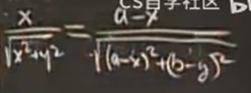

这个式子具有几何意义 可以以这种方式描述

左边就是这个a角的正弦

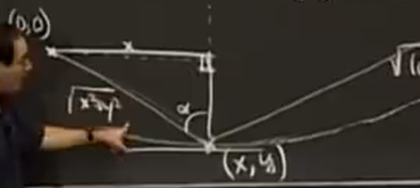

右侧是b角的正弦

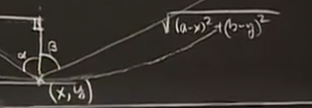

因此我们得到两个角的正弦值相同 在0到180度（和不会达到180度）范围内表明两个角相同

## 牛顿法

对于解方程 `x^2 = 5`

首先 将这个问题 具象化

`f(x) = x^2 - 5`的零点`f(x) = 0`

画出函数

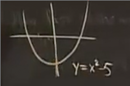

据此开始猜测，首先猜2 得到一个函数值

假设函数是线性的（也就是做该点的切线）交于x轴于x1，猜测x1，得到新的函数值

以此类推

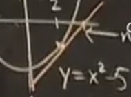

假设最初猜测值(x0, y0)

切线则是

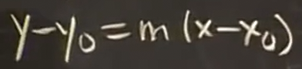

而x1则是切线在x轴的截距 带入 y = 0

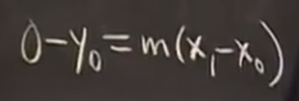

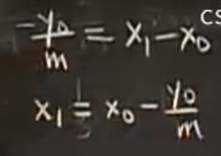

得到x1的公式 m代表上一次选择点的切线斜率

这个公式在函数中的含义是

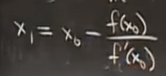

通过这个公式迭代，我们可以从某点出发求得任何根

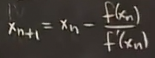

带入我们之前的例子

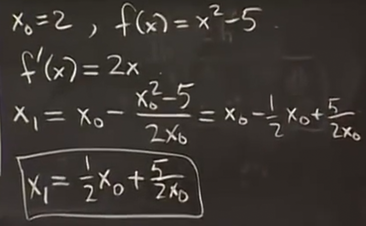

因此向这个公式不断迭代

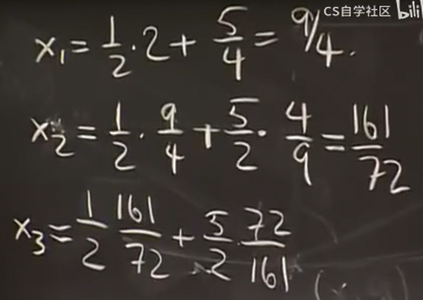

结果相差则是

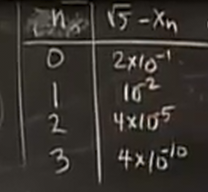

