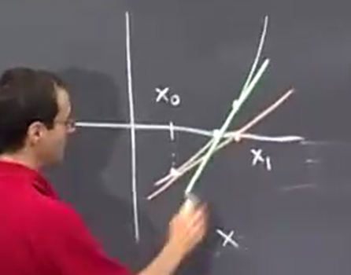
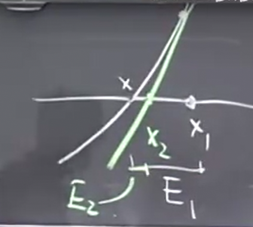
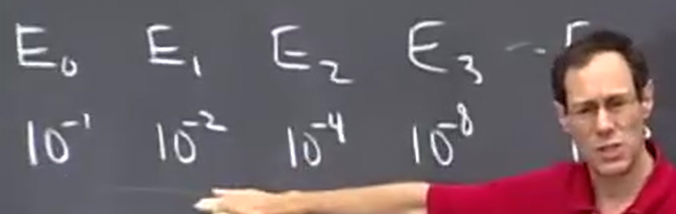
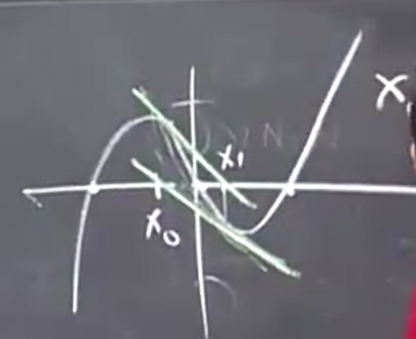

## 牛顿法回顾和限制



我们更直观的查看每次的误差缩小

`|x-x1|`记作E1 表示每次的误差

...



两次的误差之间大概是平方的关系



精确的位数随着迭代每次都是翻倍的

牛顿法表现很好 但是要**满足两个条件**

* 当|f'(x)|不小且f''(x)不大时
* 同时 x0要从目标x附近开始

如果x0很远 那么容易找到错误的根

当f'过小 比如等于 0 那么无法和x轴有交点 下一个x 无法定义

另一种f'过小导致异常的方式是



来回摆动

```py
### 牛顿法求7的立方根的近似数值

import sys

f = lambda x: x**3 - 7
df = lambda x: 3*x
x0 = float(sys.argv[1])
max_times = 1000 # 迭代次数

for i in range(max_times):
    x0, x_past = x0 - f(x0) / df(x0), x0
    if abs(x0 - x_past) < 1e-10: break # 收敛
    print(f'{i}\t{x0}')
```

```bash
~/code/tmp ❯❯❯ python whereis0.py 2
0	1.8333333333333333
1	1.9856902356902357
2	1.8464425156279822
3	1.9736838225806743
4	1.8574303333406201
5	1.9636303195775249
6	1.8666242380306057
7	1.9552239687083786
8	1.8743078829103372
9	1.948201844343324
10	1.8807239886554399
11	1.9423400558271218
...
222	1.9129311826401576
223	1.9129311828931073
224	1.9129311826621818
225	1.912931182873001
226	1.9129311826805375
227	1.9129311828562432
228	1.912931182695836
229	1.9129311828422768
230	1.9129311827085864
231	1.9129311828306366
232	1.912931182719213
233	1.9129311828209352
```

## 中值定理 mvt

如果从A到达B 共3000公里 6小时

那么一定在某个时间 瞬时速度一定是精确的平均速度 = 500 km/h 行驶

这就是中值定理

数学表述为


