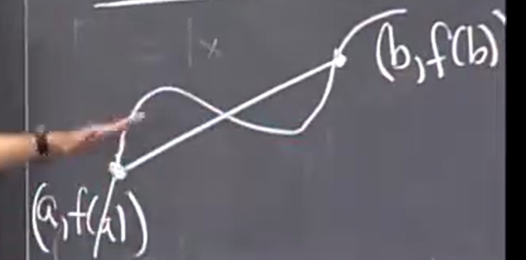

# 牛顿法限制 中值定理

## 牛顿法回顾和限制
 
* [牛顿法回顾和限制](#牛顿法回顾和限制)
  * [牛顿法求7的立方根的近似数值](#牛顿法求7的立方根的近似数值)
* [中值定理_mvt](#中值定理_mvt)
  * [几何直观证明](#几何直观证明)
  * [前提条件的必要性](#前提条件的必要性)
  * [结论_](#结论_)
    * [证明_](#证明_)
  * [和线性近似的比较](#和线性近似的比较)
  * [据此证明一些不等式](#据此证明一些不等式)


我们更直观的查看每次的误差缩小

`|x-x1|`记作E1 表示每次的误差

...


两次的误差之间大概是平方的关系


精确的位数随着迭代每次都是翻倍的

牛顿法表现很好 但是要**满足两个条件**

* 当|f'(x)|不小且f''(x)不大时
* 同时 x0要从目标x附近开始

如果x0很远 那么容易找到错误的根

当f'过小 比如等于 0 那么无法和x轴有交点 下一个x 无法定义

另一种f'过小导致异常的方式是


来回摆动

```py
### 牛顿法求7的立方根的近似数值

import sys

f = lambda x: x**3 - 7
df = lambda x: 3*x
x0 = float(sys.argv[1])
max_times = 1000 # 迭代次数

for i in range(max_times):
    x0, x_past = x0 - f(x0) / df(x0), x0
    if abs(x0 - x_past) < 1e-10: break # 收敛
    print(f'{i}\t{x0}')
```

```bash
~/code/tmp ❯❯❯ python whereis0.py 2
0	1.8333333333333333
1	1.9856902356902357
2	1.8464425156279822
3	1.9736838225806743
4	1.8574303333406201
5	1.9636303195775249
6	1.8666242380306057
7	1.9552239687083786
8	1.8743078829103372
9	1.948201844343324
10	1.8807239886554399
11	1.9423400558271218
...
222	1.9129311826401576
223	1.9129311828931073
224	1.9129311826621818
225	1.912931182873001
226	1.9129311826805375
227	1.9129311828562432
228	1.912931182695836
229	1.9129311828422768
230	1.9129311827085864
231	1.9129311828306366
232	1.912931182719213
233	1.9129311828209352
```

## 中值定理_mvt

如果从A到达B 共3000公里 6小时

那么一定在某个时间 瞬时速度一定是精确的平均速度 = 500 km/h 行驶

这就是中值定理

数学表述为

茶商（位置之差 行驶的距离） / 时间的间隔 = = 平均速度 = 起始终止时间间某个时间点的瞬时速度


* **前提条件是 f 在 开区间a b 之间可导 并且 在闭区间ab f连续**

这个定理使得**茶商（割线斜率）**等于**切线斜率**得到了验证

### 几何直观证明



这是我们的**割线斜率** 也就是对应上例的平均速度

我们试图找到和它相同的**切线斜率**

从两个很远的地方平移其（最初触碰到曲线）


在两端点之间找到这样的一个切线斜率

### 前提条件的必要性


这里没有切线定义 原因是不可导 

### 结论_

**应用于画图**

* 如果 f' > 0 则 f递增
* 如果 f' < 0 则 f递减
* 如果 f' = 0 则 f是常数

都是由中值定理得来

#### 证明_

重写公式


最后的公式很常用

假设a < b

则 b - a > 0 如果f'(c)瞬时导数大于0

那么由刚刚的式子 f(b) > f(a) 因此是增函数

而 f'(c) 小于 0 同理 

f;(c) 等于 0 代入 则 f(a) = f(b)

### 和线性近似的比较

他们密切相关

线性近似说 当delta x 接近于0 时 割线斜率和定点切线斜率近似相等（另一种表述）


而中值定理表明 左侧的式子（差商）确切等于某点导数 但是我们不知道 c在a和b 的哪个位置

也就是说 **中值定理 确定了 差商的最大值 最小值在导函数的最大值最小值** *平均速度在最小速度和最大速度之间*


这是中值定理的唯一应用和理解方式 

然而对于线性近似 它说*平均速度约等于初始速度或者终止速度 前提为过去的时间接近0*

此外，线性近似仅仅要求在x0处函数连续且可导

在实践中 我们会忘记中值定理 而是记住它上述对于增减函数判断的应用

### 据此证明一些不等式

1. 当x>0时 e^x > (x + 1)

证明构造为一个函数 并验证增减性 和定点值


综上，成立

2. 当x>0时 e^x > 1 + x + x^2/2


而g'恰恰等于1中我们所证明 故大于0


成立

3. ...

我们可以继续下去

使得下一个的导数等于上一个所证

最终得到

`e^x > 1 + x + x^2 / 2 + x^3 / (2*3) + x^4 / (2*3*4) + ...`
