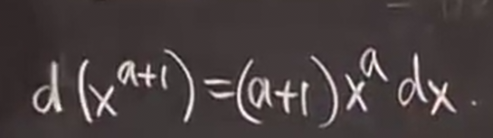

# 微分和积分
 
* [微分](#微分)
  * [在线性近似的应用](#在线性近似的应用)
* [反导数_积分](#反导数_积分)
  * [例子](#例子)
  * [不定积分的唯一性](#不定积分的唯一性)
  * [更复杂的积分](#更复杂的积分)
    * [换元积分法](#换元积分法)
    * [例子2](#例子2)
    * [例子3](#例子3)
    * [例子4](#例子4)
    * [例子5](#例子5)
    * [例子6](#例子6)

## 微分

如果函数y=f(x)，那么y的微分记作dy 定义`dy = f'(x) * dx`

这等价于`dy / dx = f'(x)` *莱布尼兹对导数的符号解释 将导数看作两个无穷小量的比率*

### 在线性近似的应用

用dx代替delta x，dy来替代 delta y

即按照导数的步骤求解

当x等于64时，代入，而0.1代入dx

因此可以代入近似计算

对比我们之前应用的线性近似

代入 

代入 x = 64.1

得到的结果相同 是同一种方式的两种不同记法

## 反导数_积分

是一种新的符号 

* G(x)为g的反导数（积分）
  * 另一个名字叫做**不定积分**
* 符号称为积分符号

### 例子

1. `∫ sinx dx = -cosx + C` 

求一个函数的积分（反导数）即使得另一个函数的导数是它

而对于常数求导是0，所以我们可以给结果任意添加常数 因此称之为**不定** *没有单一答案`

2. `∫ x^a dx = x^(a + 1) / (a + 1) + C`

尽管下面这个微分对于全部a是正确 但是上面的积分存在例外 a = -1 （出现分母为0的情况）

3. `∫ 1/x dx = ln|x| + C`

这是上一个幂函数积分不成立的情况

逆向思考的过程

lnx + C

这个式子同样对x限制 x > 0

但是我们可以扩展 检查 x < 0 时 ln|x| 的导数

是两个函数导数的合并结果

不过之后我们通常只考虑x > 0 的情况

4. `∫ sec^2 x dx = tanx + C`

5. 

= sin^-1 x + C

6. 

### 不定积分的唯一性

尽管常数可以随便加，但是对于特定函数 其积分函数取余的项是确定的

**定理**

如果f'(x) = g'(x) 则 f(x) = g(x) + C  *导数相同则原函数只差C*

证明：

如果f' = g'

则 (f - g)' = f' - g' = 0

因此 f - g = C(中值定理的推论）

### 更复杂的积分

展开相当麻烦

#### 换元积分法

为微分量身定做的一种方法

1. 另`u = x^4 + 2`

2. 取其微分

du = 4x^3 dx

3. 代入

这样就易于积分

因为问题是x提出的，因此代回x

#### 例子2

1. 换元 u = 1 + x^2
2. 求导 du = 2xdx
3. 代入

然而，一种更好的方法是"高级猜测"

这种方法通过猜测积分，再验证微分并微调系数完成

1. 猜测积分是(1 + x^2)^1/2 这样的形式
2. 对猜测求导 检验

#### 例子3

猜测e^6x 然而求导得到6e^x 

因此需要添加系数1/6才得到原函数

#### 例子4

猜测积分 e^(-x^2)

验证导数 添加系数 -1/2

*写出来 不然易犯算术错误*

#### 例子5

guess cos2x 

(cos2x)' = -2sin2x = -4sinxcosx

修正系数 -1/4

-1/2 cos2x =  sin^x

然而另一种结果则是

原因在于根据三角变换 只相差一个常数

#### 例子6

找到最难处理的地方 替换 

1. u = lnx
2. du = 1/x dx
3. 代入

严格上

