# 微分方程
 
* [例子1](#例子1)
* [例子2](#例子2)
* [分离变量法](#分离变量法)
  * [注意](#注意)
    * [关于对数](#关于对数)
    * [关于常数](#关于常数)
    * [例子1的分离变量方法](#例子1的分离变量方法)
    * [关于a的不确定性](#关于a的不确定性)
* [例子3](#例子3)
  * [注意](#注意)
* [例子4](#例子4)

*18.03 完整的微分方程课程*

## 例子1

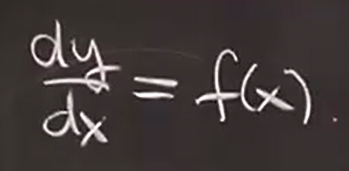

最简单的微分方程

y的解为

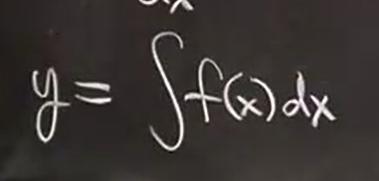

*目前我们只有换元法（高级猜测）来求出积分*

## 例子2

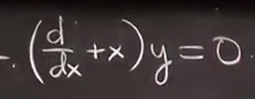

x的一项在量子力学中称为*湮灭算符* *创生算符*改为`-`

有非常简单的解

1. 将某项放在右边 重写方程

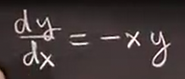

这里等号右侧出现了两个未知数

2. 分离变量

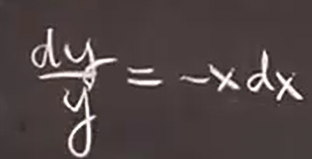

3. 对两边进行积分

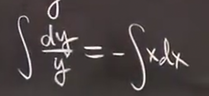

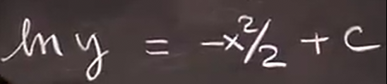

（y>0的情况）

注意引入常数

4. 解出y

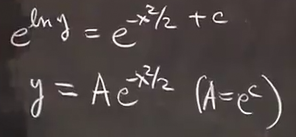

这是a的范围

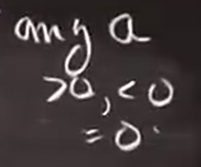

检验可以再次求导

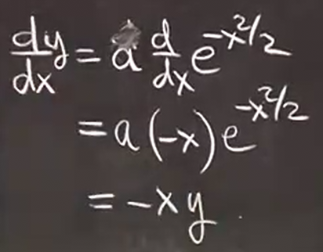

## 分离变量法

适用于

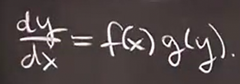

这种形式

1. 首先进行分离

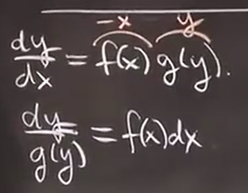

2. 分别对两边进行不定积分

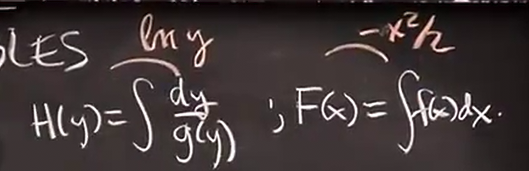

3. 关系为相差一个常数

4. 得到关于y的隐式方程

5. 转换为显式或者保持为隐式

### 注意

#### 关于对数

例子2的积分后可以写为

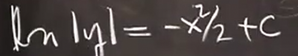

但是最终得到结果 扩展了A的范围

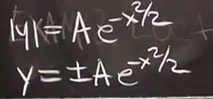

但是现在还缺少y等于0 向原式带入y = 0 出现一个恒等式

#### 关于常数

两边可以各加一个c1和c2 

但是他们总是可以合并

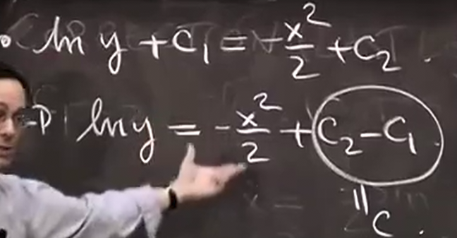

并且在积分后 不总是保持加法常数 进行非线性运算后会经常变成乘法系数等

#### 例子1的分离变量方法

分离变量

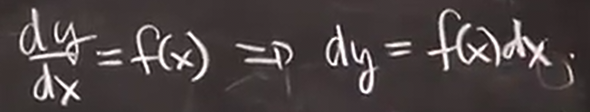

求积分

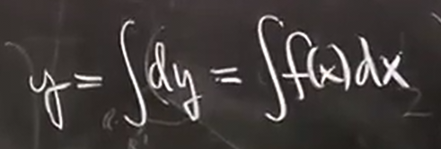

#### 关于a的不确定性

这种形式称为通解 *所有解的集合*

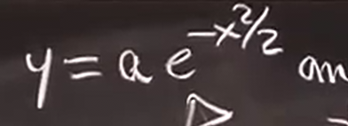

结合一些给定条件 求出A值 得到特解

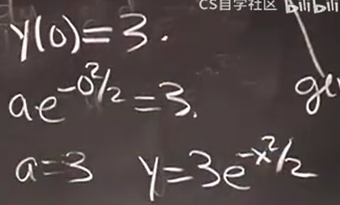

## 例子3

函数上任意一点的切线斜率等于和原点的割线斜率2倍

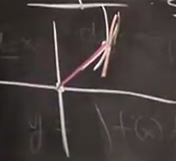

那么可以用微分方程表示

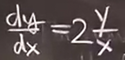

分离变量

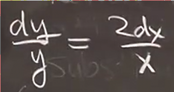

求积分

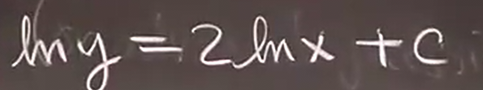

暂时不考虑正负性

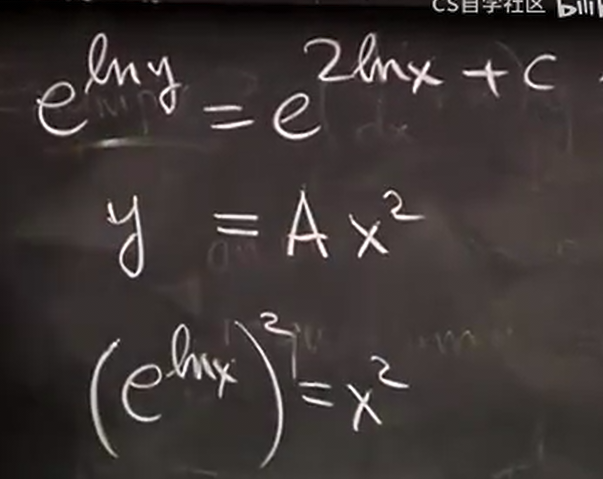

解即为

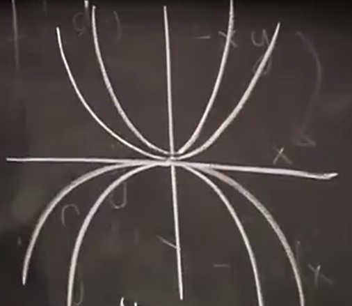

（对于负数进行检验）

可以求导以验证结果 *这同样验证了无论a正负或者0 都符合结果*

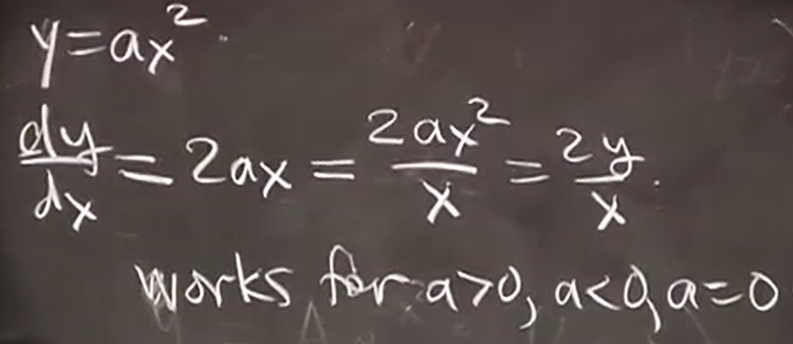

### 注意

这个式子在x等于0时是未定义的

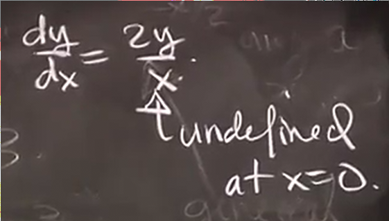

## 例子4

垂直于抛物线的曲线

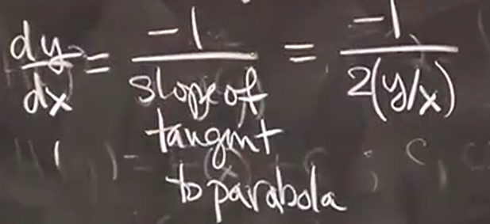

（这里用了抛物线y=Ax^2斜率的另一种写法）

分离常数

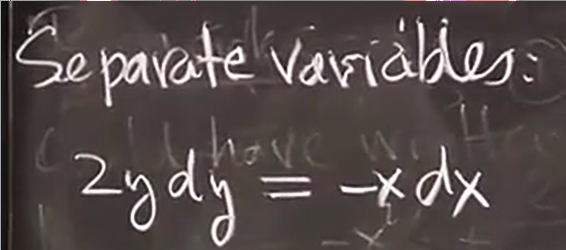

解得

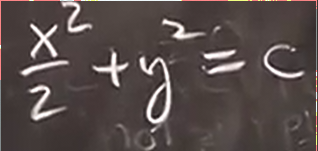

因此这里并非所有C都有意义

是一个椭圆

我们可以求得显式解

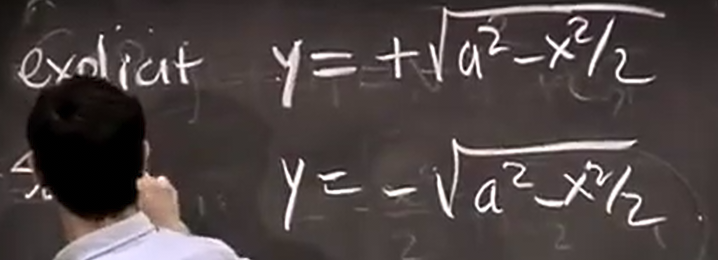

y等于0时，斜率趋近于正无穷

*导数告诉我们关于一些原函数的信息*
