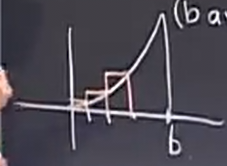

# 定积分
 
* [几何角度](#几何角度)
* [计算](#计算)
* [例子1](#例子1)
* [例子2](#例子2)
* [例子3](#例子3)
* [规律](#规律)
* [定积分的符号](#定积分的符号)
* [累加和](#累加和)

## 几何角度

求曲线下的面积（另一种角度是累加和的思想） 

曲线记为`y=f(x)`

将曲线下方的面积记作

这就是定积分，与之前不定积分相比，多了两个**上下限**

## 计算

我们遵循三个步骤计算这个面积

1. 分成"矩形"
2. 累加这些矩形的面积
3. 使得矩形变薄，取得其最薄极限

有的地方多一部分 有的地方少一部分

但是随着矩形越来越薄，我们漏掉的小面积会趋于0 变得忽略不计

## 例子1

设边界a=0 b任意

1. 分成若干 矩形 共n个

2. 求出面积

矩形的好处是很好求得面积

底是 b / n

求得对应的高

...

乘得面积 相加得总面积

3. 求出极限

在求极限时，我们先对原式进行化简

我们要求的是n趋近无穷时的值

我们使用一种*不推荐*的技巧，绘图以查看大小

像堆叠金字塔一样 结果即是它 的体积

我们可以紧邻其内围成 一个正四棱锥（底边长n 高度n） 可以求得体积 1/3 Sh = 1/3 n^3

而紧邻其外也可以围成一个n+1的四棱锥

这样限制了它的上下界限

由此可以求得极限（夹逼定理）

对这个不等式同时乘以b^3 / n ^ 3

对于这种大量求和 发明一种符号为求和符号

在本体中即为

其中常数可以提出

## 例子2

函数 f(x) = x

面积很容易求 b^2 / 2

## 例子3

f(x) = 1

面积即为 b

## 规律

对于函数及其和x轴围成的面积之间

更清晰的写法

那么 f(x) = x^3 会发生什么呢

推理得出 面积为 b^4 / 4

事实上，我们有更简洁的方式求出这些面积

## 定积分的符号

* 黎曼和

定积分的一般过程

1. 分解为小块 增量名为 delta x = 1 / n * (b - a)
2. 选取每个区间中的**任意高度**
3. 对形成的矩形面积加和

称为**黎曼和**

在极限情况下 变为

## 累加和

函数t 年

函数f(t) 每年的金额

每一天delta t则是 1/365

在第45的金额则是

总的金额则是

当t无限划分 每个时刻的金额和则是

