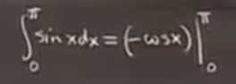
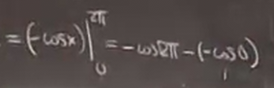

# 微积分基本定理
 
* [例子](#例子)
* [例子2](#例子2)
* [例子3](#例子3)
* [直观的解释_理解](#直观的解释_理解)
* [扩展到负数](#扩展到负数)
  * [例子](#例子)
* [定积分的性质](#定积分的性质)
  * [例子](#例子)
  * [例子](#例子)
  * [注意](#注意)

*FTC1*

如果 `F'(x) = f(x)`，那么f(x)从A到B的积分 等于 f(b) - f(a)

而另一方面，我们知道F(x)是f(x)的不定积分

另一种表示方式是

## 例子

导数则是

记作f(x)

求导函数在a到b的积分 = F(b) - F(a)

如果a为0 代入

得到和上节课的几何方法一样的结果

## 例子2

求sinx 一个峰下的面积

可以转换为定积分 0 - pi

= 2

## 例子3

## 直观的解释_理解

假设x(t) 为在时间t的位置

x的导数就是速度

定理说明 从a到b速度的积分等于位置差 也就是行驶距离

是某种速度的积累和

另外 我们还要理解其和黎曼和的关系

在某一秒 我们读取 到表上显示速度为 v(ti)

那么 这一秒 走过的距离则是 v(ti)*(delta t = 1s)

如果走完全程 则对这个项目求和

这个黎曼和和里程表显示的走过路程很接近

回到起点是正负速度的累计相互抵消的结果

## 扩展到负数

### 例子

两个峰的面积

同样对其不定积分取端点相减

得到结果 0 

说明 **定积分是高于x轴的面积** 当曲线低于x轴 面积在定积分中记作负值 *x轴上方面积-x轴下方面积*

## 定积分的性质

1. 函数和的积分等于积分的和

2. 常数可以从积分中提出

*但是依赖于x的函数不行*

3. 从a到b的积分加从b到c的积分和等于等于从a到c的积分

4. 从a到a的积分等于0

5. **定义**从a到b的积分等于-的从b到a的积分

据此，**规则3不限制a < b < c**

6. 如果f(x) <= g(x) 则从a到b f(x)的积分小于等于从从a到b g(x)的积分

限制了a < b

### 例子

进行估算

当x大于等于0时，e^x大于等于1

对其积分 从0到b 那么则

分别求其积分

得到

现在我们有当x>=0 e^x >= 1 + x

再次分别积分

结论是

...

又是对e^x展开的证明

7. 变量替换

对于不定积分，我们称之为换元法

而对于定积分 我们只需要加入限制

但是**注意 x处的上限对应u取得的上限** 

以及**u'始终不变号时**有效 如果变化则分成几部分

### 例子

函数(x^3+2)^5从1到2的积分

采用替换法 

要**确定关于u的上下限** 从3到10

得到结果

### 注意

我们为了演示，利用换元法

u - x^2 注意 u' = 2x 在范围内并非在0的一侧

如果不分开求，得到错误结果 0

