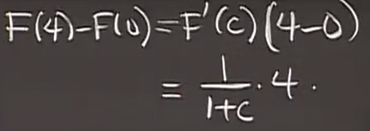
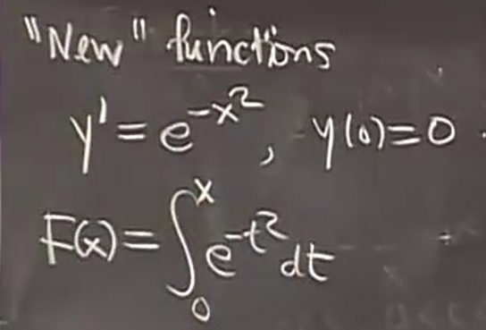

# 比较中值定理 微积分基本定理的另一种表述
 
* [微积分基本定理可以替代中值定理](#微积分基本定理可以替代中值定理)
  * [例子](#例子)
* [微积分基本定理版本2](#微积分基本定理版本2)
  * [例子](#例子)
  * [用微积分基本定理表述1_验证](#用微积分基本定理表述1_验证)
  * [对基本定理第二表述的证明](#对基本定理第二表述的证明)
  * [对微积分基本定理表述1的证明](#对微积分基本定理表述1的证明)
  * [例子](#例子)
  * [例子2](#例子2)

## 微积分基本定理可以替代中值定理

反过来思考定理的结论

通过原函数F理解

比较微积分基本定理和中值定理

因此基本定理可以写为

同时除以`delta x`

右侧表述**f从a到b的平均值** 即也是F'从a到b的平均值 因此我们可以和中值定理比较

* 是平均值的原因在于 对于离散的取值

这是平均值 这里黎曼和的形式

在连续环境中，分子变为积分，也是一种和 *利用积分的几何意义绘制小长方体更好理解*

因此，这是基本定理

而中值定理表明 

*割线斜率等于其中某切线斜率*

中值定理 只是确定了c在ab的某个地方 将割线限定在最大切线 和最小切线中间

而微积分基本定理 给出更强的结论 *由此可以丢弃掉中值定理*

而同样将割线限制在切线最小值和切线最大值当中 并且我们得知割线斜率就等于区间中切线斜率的平均值

### 例子

问题是 中值定理 能得到 关于 A < F(4) < B 成立的哪些A B

> minF'(x) <= F(4) - F(0) / 4 <= maxF'(x)

而另一方面 我们可以比较微积分基本定理

看作导数平均值的形式 同样小于导数最大值 大于导数最小值

另一角度 在几何上

对于f(x)积分上下限的估计 分别是最高和最低的两个矩形

 

（只有1项的黎曼和）

## 微积分基本定理版本2

假设函数f连续

令G(x)为

其中

注意计算积分时 a 和 x 是固定的 而t作为计算变量

而当f(t)一定时，我们确实可以通过定积分得到关于x的一个函数G(x)

定理则是

此外G(a) = 0(由于积分两界限一致)

构成这样一个微分方程

另一方面 定理说明这种微分方程总可以解决

### 例子

 

这里的积分部分 就是 定理中的G(x)

而对G(x)求导 根据定理 就是 积分中的部分

### 用微积分基本定理表述1_验证

代入

对其求导

### 对基本定理第二表述的证明

图解法 曲线下面积

函数 y = f(x) 三条竖直线分别是 a x x+(delta x)

从a 到 x的面积我们称为G(x)

根据积分的定义 因此G(x) 是 从a到x的积分

而从x到x+(delta x)围成的面积 即为delta G

其约为

（视作delta x很小）

这里用到f 连续的性质

恰恰是G(x)的导数 证明结束

### 对微积分基本定理表述1的证明

已知 F' = f  假设f 连续

定义G(x)

根据第二表述

则G'(x) = f(x)

因此F'(x) = G'(x)

根据中值定理的推论 F(x) = G(x) + C

代入b 和 a

= G(b) - G(a)

代入 G 的定义

证明结束

### 例子

这个微分方程 

表述二告诉我们 结果是

### 例子2

f(x)被称为钟形函数

然而F(x)不能使用之前的任何函数表示 是一个全新的函数

但是我们能获取全部想要的信息
