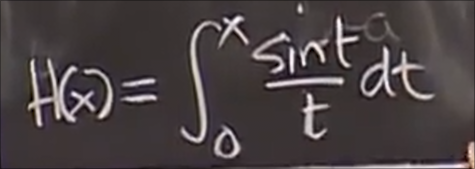

# 微积分第二基本定理
 
* [对数函数的性质](#对数函数的性质)
* [例子2_新函数性质](#例子2_新函数性质)
* [另外一些基于积分的新函数_科普](#另外一些基于积分的新函数_科普)
* [曲线间的面积](#曲线间的面积)
  * [例子_曲线间面积](#例子_曲线间面积)
    * [方法1](#方法1)
    * [方法2](#方法2)

## 对数函数的性质

可以用来解微分方程

在上一个例子1 我们由反比是例函数推导出

 而这个函数可以推导出对数函数的所有性质

把这个 积分作为 对数函数的定义

* `L'(x) = 1 / x`
* `L(1) = 0` 这两个性质都由给出的微分方程指定

我们可以求解其二阶导数

* 由于二阶导总是负数因此 总是凸函数（国内）
* 在1处值为0 而斜率为 1 / 1 = 1

我们将这个函数`x=1`处的函数值定义为`e`

为什么在`< 1`的时候图像小于0

* 一方面由于导数`> 0` 且 `L(1) = 0`
* 另一方面从这个函数的积分定义出发

根据性质

而其中的积分项 是一个正数(x小于1 下限小于上限 解释为面积)

而另一个可证明的性质是

代入积分定义式

也就等同于证明

`L(b) == 最后一个积分`

我们进行变量替换

由于 L(b)的上下限正好少了一个系数a 不妨令 `u = t / a`

`du = dt / a`

因此

上下限变为 1 - b 

所以

## 例子2_新函数性质

了解新函数的首要途径是绘制其函数

* 导数

* 起始位置 `F(0) = 0` 对应导数是1
* 二阶导

得知: 增函数 小于0时 凹 大于0时 凸(国内)

我们可以证明这个函数为**奇函数** 原因在于其导数是偶函数 并且点x = 0 

另一种理解方式是 绘制其导数图像

导数首先接近0 之后在 `x = 0` 处达到最大值 之后开始下降

对于原函数右半部分的图像可以解释为导函数从0到x的面积（根据积分定义式）

之后而左半部分相同的面积等于从x到0的积分 也就是负的F(x) 满足奇函数的判别式

在证明F是奇函数后 只需要研究其一边的性质

在末端 可以证明 存在一个渐近线 其值等于导数沿x轴无限延伸的面积 

在得知渐近线的值后 方便起见 人们引入新函数 `enf(x)` *误差函数*

这样使得渐近线的值为1 *标准正态分布*

## 另外一些基于积分的新函数_科普

* 菲涅尔积分

* 用于傅里叶分析的函数

* Li 函数值 近似等于小于x的素数个数 *黎曼猜想*

*如今的目标是希望这个近似尽可能准确*

研究这类函数只需要

* 理解导数
* 二阶导数
* 跟踪函数的行为

## 曲线间的面积

可以采用黎曼和的思想分为若干`dx`

因此每个小矩形的面积为

总的面积把他们加起来

确定一个积分的几点目标

* 被积函数是什么
* 上下限是什么
* 等同于 **几何面积上的四个界限**

### 例子_曲线间面积

找到两个曲线间的面积

1. 绘图

接下来可以有两种方法计算面积

#### 方法1

按照上述黎曼和思想 切为垂直的片

然而上方曲线始终为抛物线 但是下方却既有抛物线 又有直线

因此要分为两半

为了确定每一段的上下限 求出图形的三个顶点

可以联立两个曲线

分别是 `(0, 0) (1, -1) (4, 2)`

再求出积分函数 也就是每段上下的曲线

最后计算面积

#### 方法2

更好的方法 采用水平切片

此时变化量为y方向的 称为`dy`

应写为 x 是 y 的函数

而上下限此时是 对于y来说 

那么积分为

很好求出
