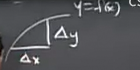
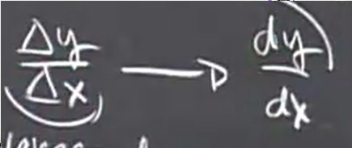
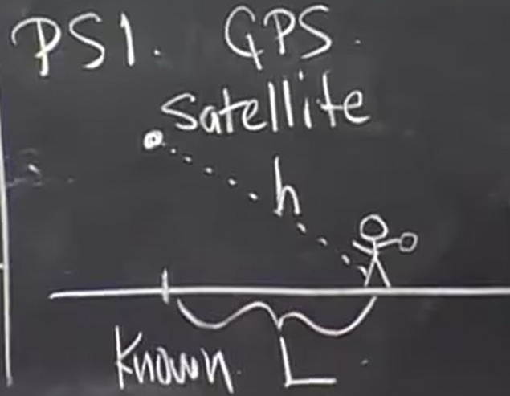

# 其他角度下导数的定义

上节课我们了解到导数的几何意义就是函数在特定点的切点斜率 并且我们可以使用极限进行导数的计算 并且我们计算了一些常用导数

其他角度下导数的定义 这是一个重要的问题，我们在生活中使用微积分中经常会遇到

## 什么是导数

**导数是变化率**

这是我们之前讨论的函数

而新的视角下，y相对于x的变化率即为`Δy / Δx` 这是**平均变化率**

而在极限情况，**瞬时变化率**应为

### 例子

#### 1

在物理学中`q`指电荷量，而`dq/dt`就是电流 *电荷的变化率*

#### 2

`s`指距离，而距离的变化率就是速度`v=ds/dt`

我们从80m高的楼上扔一个南瓜，时间起始为0，加速度为10,那么南瓜高度的公式就是`h = 80 - 5t^2`

`t = 0` `h = 80`

`t = 4` `h = 0`

距离的平均变化我们称之为平均速度 

`Δh / Δt = -20 m/s`

而我们更关心的是其撞击路面时的瞬时速度

那么瞬时速度，就是瞬时变化率，根据我们对其定义，就是`h'(t) = -10t`

其在`t = 4`时，就是`-40 m/s`

#### 3

`T`表示温度 `dT/dx`表示温度梯度

#### 4

测量的敏感性

GPS通过这种原理定位，假设地面水平，与卫星垂直处有一GPS明确知道距离的点，通过无线电信号得到距离h,来推算距离L

但是h会有误差，存在一个误差`Δh`

