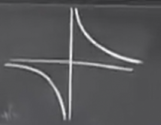
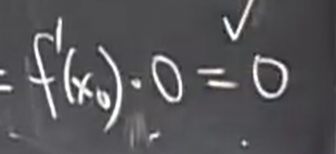

# 其他角度下导数的定义_极限和连续性
 
* [什么是导数](#什么是导数)
  * [例子](#例子)
    * [1](#1)
    * [2](#2)
    * [3](#3)
    * [4](#4)
* [极限和连续性](#极限和连续性)
  * [简单极限](#简单极限)
  * [导数总是更难](#导数总是更难)
  * [左极限和右极限](#左极限和右极限)
    * [例子](#例子)
  * [连续性](#连续性)
    * [定义](#定义)
    * [不连续函数](#不连续函数)
      * [跳跃间断](#跳跃间断)
      * [可去间断点](#可去间断点)
        * [例子](#例子)
      * [无限不连续](#无限不连续)
        * [函数和其导函数的奇偶性](#函数和其导函数的奇偶性)
      * [其余丑陋的不连续性_振荡](#其余丑陋的不连续性_振荡)
  * [可导蕴含连续](#可导蕴含连续)

上节课我们了解到导数的几何意义就是函数在特定点的切点斜率 并且我们可以使用极限进行导数的计算 并且我们计算了一些常用导数

其他角度下导数的定义 这是一个重要的问题，我们在生活中使用微积分中经常会遇到

## 什么是导数

**导数是变化率**

这是我们之前讨论的函数

而新的视角下，y相对于x的变化率即为`Δy / Δx` 这是**平均变化率**

而在极限情况，**瞬时变化率**应为

### 例子

#### 1

在物理学中`q`指电荷量，而`dq/dt`就是电流 *电荷的变化率*

#### 2

`s`指距离，而距离的变化率就是速度`v=ds/dt`

我们从80m高的楼上扔一个南瓜，时间起始为0，加速度为10,那么南瓜高度的公式就是`h = 80 - 5t^2`

`t = 0` `h = 80`

`t = 4` `h = 0`

距离的平均变化我们称之为平均速度 

`Δh / Δt = -20 m/s`

而我们更关心的是其撞击路面时的瞬时速度

那么瞬时速度，就是瞬时变化率，根据我们对其定义，就是`h'(t) = -10t`

其在`t = 4`时，就是`-40 m/s`

#### 3

`T`表示温度 `dT/dx`表示温度梯度

#### 4

测量的敏感性

GPS通过这种原理定位，假设地面水平，与卫星垂直处有一GPS明确知道距离的点，通过无线电信号得到距离h,来推算距离L

但是h会有误差，存在一个误差`Δh`

根据这个Δh,我们还可以求出一个对应L的变化范围`ΔL`

我们通过`ΔL / Δh`来计算`ΔL` 其在比值近似于 `dl / dh`

## 极限和连续性

*目标是得出其他已知函数的求导公式*

### 简单极限

我们只需要代入 `x = 4` 因为此时分母代入后不为0

### 导数总是更难

这是因为对于导数的极限公式，分母直接代入后总是为0，因此我们需要一些手段来化简

### 左极限和右极限

这意味着一方面`x`趋近于`x0`，而另一方面限制了`x > x0`

而左极限是对应的概念

#### 例子

其图像如图

我们分别计算其趋近于0时f(x)的左右极限

在本题中，我们得知在求某一点的极限（无论是单一的左右极限或者是极限），我们不需要函数在该点处有定义

而有无定义对极限的求值结果没有影响，因为我们在计算左右极限时，总把其化为大于或小于此点，应用的具体函数来去，而不关心`等于`

### 连续性

#### 定义

***当`f(x)`趋近于x0时，其极限值等于`f(x0)`，则函数`f`在`x0`处连续***

其中我们可以将连续性的等价于几个要素

* 此点处极限存在 *其又等价于**左右极限都存在且相等***

* `x0`处`f`有定义为`f(x0)`
* **上述两点相等 x0处的极限值等于x0处的函数值**

#### 不连续函数

##### 跳跃间断

* **左右极限存在但不相等**

##### 可去间断点

* **左右极限相等，但是不满足等于`f(x0)`** *x0处可能非定义或者是其它值**

###### 例子

`g(x) = sinx / x` 

`h(x) = (1 - cosx) / x` 

这个函数在`x=0`处未定义

对于`g(x)`我们先给出其在`x = 0`处的极限，我们后续会学习

`h(x)`在`x`趋近于0时的极限是0，计算我们同样后续学习

因此这两个函数`x = 0`处都是可去间断点

##### 无限不连续

如 `y = 1 / x`

其极限根据图像我们可以看出

而左极限在图像上随着趋近于0不断向下到负无穷

但是`x`趋近于0时的极限是不存在的

而我们回顾`1/x`和其导数

我们可以画出导数的图像，并能验证其和函数斜率的关系, [这里](power.md)是对于幂函数图像的一般画法

而这是我们可以说`- 1 / x^2`的在`x=0`处的极限为负无穷

###### 函数和其导函数的奇偶性

我们通过`1/x`和其导数的奇偶性可以总结

***对奇函数求导，结果总是偶函数，对偶函数求道，结果总是奇函数***

##### 其余丑陋的不连续性_振荡

当`x`趋近于`0`时会无限震荡 这种情况下没有左极限或右极限

在这门课我们不会研究此类震荡的情况

### 可导蕴含连续

***如果`f`在`x0`处可导(导数存在)，那么`f`在`x0`处连续***

证明如下

这是我们想要证明的连续性

其等同于

* 这里看起来像是在除以0又乘以了0，这通常是行不通的
* 但是在极限中 `x` **从不等于** `x0` 他们只是**无限趋近** *也是我们求极限时无需考虑函数值的原因*

而这个要证明的内容，其极限第一项就是`f'(x0)`，而第二项极限就是`0`

* 这里能带入 第二项 为0的原因 就是简单极限的计算方法，我们是在计算极限

故，如果`f'(x0)`存在，那么上述相等的过程一定能推到我们想要的

