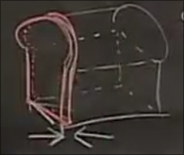
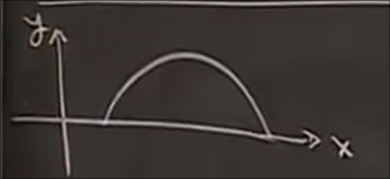
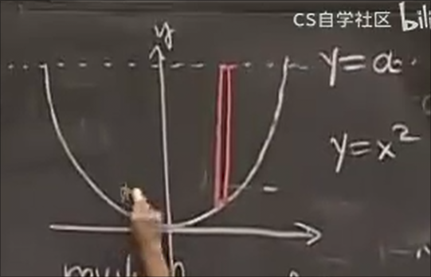

# 体积 和 积分

## 例子 面包的体积

要弄清面包的大小通常会将其切片

将厚度记为`dx` 表面的面积记作A 

那么即可求出一片的体积

总体的体积进行积分

## 旋转体的切片

### 例子1 圆盘法

假设有这样的平面图形

将其沿着x轴旋转

得到 橄榄球状 的立体图形

这种旋转体的切片有一个通用的方法

我们不需要真正画出3D图形 而是从2D想象出3D

我们对其取一小块

也就是沿x轴取`dx` 在想象中的3D旋转体上 看起来是这样

一个小圆盘 这种计算体积的方法称为**圆盘法**

我们要做的是计算这个圆盘的体积 即要求出它的 **厚度** 和 **横截面积**

在2D图中 函数的高度 为 y 那么其作为想象中3D图形 横截面的半径 横截面积即为 `pi*y^2`

而厚度为 `dx`

体积就是 `dv = (pi * y ^ 2) * dx` 其中 y 是 x 的函数

### 例子2 足球

由半径是 `a` 的圆旋转而来

仍然是 圆盘法的公式

我们需要得知`y`关于`x`的函数

不过有一个技巧是我们永远只需要得知 `y^2` 关于 `x` 的公式

接下来就是代入公式（方法）环节了

但是我们还要知道对x积分的上下限

然而我们不仅仅找到了球的体积公式 还有**球的部分**的体积公式

如果我们把积分上限定于此 即可求得

这应用于一些实际的科学问题

### 壳层法 

女巫的大锅中能装多少液体

这是壳外形函数 高度记作`a`

这个锅是由函数沿着`y`轴旋转得来

我们同样取一竖直切片 不过现在变为沿着y轴旋转 因此在3d图的样子有所不同

旋转会形成一个空心的圆柱 **壳**

对于这个壳的体积 其厚度为`dx` 而高度为`a - y` 

此外我们计算周长 （原因是试图将这个空圆柱展开）

从图中可以看出是`2 * pi * x`

最终得到小体积

化简后

之后求出积分 包括上下限

应从0开始 而不是完整的抛物线 *这一点和例子1类似 例子1只算 x轴的上部分 要得知这一点 我们需要了解从2D到3D的dx对应体积和累积和发生了什么*

得到

