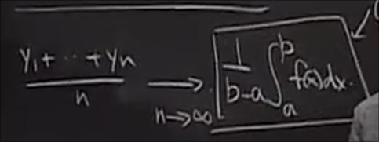
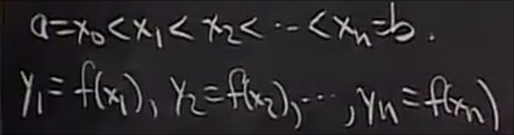
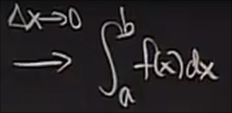
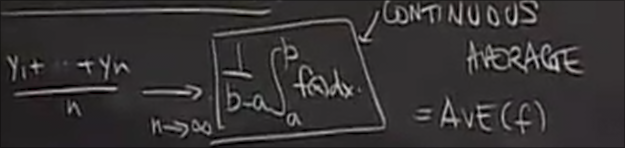
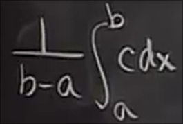
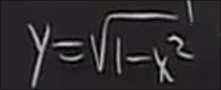
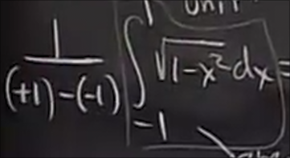
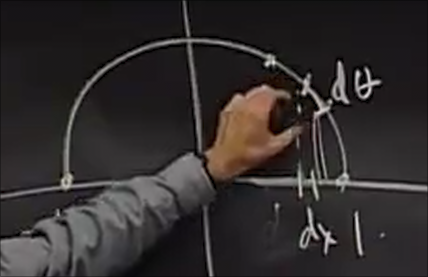

# 平均值

一组数据的平均值

离散和连续形式的平均值

函数的积分一方面是 **曲线下的面积** 另一方面也可以用其平均值解释

取 其中一系列 等距的点 

其中距离则是 `(b - a) / n`

黎曼和为 一系列小矩形的面积和

当 `delta x` 趋于 `0` 时 趋近于积分

而两侧同时 除以 `b - a`

我们上面说过 距离 `delta x = (b - a) / n`

可以写成

得以证明

## 例子 常数的平均值

根据上面的结论 其平均值等于

我们可以得到`c`

说明常数的平均值就是本身 `1 / (b - a)` 的系数使得我们正确的归一化

## 例子 圆上一点的平均高度

这是一个单位半圆

函数则是

由平均值的积分公式

得知其是半圆面积的一半 因此为 pi / 4

## 例子 变量为弧长时 关于高度的平均值

求得平均值 会根据指定变量而异

随着向下移动 很短的`dx`有更长的`d theta`

因此积分更加注重较低的值 答案应更小一点
